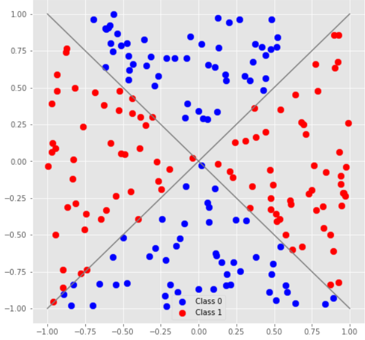
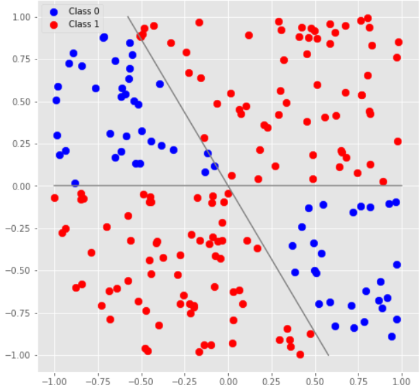

# Tutorial_(en)

The warmup round is over; I hope you enjoyed it and learned something new in the process!

Here are the explanations for the contest problems and pointers some extra resources that can help you learn more about the respective topics before the main contest. You should also be able to see the solutions of the contest participants and to solve the problems in practice mode.

A: "Distinguishing Unitaries" problems
--------------------------------------

Here is the editorial for the problems: [https://assets.codeforces.com/rounds/1356/A1-A5.pdf](https://assets.codeforces.com/rounds/1356/A1-A5.pdf).

 
> These problems are [published in the Quantum Katas](https://codeforces.com/https://github.com/microsoft/QuantumKatas/tree/master/DistinguishUnitaries), so that you can see the testing harness used for the problems and use it for testing your solutions in the main contest.

B: Reversible computing
-----------------------

Reversible computing is a branch of quantum computing that deals with expressing classical computations in a reversible manner (i.e., so that the computation has a unique input state for each output state, and inputs and outputs allow a 1:1 mapping). This enables us to perform classical computations (such as arithmetic) on quantum data. This can be done in a systematic way by decomposing the classical computation into primitive classical gates (such as NOT, XOR, OR and AND) and replacing each classical gate with its reversible equivalent (NOT with X gate, XOR with CNOT gate and AND with CCNOT gate), possibly with the use of extra qubits to store intermediary computation results. Let's see how this approach can be applied to these tasks.

### [1356B1 - Increment](../problems/B1._Increment.md "Microsoft Q Coding Contest - Summer 2020 - Warmup")

Consider the logic of incrementing a classical number in binary notation:

 * Flip the least significant bit.
* If the least significant bit is now 0, increment the rest of the number (i.e., flip the second-least significant bit, check whether it is 0 and apply the same procedure recursively).

We can swap these two steps, so that we would first increment the rest of the number if the least significant bit is 1, and then flip the least significant bit.

To translate these steps to quantum gates,

 * If statements translate to controlled gates (remember that all computations have to be done without measurements, so that if the qubit inputs are in superposition, they remain in superposition after the computation as well); we can use `Controlled` functor to call controlled version of `Solve`, with the first argument being the array of control qubits (the least significant bit) and the second argument being the arguments passed to the `Solve` (the rest of the bits).
* Flipping the bit corresponds to applying an X gate to it.

 
```cpp
operation Solve (register : LittleEndian) : Unit is Adj+Ctl {
    // unwrap LittleEndian type
    let qarray = register!;
    if (Length(qarray) > 1) {
        // increment the rest of the number if the least significant bit is 1
        (Controlled Solve)([qarray[0]], LittleEndian(qarray[1 ...]));
    }
    // increment the least significant bit
    X(qarray[0]);
}
```
### [1356B2 - Decrement](../problems/B2._Decrement.md "Microsoft Q Coding Contest - Summer 2020 - Warmup")

It is possible to implement the decrement operation in a manner similar to the increment, by analyzing the pattern of bits transformation that happens to a number when it is decremented. But a faster and more neat way involves realizing that decrement is the inverse of the increment operation, or, in quantum computing terms, its adjoint. This means that you can just copy your solution to the previous problem (under a different name, say, `Increment`) and call `Adjoint Increment(register);` in your solution.

 
> Here are the resources to learn more about reversible computing and solving problems of this type: 
> 
>  * [The Quantum Katas](https://codeforces.com/https://github.com/microsoft/QuantumKatas/) that cover quantum oracles (DeutschJozsaAlgorithm, GroversAlgorithm, SolveSATWithGrover, GraphColoring) and quantum arithmetic (RippleCarryAdder).
> * Problems G1-G3 from [Winter 2019 — Warmup](https://codeforces.com/contest/1115) and problems C1-C3 from [Winter 2019](https://codeforces.com/contest/1116) Q
# contests.

C: [1356C - Prepare state |01⟩ + |10⟩ + |11⟩](../problems/C._Prepare_state_|01⟩_+_|10⟩_+_|11⟩.md "Microsoft Q Coding Contest - Summer 2020 - Warmup")
------------------------------------------------------------------------------------------------------------------------------------------------------

This problem is extremely similar to [task 2.3 of the Superposition kata](https://codeforces.com/https://github.com/microsoft/QuantumKatas/blob/master/Superposition/Tasks.qs#L228). You can find a detailed explanation of the math used in that solution in the [workbook](https://codeforces.com/https://github.com/microsoft/QuantumKatas/blob/master/Superposition/Workbook_Superposition_Part2.ipynb).

To adapt that solution to this problem, you can use the code for that solution exactly as it is to prepare a 1√3(|00⟩+|01⟩+|10⟩)13√(|00⟩+|01⟩+|10⟩) state, and as the last step apply an X gate to each of the qubits. This will flip |0⟩|0⟩ states to |1⟩|1⟩ and vice versa, resulting in the 1√3(|11⟩+|10⟩+|01⟩)13√(|11⟩+|10⟩+|01⟩) state, which is exactly our target state.

 
> * This approach to preparing states is called post-selection. You can learn more about it in the ["Repeat-Until-Success Examples"](https://codeforces.com/https://docs.microsoft.com/en-us/quantum/user-guide/using-qsharp/control-flow#repeat-until-success-examples) section of Q
# documentation.
> * Another example of preparing a state using post-selection can be found in task 2.7 of the [Superposition kata](https://codeforces.com/https://github.com/microsoft/QuantumKatas/tree/master/Superposition).

D: Quantum classification
-------------------------

Both classification problems in the warmup round were very similar to the problem solved in [MLADS tutorial](https://codeforces.com/https://github.com/microsoft/MLADS2020-QuantumClassification) linked from the statements.

If you plot the training data you're given (I used the Python notebook included in the tutorial to do this, with some modifications to load the data from file rather than generate it on the fly), here are the images you'll get:

 

You see the similarity with the tutorial: in all cases the classes are defined by the polar angle of the data point, and not by the distance from the origin. The encoding of the data in the qubit state, described in the "Data Encoding" section of the tutorial, fits this type of problems perfectly, since it preserves the relative magnitudes of the features but discards the information about their absolute magnitudes.

This means the we have only one qubit to build our model upon, which leaves us a very limited choice of gates: Rx, Ry and Rz. The classification process is going to be very simple (and match exactly the one described in the tutorial):

 1. Encode the data point into the qubit state.
2. Apply a rotation gate.
3. Measure the result and interpret it.

From here, you can take two approaches to the solution:

#### Mathematical approach

A model without any gates and with 0 bias is going to perform classification that is exactly the opposite of what we need in D1, with 100% error rate, classifying the vertical "hourglass" area as class 1 and the horizontal "hourglass" — as class 0. To get D1 classification correct, you need to rotate the data by π/2π/2 either clockwise or counterclockwise (which corresponds to Ry gate), so that the data from class 0 becomes aligned with the horizontal axis, and the data from class 1 — with vertical. Remember that the angle parameter you pass to the gate is *twice* the rotation angle you'd use geometrically, so the model parameters end up being (rotation angle = 3.14, bias = 0.0).

The first step to solve D2 is to rotate the data as well, so that middle axis of class 0 is aligned with the horizontal axis — we'll need a π/6π/6 geometric rotation, or π/3π/3 parameter for Ry gate. However, this time we'll also need to tweak the bias to modify the width of the area that is classified as class 0. Some experimentation or a geometric representation will show that bias = 0.25 allows to achieve this.

#### Software engineering approach

Alternatively, you can train the model using the provided library to learn the rotation angle and the bias. Most frequently asked question here was tweaking the hyperparameters of the training process so as to speed up the learning. To improve the learning speed and push the model away from the starting parameters, I had to increase LearningRate parameter and reduce Tolerance, as you can see in [this code](https://codeforces.com/https://github.com/microsoft/MLADS2020-QuantumClassification/blob/master/QuantumClassification/Backend.qs#L44). You can find the list of hyperparameters available to the training process [in the code comments here](https://codeforces.com/https://github.com/microsoft/QuantumLibraries/blob/8706abea604ab74db94992c69cd726a268d5c309/MachineLearning/src/Types.qs#L163).

 
> The most frequent cause of runtime error verdicts on these two problems was using the more complicated model structure from the [library documentation example](https://codeforces.com/https://docs.microsoft.com/en-us/quantum/libraries/machine-learning/basic-classification), rather then the simpler and the more suitable model structure from the tutorial. You have to make sure that the qubits you're referencing in your model will actually be used to encode the data; in this case the data has 2 features and there is no preprocessing to engineer more features, so those 2 features will be encoded in the state of 1 qubit, and referencing qubit with index 1 will cause a runtime error. 3 or 4 features will be encoded in 2 qubits, 5-8 — in 3 qubits and so on, the number of qubits used is the power of the nearest power of two greater than or equal to the number of features.

In the main round of the contest we'll take a closer look at how to use feature engineering to build and train more complex models.

