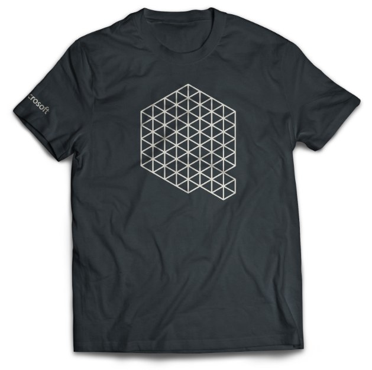

# Announcement_2_(en)

Microsoft's Quantum team and Codeforces are excited to invite you to Microsoft Q
# Coding Contest — Summer 2020! The contest will run from **June 19 to June 22**.

As a reminder, last weekend we held a warmup round with easier tasks on the topics that have not been covered in the [previous contests](https://codeforces.com/contests/1116,1115,1002,1001). You can find the problems from the warmup round for practice [here](https://codeforces.com/contest/1356), and the described solutions [here](https://codeforces.com/blog/entry/78832). There is also a list of great learning and practice resources [here](Announcement_1_(en).md).

Several useful reminders:

 * The contest is unrated :-)
* Solutions are accepted only in Q#.
* The tasks are grouped by topic, and the tasks within one topic are ordered in approximate order of increasing difficulty. If you find a problem too hard, check the next problems in this topic and problems from different topics, they might turn out to be easier for you.
* Custom Invocation allows you to run Q
# code on Codeforces servers; make sure your code has namespace `Solution` and an operation with a signature `operation RunQsharp () : Bool` defined in it.
* And the really important stuff: the top 50 ranked participants will receive a Microsoft Quantum T-shirt, and 25 random participants who solved at least one problem but didn't finish in the top 50 will also receive a Microsoft Quantum T-shirt! Here is a preview (we haven't printed the T-shirts yet, so the final look in print might differ slightly):  

Good luck! We hope you enjoy the contest! 

For first time Codeforces users:

 1. Create user account [here](https://codeforces.com/register).
2. Register for the contest [here](https://codeforces.com/contestRegistration/1357).
3. Once the contest starts on June 19th, access the problems [here](https://codeforces.com/contest/1357).
