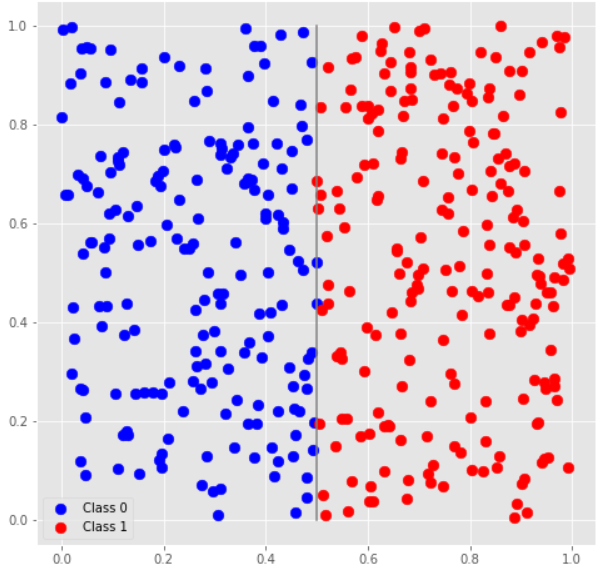
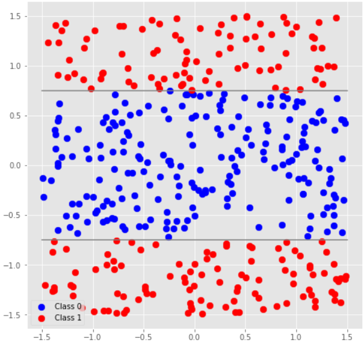
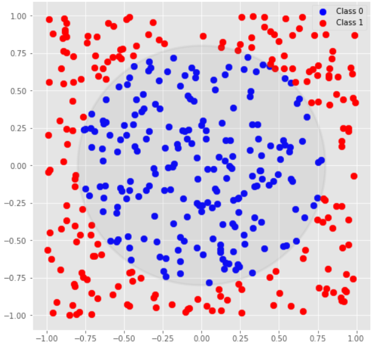
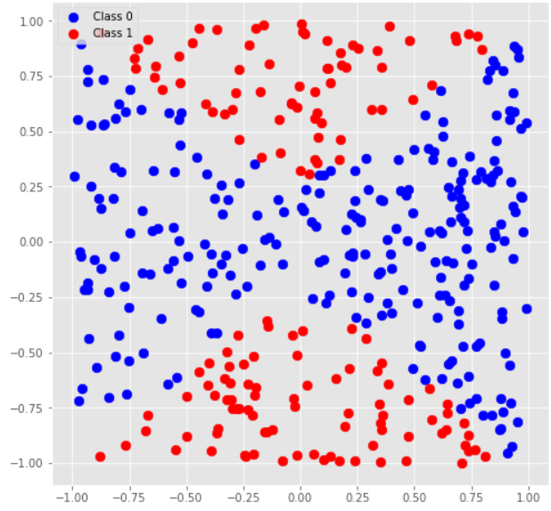
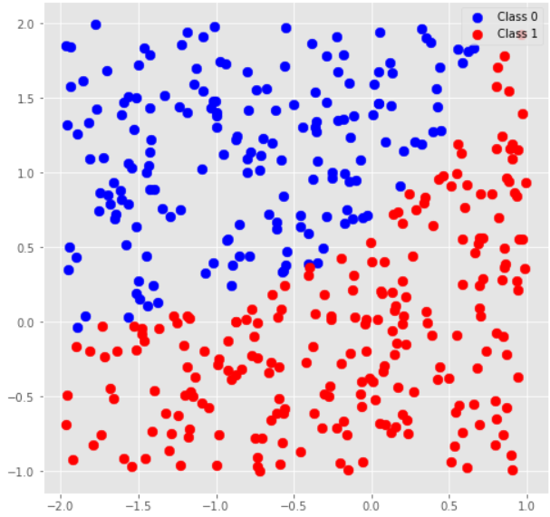

# Tutorial_(en)

The contest is over; I hope you enjoyed it and learned something new in the process!

Here are the solution descriptions. You should also be able to see the solutions of the contest participants, and the discussions in the comments offer a lot of insight.

A: "Distinguishing Unitaries" problems
--------------------------------------

### [1357A1 - Figure out direction of CNOT](../problems/A1._Figure_out_direction_of_CNOT.md "Microsoft Q Coding Contest - Summer 2020")

Let's consider the effect of these gates on the 2-qubit basis states, similar to how we did in [1356A5 - Distinguish Z from -Z](https://codeforces.com/contest/1356/problem/A5 "Microsoft Q Coding Contest - Summer 2020 - Warmup"). We'll see that applying CNOT12 and CNOT21 to any of the basis states other than |00⟩ yields different results. For example, CNOT12|01⟩=|01⟩ and CNOT21|01⟩=|11⟩. Thus, the easiest solution is: prepare two qubits in the |01⟩ state and apply the unitary to them, then measure the second qubit; if it is still One, the gate is CNOT12, otherwise it's CNOT21.

 
```cpp
    operation Solve (unitary : (Qubit[] => Unit is Adj+Ctl)) : Int {
        // apply to |01⟩ and measure 1st qubit: CNOT₁₂ will do nothing, CNOT₂₁ will change to |11⟩
        using (qs = Qubit[2]) {
            within { X(qs[1]); }
            apply { unitary(qs); }
            return MResetZ(qs[0]) == Zero ? 0 | 1;
        }
    }
```
### [1357A2 - Distinguish I, CNOTs and SWAP](../problems/A2._Distinguish_I,_CNOTs_and_SWAP.md "Microsoft Q Coding Contest - Summer 2020")

In this problem we are allowed to use the given unitary twice, so we can split our decision-making process in two phases:

 1. Apply the unitary to the |11⟩ state; CNOT12 will yield the |10⟩ state, CNOT21 — |01⟩, and both I and SWAP gates will leave the state unchanged.
2. Now to distinguish I from SWAP, we can use the |01⟩ state: I gate will leave it unchanged while SWAP will yield |10⟩.

 
```cpp
    operation Solve (unitary : (Qubit[] => Unit is Adj+Ctl)) : Int {
        // first run: apply to |11⟩; CNOT₁₂ will give |10⟩, CNOT₂₁ will give |01⟩, II and SWAP will remain |11⟩
        using (qs = Qubit[2]) {
            X(qs[0]);
            X(qs[1]);
            unitary(qs);
            let ind = MeasureInteger(LittleEndian(qs));
            if (ind == 1 or ind == 2) {
                // respective CNOT
                return ind;
            }
        }
        // second run: distinguish II from SWAP, apply to |01⟩: II will remain |01⟩, SWAP will become |10⟩
        using (qs = Qubit[2]) {
            X(qs[1]);
            unitary(qs);
            let ind = MeasureInteger(LittleEndian(qs));
            return ind == 1 ? 3 | 0;
        }
    }
```
### [1357A3 - Distinguish H from X](../problems/A3._Distinguish_H_from_X.md "Microsoft Q Coding Contest - Summer 2020")

In this problem again we are allowed to apply the unitary twice. The solution relied on the well-known identity HXH = Z (i.e., Hadamard gate can be used to convert X to Z and vice versa). Applying a sequence of gates "unitary — X — unitary" will be equivalent to XXX = X gate if the unitary was X, and to HXH = Z if the unitary was H. With this observation we need to distinguish X from Z, which can be done using the |0⟩ state:

 
```cpp
    operation DistinguishHfromX_Reference (unitary : (Qubit => Unit is Adj+Ctl)) : Int {
        // apply operation unitary - X - unitary to |0⟩ state and measure: |0⟩ means H, |1⟩ means X
        // X will end up as XXX = X, H will end up as HXH = Z (does not change |0⟩ state)
        using (q = Qubit()) {
            within {
                unitary(q);
            } apply {
                X(q);
            }
            return MResetZ(q) == Zero ? 0 | 1;
        }
    }
```
### [1357A4 - Distinguish Rz from R1](../problems/A4._Distinguish_Rz_from_R1.md "Microsoft Q Coding Contest - Summer 2020")

As a reminder,

 Rz(θ)=[e−iθ/200eiθ/2]R1(θ)=[100eiθ]=eiθ/2Rz(θ)We see that these two gates differ by a global phase eiθ/2. In this problem we're free to choose the angle parameter which we'll pass to our gate, so we can choose an angle that make this global phase difference something nice: for θ=2π, eiθ/2=−1, Rz(θ)=−I, and R1(θ)=I.

With this choice of θ, the solution becomes very similar to [1356A5 - Distinguish Z from -Z](https://codeforces.com/contest/1356/problem/A5 "Microsoft Q Coding Contest - Summer 2020 - Warmup").

 
```cpp
    operation Solve (unitary : ((Double, Qubit) => Unit is Adj+Ctl)) : Int {
        using (qs = Qubit[2]) {
            within {
                H(qs[0]);
            } apply {
                Controlled unitary(qs[0..0], (2.0 * PI(), qs[1]));
            }
            return MResetZ(qs[0]) == Zero ? 1 | 0;
        }
    }
```
### [1357A5 - Distinguish Rz(θ) from Ry(θ)](../problems/A5._Distinguish_Rz(θ)_from_Ry(θ).md "Microsoft Q Coding Contest - Summer 2020")

As a reminder,

 Rz(θ)=[e−iθ/200eiθ/2]Ry(θ)=[cosθ2−sinθ2sinθ2cosθ2]The key observation here is that Rz is a diagonal matrix and Ry is not, so when applied to the |0⟩ state, the former will leave it unchanged (with an extra phase which is not observable), and the latter will convert it to a superposition cosθ2|0⟩+sinθ2|1⟩. The trick is how to distinguish those two states if they are not orthogonal (and for most values of θ they will not be)?

The statement gave you a big hint on this: it allowed you to use the given unitary unlimited number of times, which pointed to a probabilistic solution (as opposed to deterministic solutions in all previous A problems). Apply the unitary to the |0⟩ state and measure the result; if it is |1⟩, the unitary has to be Ry, otherwise you can repeat the experiment again. After several iterations of measuring |0⟩ you can conclude that with high probability the unitary is Rz.

To reduce the number of iterations after which you make the decision, you could apply the unitary several times to bring the overall rotation angle closer to π: in case of Ry gate this would allow you to rotate the state closer to the |1⟩ state, so that you'd detect it with higher probability.

See [vilim_l](https://codeforces.com/profile/vilim_l "Candidate Master vilim_l")'s [solution](https://codeforces.com/contest/1357/submission/84346001) for a neat implementation.

### [1357A6 - Distinguish four Pauli gates](../problems/A6._Distinguish_four_Pauli_gates.md "Microsoft Q Coding Contest - Summer 2020")

At the first glance it might seem impossible to distinguish 4 different unitaries with just one unitary application. However, since the unitaries were chosen carefully (and you're allowed to do unlimited measurements), it is possible. The solution uses the [Bell states](https://codeforces.com/https://en.wikipedia.org/wiki/Bell_state#Bell_basis): the 4 orthogonal states which you can prepare starting with the first of them 1√2(|00⟩+|11⟩) by applying gates I, X, Z and Y, respectively, to the first qubit. Thus the solution becomes: prepare the 1√2(|00⟩+|11⟩) state, apply the unitary and measure the resulting state in Bell basis to figure out which of the Bell states it is ([1001E - Distinguish Bell states](https://codeforces.com/contest/1001/problem/E "Microsoft Q Coding Contest - Summer 2018 - Warmup")).

 
```cpp
    operation Solve(unitary : (Qubit => Unit is Adj+Ctl)) : Int {
        // apply operation to the 1st qubit of a Bell state and measure in Bell basis
        using (qs = Qubit[2]) {
            H(qs[0]);
            CNOT(qs[0], qs[1]);

            unitary(qs[0]);

            CNOT(qs[0], qs[1]);
            H(qs[0]);

            // after this I -> 00, X -> 01, Y -> 11, Z -> 10
            let ind = MeasureInteger(LittleEndian(qs));
            let returnValues = [0, 3, 1, 2];
            return returnValues[ind];
        }
    }
```
### [1357A7 - Distinguish Y, XZ, -Y and -XZ](../problems/A7._Distinguish_Y,_XZ,_-Y_and_-XZ.md "Microsoft Q Coding Contest - Summer 2020")

In this problem we needed to distinguish 4 gates that were identical up to a global phase, i.e., gates Y, iY, −Y and −iY. It is possible to do this "by hand", i.e., first applying the unitary twice and checking whether the result is I (which allows us to distinguish ±Y and ±iY, since the first two gates squared will be equivalent to the I gate, and the last two — to the −I gate), and then distinguishing the gates in each group.

The reference solution took advantage of [phase estimation](https://codeforces.com/https://en.wikipedia.org/wiki/Quantum_phase_estimation_algorithm) algorithm which, given a unitary and its eigenstate, allows to find its eigenvalue. If we prepare an eigenstate of the Y gate 1√2(|0⟩+i|1⟩), it will be the eigenstate of all other gates as well, with eigenphases 0,π/2,π,3π/2, respectively. You can convert the output of the phase estimation procedure into the return index directly.

You can learn more about phase estimation in [this kata](https://codeforces.com/https://github.com/microsoft/QuantumKatas/tree/master/PhaseEstimation).

 
```cpp
    operation DistinguishYfromXZWithPhases_Reference (unitary : (Qubit => Unit is Adj+Ctl)) : Int {
        // Run phase estimation on the unitary and the +1 eigenstate of the Y gate |0⟩ + i|1⟩

        // Construct a phase estimation oracle from the unitary
        let oracle = DiscreteOracle(Oracle_Reference(unitary, _, _));

        // Allocate qubits to hold the eigenstate of U and the phase in a big endian register 
        mutable phaseInt = 0;
        using ((eigenstate, phaseRegister) = (Qubit[1], Qubit[2])) {
            let phaseRegisterBE = BigEndian(phaseRegister);
            // Prepare the eigenstate of U
            H(eigenstate[0]); 
            S(eigenstate[0]);
            // Call library
            QuantumPhaseEstimation(oracle, eigenstate, phaseRegisterBE);
            // Read out the phase
            set phaseInt = MeasureInteger(BigEndianAsLittleEndian(phaseRegisterBE));

            ResetAll(eigenstate);
            ResetAll(phaseRegister);
        }

        // Convert the measured phase into return value
        return phaseInt;
    }
```
B: Reversible computing
-----------------------

### [1357B1 - "Is the bit string balanced?" oracle](../problems/B1._"Is_the_bit_string_balanced_"_oracle.md "Microsoft Q Coding Contest - Summer 2020")

Classically this problem would've been quite straightforward: count the number of 1s in the bit string and check that this number equals half of the bit string length. In quantum computing, you do exactly the same, but in a reversible manner.

 * We already know how to increment a number written in a quantum register from [1356B1 - Increment](https://codeforces.com/contest/1356/problem/B1 "Microsoft Q Coding Contest - Summer 2020 - Warmup") — here we'll assume that we've already implemented this operation as `Increment`.
* To count the number of 1s in the input register, you increment the counter for each element of the input register that is 1 using a controlled variant of the increment operation.
* To flip the output qubit if the number written in the counter register equals some classical constant, you use [ControlledOnInt](https://codeforces.com/https://docs.microsoft.com/en-us/qsharp/api/qsharp/microsoft.quantum.canon.controlledonint) function that will apply the X gate to the output only if the control register is in the state that corresponds to that constant.
* You have to remember to uncompute the counter register before releasing the qubits — within ... apply construct is useful to express the uncomputation step automatically.

 
```cpp
    operation Solve(inputs : Qubit[], output : Qubit) : Unit is Adj+Ctl {
        let log = BitSizeI(Length(inputs));
        using (inc = Qubit[log]) {
            within {
                for (q in inputs) {
                    (Controlled Increment)([q], LittleEndian(inc));
                }
            } apply {
                (ControlledOnInt(Length(inputs) / 2, X))(inc, output);
            }
        }
    }
```
### [1357B2 - "Is the number divisible by 3?" oracle](../problems/B2._"Is_the_number_divisible_by_3_"_oracle.md "Microsoft Q Coding Contest - Summer 2020")

This problem required you to come up with a way to perform increment and decrement modulo 3 reversibly. You can do that by allocating two extra counter qubits and figuring out the rules of updating them in a way which allows to go from |00⟩ to |10⟩ to |01⟩ to |00⟩ upon increment (and you can use adjoint of increment as decrement). (This has been the main part of [1116C3 - ``Is the number of ones divisible by 3?'' oracle](https://codeforces.com/contest/1116/problem/C3 "Microsoft Q Coding Contest - Winter 2019") in Winter 2019 contest).

This time you need an extra trick: instead of just counting the number of 1 bits modulo 3, you need to calculate the remainder of dividing the number by 3. You can use the fact that consecutive powers of 2 give remainders 1 and −1 in turn: 20≡1, 21=2≡−1, 22=4≡1, 23=8≡−1, and so on. You start iterating from the least significant bit of the number, performing controlled increment of the counter qubits with qubits 0, 2, 4, ... as controls, and controlled decrement with qubits 1, 3, 5, ... as controls.

Finally, the number itself will be divisible by 3 only if the counter qubits are in the |00⟩ state.

 
```cpp
    operation IncrementMod3 (counterRegister : Qubit[]) : Unit is Adj+Ctl {
        let sum = counterRegister[0];
        let carry = counterRegister[1];
        // we need to implement +1 mod 3:
        // sum carry | sum carry
        //  0    0   |  1    0
        //  1    0   |  0    1
        //  0    1   |  0    0
        // compute sum bit
        (ControlledOnInt(0, X))([carry], sum);
        // sum carry | carry
        //  1    0   |   0
        //  0    0   |   1
        //  0    1   |   0
        (ControlledOnInt(0, X))([sum], carry);
    }

    operation Task4_TestMod3_Reference(register : Qubit[], output : Qubit) : Unit is Adj+Ctl {
        using (counter = Qubit[2]) {
            within {
                for (i in 0 .. Length(register) - 1) { // starting from LSB
                    if (i % 2 == 0) {
                        // i-th power of 2 is 1 mod 3
                        Controlled IncrementMod3([register[i]], counter);
                    } else {
                        // i-th power of 2 is 2 mod 3 - same as -1, which is Adjoint of +1
                        Controlled Adjoint IncrementMod3([register[i]], counter);
                    }
                }
            } apply {
                // divisible by 3 only if the result is divisible by 3
                (ControlledOnInt(0, X))(counter, output);
            }
            
        }
    }
```
C: State preparation without arbitrary rotations
------------------------------------------------

### [1357C1 - Prepare superposition of basis states with 0s](../problems/C1._Prepare_superposition_of_basis_states_with_0s.md "Microsoft Q Coding Contest - Summer 2020")

This task is extremely similar to [1356C - Prepare state |01⟩ + |10⟩ + |11⟩](https://codeforces.com/contest/1356/problem/C "Microsoft Q Coding Contest - Summer 2020 - Warmup") and to [task 2.3 of the Superposition kata](https://codeforces.com/https://github.com/microsoft/QuantumKatas/blob/master/Superposition/Tasks.qs#L228): you need to prepare an equal superposition of all basis states except one, the |1...1⟩ state. The solution is also similar to [this one](https://codeforces.com/https://github.com/microsoft/QuantumKatas/blob/master/Superposition/Workbook_Superposition_Part2.ipynb): prepare an equal superposition of all basis states (by applying an H gate to each qubit), allocate an extra qubit, apply a controlled X gate with the input qubits as controls and the extra qubit as a target, and measure the extra qubit: if it is measured in the 0 state, the rest of the qubits are in the necessary superposition, otherwise we have to retry.

 
```cpp
    operation Solve(qs : Qubit[]) : Unit {
        using (ancilla = Qubit()) {
            repeat {
                // Create equal superposition of all basis states
                ApplyToEach(H, qs);
                // Create (our state) ⊗ |0⟩ + |11...11⟩ ⊗ |1⟩
                Controlled X(qs, ancilla);
                let res = MResetZ(ancilla);
            }
            until (res == Zero)
            fixup {
                ApplyToEach(X, qs);
            }
        }
    }
```
### [1357C2 - Prepare superposition of basis states with the same parity](../problems/C2._Prepare_superposition_of_basis_states_with_the_same_parity.md "Microsoft Q Coding Contest - Summer 2020")

This problem can be treated as another post-selection state preparation task. Same as before, we start by preparing an equal superposition of all basis states and allocating an extra qubit. This time we use the extra qubit to calculate the parity of the input state: applying a series of CNOT gates, each one with one of the input qubits as control and the extra qubit as a target, will compute the parity of the state. Now we measure the extra qubit: if the measurement result matches our parity, we're done — the input qubits collapsed to an equal superposition of all states that have this parity. If the measurement result is the opposite, we can retry the whole process, like we did in the previous problems, if we're happy with a randomized solution. Alternatively, we can notice that applying an X gate to any one of the qubits changes the parity of each basis state to the opposite one, and thus converts the state we got to the state we need.

 
```cpp
    operation Solve(qs : Qubit[], parity : Int) : Unit {
        using (ancilla = Qubit()) {
            // Create equal superposition of all basis states
            ApplyToEach(H, qs);
            // Calculate the parity of states using CNOTs
            ApplyToEach(CNOT(_, ancilla), qs);
            let res = MResetZ(ancilla);
            if ((res == Zero ? 0 | 1) != parity) {
                X(qs[0]);
            }
        }
    }
```
D: Quantum classification
-------------------------

 
> This turned out to be a rather controversial set of problems :-) Quantum machine learning, like most areas in quantum computing, is a topic of active research. The library used in these problems shows one possible algorithm, and it was interesting for me to explore it and to reverse-engineer the data encoding and model structures that would allow the algorithm to learn and classify the data easily. The problems were chosen to be deliberately "artificial" with just two features, so as to enable both a mathematical approach to the solutions and an engineering one.

### [1357D1 - Quantum Classification - Dataset 3](../problems/D1._Quantum_Classification_-_Dataset_3.md "Microsoft Q Coding Contest - Summer 2020")

If you plot the training data you're given, you'll get two classes divided by a vertical line at x0=0.5.

 This means that we need to discard the information about the second feature of the dataset, and base our classification decision only based on the first feature. Feature engineering mode 4 allows to do exactly that: if applied to a parameters array [a0,a1] and a features array [x0,x1], it combines them into an array that will be encoded as the state (a1|0⟩+x1|1⟩)⊗(a0|0⟩+x0|1⟩) (in the encoding in which the *last* qubit is measured in the end, which is consistent with the library behavior). 

Now, if you measure the second qubit, you'll get 0 with probability |a0|2 and 1 with probability |x0|2, and 1 will be the more likely outcome of the two if |x0|>|a0|. If we choose a0=0.5, we'll get exactly the classification boundary that we need, and won't need to perform any rotations or to apply bias.

 
```cpp
    operation Solve () : ((Int, Double[]), ControlledRotation[], (Double[], Double)) {
        return ((4, [0.5, 0.5]), [ControlledRotation((0, new Int[0]), PauliY, 0)], ([0.0], 0.0));
    }
```
### [1357D2 - Quantum Classification - Dataset 4](../problems/D2._Quantum_Classification_-_Dataset_4.md "Microsoft Q Coding Contest - Summer 2020")

The next problem featured a similar dataset, but with horizontal divides between classes at |x1|=0.75.

 This time we need to base our decision on the second feature of the dataset. We can use the same feature engineering as in the first case, followed by a SWAP gate (which can be represented as 3 CNOT gates with alternating control qubits, which in turn are controlled PauliX rotations with π as the rotation parameter). This will transform our data into a state (a0|0⟩+x0|1⟩)⊗(a1|0⟩+x1|1⟩), and measuring the last qubit will give us class 1 if |x1|>|a1|, so choosing a1=0.75 will allow us to perform the necessary classification.

 
```cpp
    operation Solve () : ((Int, Double[]), ControlledRotation[], (Double[], Double)) {
        return ((4, [0.75, 0.75]), 
                [ControlledRotation((0, [1]), PauliY, 0),
                 ControlledRotation((1, [0]), PauliY, 0),
                 ControlledRotation((0, [1]), PauliY, 0)], ([3.14, 3.14, 3.14], 0.0));
    }
```
### [1357D3 - Quantum Classification - Dataset 5](../problems/D3._Quantum_Classification_-_Dataset_5.md "Microsoft Q Coding Contest - Summer 2020")

In this problem we're finally moving on from linearly separable classes to classes separated by more interesting curves — in this case by a circle with the center in (0, 0) and radius 0.8.

 We're looking for a classification criteria x20+x21<0.82 for class 0. The squares of the features point us to a state 0.8|00⟩+x0|01⟩+x1|11⟩, which, if we measure the second qubit, will give us measurement result 0 with higher probability in exactly this case (note that the amplitude of the |10⟩ state is 0). We can prepare this state using feature engineering mode 1 by padding the features array [x0,x1] on the left with parameters array [0.8,0.0] (or any other array [a0,a1] such that a20+a21=0.82).

 
```cpp
    operation Solve () : ((Int, Double[]), ControlledRotation[], (Double[], Double)) {
        return ((1, [0.8, 0.0]), [ControlledRotation((0, new Int[0]), PauliY, 0)], ([0.0], 0.0));
    }
```
### [1357D4 - Quantum Classification - Dataset 6](../problems/D4._Quantum_Classification_-_Dataset_6.md "Microsoft Q Coding Contest - Summer 2020")

Here the classes are separated by a hyperbola 0.32+x20=x21. 

 The state that gives us this result when measured is 0.3|00⟩+x0|10⟩+x1|01⟩ (notice that now the amplitude of |11⟩ is 0), which can be prepared using the same feature engineering mode by padding [x0,x1] on the left with parameters array [0.3].

 
```cpp
    operation Solve () : ((Int, Double[]), ControlledRotation[], (Double[], Double)) {
        return ((1, [0.3]), [ControlledRotation((0, new Int[0]), PauliY, 0)], ([0.0], 0.0));
    }
```
 
> Originally I used a more complicated solution that involved padding with [0.3,0.0] and swapping the qubits, but then I realized it can be simplified.

### [1357D5 - Quantum Classification - Dataset 7](../problems/D5._Quantum_Classification_-_Dataset_7.md "Microsoft Q Coding Contest - Summer 2020")

In the last problem we put together several rotation gates with random parameters and used that model to classify a random set of data. I think some participants managed to reconstruct the result by hand, similarly to the previous problems, but training a model might have been easier.

 E: Quantum Fourier transform
----------------------------

[Solutions pdf](https://assets.codeforces.com/rounds/1357/problems-e1e2-2.pdf)

