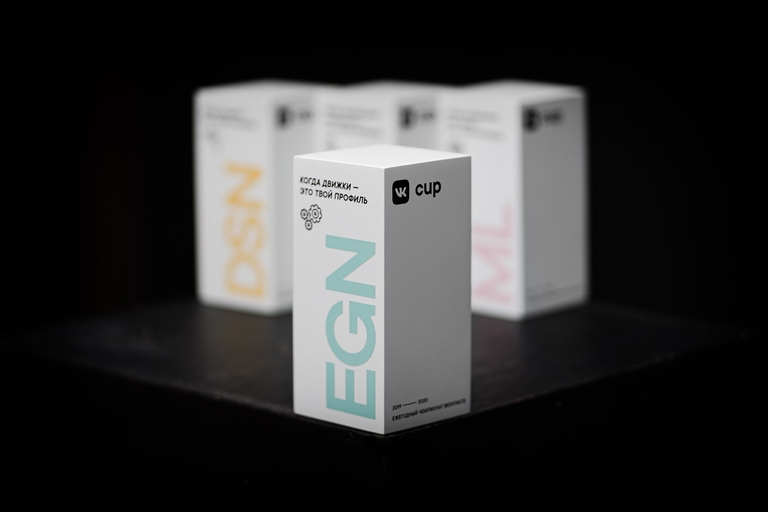

# Квалификация_VK_Cup_2021_(ru)

Привет! 

Квалификационный раунд VK Cup 2021 начнётся в [Monday, May 24, 2021 at 15:00UTC+6](https://codeforces.com/https://www.timeanddate.com/worldclock/fixedtime.html?day=24&month=5&year=2021&hour=12&min=0&sec=0&p1=166) и завершится 30 мая в 23:59 МСК. Задачи для раунда подготовлены мной. Он пройдёт по правилам ICPC без учёта штрафного времени и неудачных попыток — решения тестируются сразу на полном наборе тестов, а участники ранжируются по числу решённых задач. Для прохода в отборочный раунд нужно будет решить задач не меньше, чем участник на 256 месте.

**Регистрация открыта до конца квалификации!** Чтобы присоединиться к соревнованию, привяжите к вашему аккаунту на codeforces аккаунт ВКонтакте и заполните [анкету прямо на Codeforces](https://codeforces.com/vkcup2021/apply).

[Начать соревнование Engine](https://codeforces.com/contests/1531)

Трек Engine приглашает спортивных программистов, участвовать могут все русскоязычные программисты с четырнадцати лет, без ограничений по рейтингу или количеству участий в прошлых VK Cup. Топ 64 отборочного раунда получат фирменные футболки соревнований, а 32 лучших приедут в Санкт-Петербург на финальный раунд, где поделят призовой фонд в 680 000 рублей:

 * 1 место: 300 000 рублей
* 2 место: 200 000 рублей
* 3 место: 100 000 рублей
* 4 место: 50 000 рублей
* 5 место: 30 000 рублей

Если вам хочется попробовать свои силы в чём-то новом, то приглашаем в другие треки VK Cup: [Design, Mobile](https://codeforces.com/https://vk.cc/cup) и [ML](https://codeforces.com/https://cups.mail.ru/ru/contests/vkcup2021). Присоединяйтесь к [официальному сообществу Команды ВКонтакте](https://codeforces.com/http://vk.com/vkteam), чтобы быть в курсе последних новостей.

