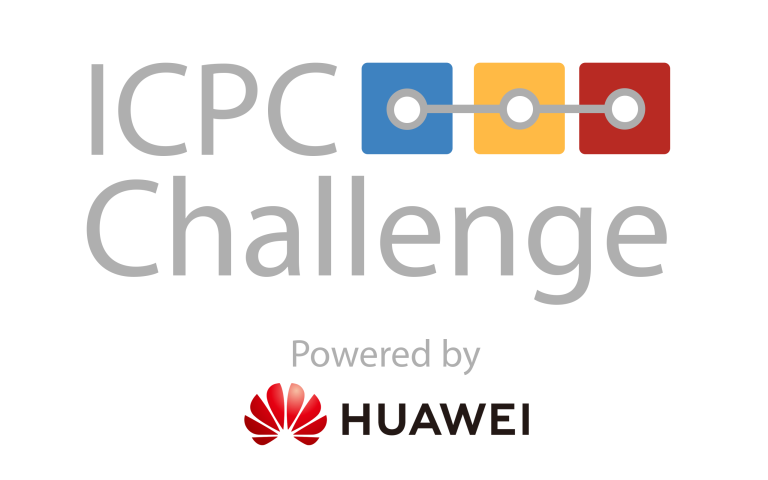
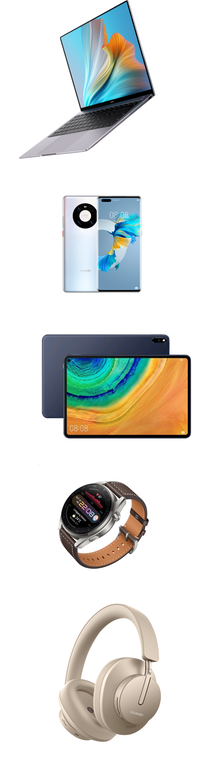

# Announcement_(en)

**Hello, Codeforces!**

Welcome to the ICPC Communication Routing Challenge powered by Huawei!

This challenge edition is very special, as it will be happening in conjunction with the ICPC World Finals! For those who are not participating in the finals — ICPC and Codeforces are offering a unique chance to compete during a **5-day Challenge Marathon** and win amazing prizes from Huawei!

**ICPC Challenge Marathon (open to public, unrated): [October 9-14, 2021, 00:00 UTC](https://codeforces.com/https://www.timeanddate.com/worldclock/fixedtime.html?msg=2021+ICPC+Communication+Routing+Challenge&iso=20211009T00&p1=1440):** 

 [REGISTER](https://codeforces.com/contests/1576) 

This time we’re delighted to provide you with a future-oriented topic – routing algorithms for next-generation communication. During this Challenge we will provide you with a super-large inter-satellite optical network to properly plan message paths, to reduce communication latency and improve resource utilization. However, finding the optimal path in a network with limited resources is an NP-hard problem. Considering the physical constraints of optics and circuits, our algorithm faces greater technical challenges:

 * How can we model and abstract device constraints and design algorithms in the most appropriate way?
* Is there an algorithm that takes almost the same time to calculate routes as the network scale increases?
* Is there any way to obtain the theoretical optimal solution in a short period for ultra-large networks?

We hope that these satellite communications challenge questions can help you understand the problems that Huawei's software algorithm researchers face every day. All the best!!!

#### Prizes

For **3-hours onsite ICPC World Finals Challenge** Huawei will provide prizes to the winners in 2 groups of participants:

 * **Group 1: TOP 30 ICPC World Finalists**, who participate individually:  

| 1st-10th place | HUAWEI MATE 40 Pro |
| --- | --- |
|
| 11th-20th place | HUAWEI MatePad Pro |
| 21st-30th place | HUAWEI WATCH 3 Pro |
* **Group 2: TOP 9 ICPC World Finals Coaches and Co-Coaches**, who participate individually: 

| 1st-3rd place | HUAWEI MATE 40 Pro |
| --- | --- |
|
| 4th-6th place | HUAWEI MatePad Pro |
| 7th-9th place | HUAWEI WATCH 3 Pro |

For **5 days online Challenge Marathon**, Huawei will provide prizes to TOP 30 individual participants: 

| 1st place* | HUAWEI MateBook X Pro + 5000 USD |
| --- | --- |
| 2nd — 4th place | HUAWEI MateBook X Pro |
|
| 5th — 10th place | HUAWEI MATE 40 Pro |
| 11th — 16th place | HUAWEI MatePad Pro |
| 17th — 22nd place | HUAWEI WATCH 3 Pro Classic |
| 23rd — 30th place | HUAWEI FreeBuds Studio |

* The 1st place winner will get additional bonus in amount of 5000 USD. If the bonus cannot be transferred to the winner due to any reason, it may be replaced by a prize of the same value.

If the allocated Huawei Challenge prize cannot be delivered to your region for any reason it may be replaced by another prize of the same value (if no legal restrictions), at the discretion of the sponsor. 

By participating in this Challenge, you agree to the [Challenge Rules and Conditions of Participation](https://codeforces.com/https://docs.google.com/document/d/1adimnPfXIAci6lPRgh0WUeMxphFNe21S)

Good luck to all participants!

*UPD*: The contest duration has been extended to 5 days. The actual finish time is [October 14, 2021, 00:00 UTC](https://codeforces.com/https://www.timeanddate.com/worldclock/fixedtime.html?msg=2021+ICPC+Communication+Routing+Challenge&iso=20211014T00&p1=1440)

