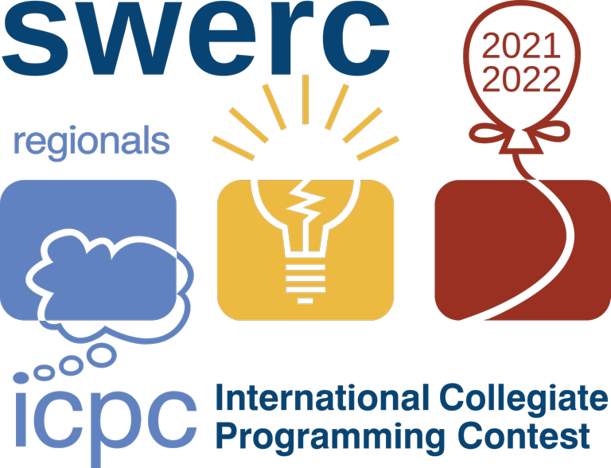

# SWERC_2021-2022_(en)



The Southwestern Europe Regional Contest will take place on the 23rd of April. It is the ICPC regional contest (i.e., the winning teams will advance to the ICPC World Finals) for teams from France, Israel, Italy, Portugal, Spain, and Switzerland.

The mirror contest [SWERC 2021-2022 - Online Mirror (Unrated, ICPC Rules, Teams Preferred)](https://codeforces.com/contest/1662 "SWERC 2021-2022 - Online Mirror (Unrated, ICPC Rules, Teams Preferred)") will be held on Codeforces at [Sunday, April 24, 2022 at 17:05UTC+6](https://codeforces.com/https://www.timeanddate.com/worldclock/fixedtime.html?day=24&month=4&year=2022&hour=14&min=5&sec=0&p1=166) and will last 5 hours. 

The mirror contest will contain all the problems from the official competition plus some additional problems.

I am the chief judge for the competition and I want to thank:

 * The amazing set of judges who proposed and prepared the problems: [cescmentation_folch](https://codeforces.com/profile/cescmentation_folch "Grandmaster cescmentation_folch"), [cip999](https://codeforces.com/profile/cip999 "Master cip999"), [Delfad0r](https://codeforces.com/profile/Delfad0r "International Master Delfad0r"), [gangsterveggies](https://codeforces.com/profile/gangsterveggies "Master gangsterveggies"), [Giove](https://codeforces.com/profile/Giove "Master Giove"), [gog.gerard](https://codeforces.com/profile/gog.gerard "Master gog.gerard"), [majk](https://codeforces.com/profile/majk "International Grandmaster majk"), [Petr](https://codeforces.com/profile/Petr "Legendary Grandmaster Petr"), [Simon](https://codeforces.com/profile/Simon "Candidate Master Simon"), [tap_tapii](https://codeforces.com/profile/tap_tapii "Candidate Master tap_tapii").
* The MIT team composed of [Rewinding](https://codeforces.com/profile/Rewinding "Legendary Grandmaster Rewinding"), [TLE](https://codeforces.com/profile/TLE "Legendary Grandmaster TLE"), [antontrygubO_o](https://codeforces.com/profile/antontrygubO_o "International Grandmaster antontrygubO_o") for testing the round and [Philae](https://codeforces.com/profile/Philae "International Master Philae") for proofreading the statements.
* Everyone involved in the organization of SWERC, in particular [Dariost](https://codeforces.com/profile/Dariost "Candidate Master Dariost") (director), [edomora97](https://codeforces.com/profile/edomora97 "Specialist edomora97") (technical director), Gianpaolo Agosta (director) and [wil93](https://codeforces.com/profile/wil93 "Expert wil93") (secretary).
* [MikeMirzayanov](https://codeforces.com/profile/MikeMirzayanov "Headquarters, MikeMirzayanov") for Polygon (that we used to prepare the problems) and for letting us host the mirror on Codeforces.

I invite you to participate in the contest and I hope that you will like the problems.

On the difficulty  
 The contest features problems with **difficulties from div2A to div1F**; so anyone can find something at their level.

Many teams without much experience participate in SWERC, so the problem set should be enjoyable also for div2 contestants. On the other hand, solving all the problems should be challenging even for the strongest teams in the world: the [MIT team](https://codeforces.com/team/92349) did not AK in 5 hours.

 **On the beauty**Here is a comment by none other than [antontrygubO_o](https://codeforces.com/profile/antontrygubO_o "International Grandmaster antontrygubO_o"):

 
```cpp
How did you manage to get such good quality of the problems...
Who are the setters?
One of the best problem sets I have seen if not best
```
Rules  


 1. The contest is unrated, so your codeforces rating will not be affected.
2. The scoring is ICPC-style: teams are first sorted by number of problems solved, then the time-penalty is used as a tie-break. An incorrect submission gives a 20 minutes penalty.
3. We encourage participation as a team.
4. If you are participating in a team, we encourage you to use only one computer for coding the solutions (as in an ICPC contest). Regarding using templates and copy-pasting code: feel free to do it.

 **Rationale of rule 4.**We decided to write explicitly rule 4 since there is always the doubt of how one should participate in this kind of mirrors. Not allowing the usage of templates and copy-pasting is a not-so-funny rule of icpc contests, so we decided not to include it for this mirror. On the other hand, using only one computer is a cool rule which makes this kind of contests unique, so we decided to include it.

UPDATE: We hope you liked the problems, here is the editorial for all the problems in the mirror: <Tutorial_(en).md> .

UPDATE: Congratulatins to the all the participants of the onsite contest and in particular to the two gold medal winning teams, both solving 10 problems (and with a very similar penalty time):

 1. **Raw Pots** -- **Harbour.Space University**
2. **TAU++** -- **Tel Aviv University**

And congratulations also to the four teams who managed to solve all the problems in the mirror:

 1. [tourist](https://codeforces.com/profile/tourist "Legendary Grandmaster tourist"), [ksun48](https://codeforces.com/profile/ksun48 "Legendary Grandmaster ksun48")
2. [jiangly](https://codeforces.com/profile/jiangly "Legendary Grandmaster jiangly")
3. [Merkurev](https://codeforces.com/profile/Merkurev "International Grandmaster Merkurev"), [KAN](https://codeforces.com/profile/KAN "Legendary Grandmaster KAN"), [Um_nik](https://codeforces.com/profile/Um_nik "Legendary Grandmaster Um_nik")
4. [djq_cpp](https://codeforces.com/profile/djq_cpp "Legendary Grandmaster djq_cpp"), [hehezhou](https://codeforces.com/profile/hehezhou "Legendary Grandmaster hehezhou"), [jqdai0815](https://codeforces.com/profile/jqdai0815 "Legendary Grandmaster jqdai0815")
