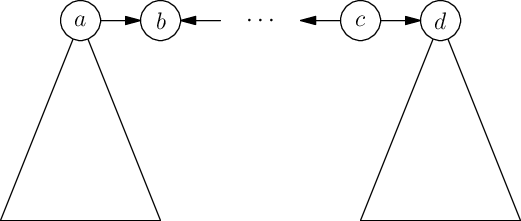
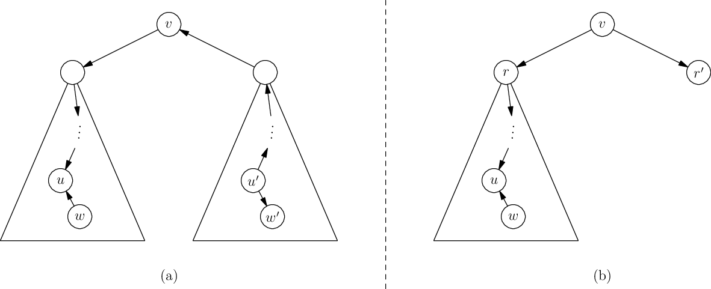
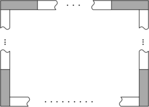
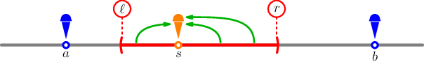
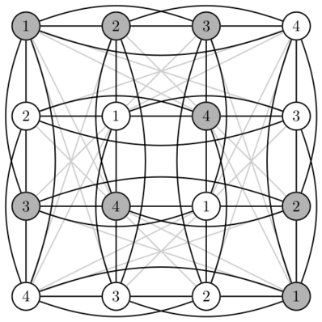
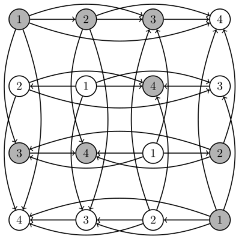
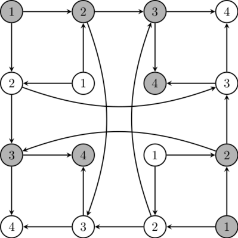
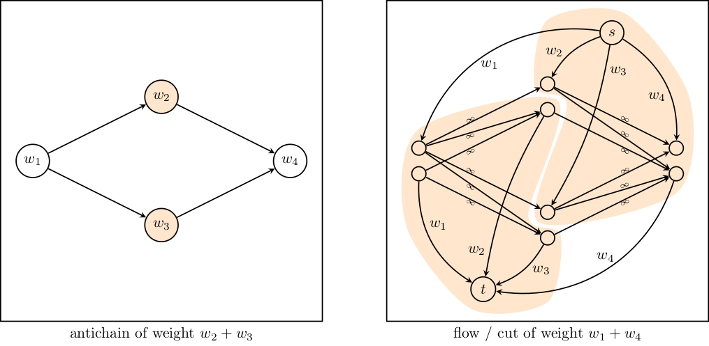

# Tutorial_(en)

Hello Codeforces!

Thanks for taking part in the SWERC 2021-2022 mirror. We hope you enjoyed thinking about the problems.

The contest was intended for a wide range of participants. As such, there were "very easy" to "easy" problems (A, M, H) as well as extremely challenging ones (B and J, neither of which appeared in the official contest, together with C). Some problems demanded the knowledge of specific techniques, algorithms or data structures (e.g. E, G, K, J), while others were purely based on insight and deduction (B, D, N).

But without further ado, let's present the editorial!

  

Solutions
---------

 

---

  

 **Solution of Problem A**
### [1662A - Organizing SWERC](../problems/A._Organizing_SWERC.md "SWERC 2021-2022 - Online Mirror (Unrated, ICPC Rules, Teams Preferred)")

This is the ice breaker problem of the contest. To solve it one shall implement what is described in the statement.

One way to implement it is to keep an array beauty[1…10] (initialized to 0), so that, for 1≤diff≤10, the value beauty[diff] corresponds to the maximum beauty of a proposed problem with difficulty equal to diff. One can update the entries of beauty while processing the input. In the end, if some entries of beauty are still 0 then the correct output is MOREPROBLEMS, otherwise it is the sum of the entries beauty[1]+beauty[2]+⋯+beauty[10].

Notice that the small size of the input allows for less efficient solutions. For instance, one could iterate 10 times over the problems, once for each difficulty, and find the maximum beauty associated with difficulty i during the i-th iteration (this way, array beauty is not needed).

Statement by [dario2994](https://codeforces.com/profile/dario2994 "International Grandmaster dario2994"), preparation by [dario2994](https://codeforces.com/profile/dario2994 "International Grandmaster dario2994")

  

 **Solution of Problem B**
### [1662B - Toys](../problems/B._Toys.md "SWERC 2021-2022 - Online Mirror (Unrated, ICPC Rules, Teams Preferred)")

Toys is one of the most challenging problems of the contest, but no particular knowledge of algorithms and data structures is required to solve it. We propose two greedy solutions that start with a common reformulation of the problem statement. The limit to the length of the three names is very permissive (≤1000), so there is no need to pay much attention to computational efficiency.

Problem reformulation and notations

Suppose to have a set of sheets that allows to spell all three names. Once we fix the way all names are spelled, each sheet either contributes to the i-th name with a letter xi or does not contribute to the i-th name. In the latter case, we conventionally set xi=⋆. The triplet (x1,x2,x3) consists of three English letters (A-Z) or ⋆, with the constraint that at most two different English letters can occur (we say that such a triplet is valid).

The problem can then be reformulated as follows: find a set of valid triplets (x11,x12,x13),…, (xm1,xm2,xm3) of minimal size m such that, for each i∈{1,2,3}, the letters x1i,…,xmi are a permutation of the i-th name with some extra ⋆'s. A set of valid triplets satisfying this property (not necessarily of minimal size) will be called an admissible set; if it is also of minimal size, it will be called an optimal admissible set.

For instance, in the first sample, the two sheets AG and AM can be represented by the triples (A,G,A) and (A,A,M) to form the three names AA, GA, MA. In the second sample (where the three names are TEDDY, HEDWIG, and RACCOON), the eight sheets of the sample output can be represented by the triplets in the following columns: 

 

| T | ⋆ | Y | D | D | E | ⋆ | ⋆ |
| --- | --- | --- | --- | --- | --- | --- | --- |
| ⋆ | H | ⋆ | G | D | E | I | W |
| A | C | C | ⋆ | O | R | N | O |

 Denote by fi(x) the number of occurrences of the letter x in the i-th name. Let f(x)= (f1(x), f2(x), f3(x)). For instance, in the second sample, f(D)=(2,1,0). Denote by l1,l2,l3 the lengths of the three names.

Comments on the sample inputs/outputs

The first sample (where the three input names are AA, GA, MA) is very small but it already shows that one can cleverly construct a solution with only two sheets, by putting the G and the M in two different sheets. If we are not careful and put the G and the M on the two sides of the same sheet, then we are forced to use a total of three sheets which is sub-optimal. Note that AA, GA, and MA are indeed among Vittorio's early favorite words.

A trivial lower bound to the number of sheets needed is max(l1,l2,l3). The second sample (TEDDY, HEDWIG, RACCOON) is a case where max(l1,l2,l3)=7 sheets are not enough. To become convinced that this is indeed the case, one can try to construct an admissible set of 7 triplets having the letters of RACCOON in the third positions. None of the letters of RACCOON is reusable in the other two names, so the only way to save some space is to have two D's on one sheet and two E's on another sheet (these are the letters in common between TEDDY and HEDWIG). Since l1+l2=11, we would still need 9 sheets. If we try instead to construct 8 sheets, one of them is not required to spell RACCOON (so the corresponding triplet has a ⋆ in the third position) and so it can fit two different letters from TEDDY and HEDWIG (for instance, D and G in the sample output).

At this point, one could guess that the minimal number of sheets is given by the formula max(l1,l2,l3,⌈12∑xmaxf(x)⌉). Indeed, each of the four terms inside the max is a lower bound to the minimal number of sheets: this is clear for l1,l2,l3; the summation in the fourth term is a lower bound on the number of letters that need to be written on all the sheets, and each sheet has space for two letters, hence the 12 factor. However, it turns out that this lower bound might not be attained. In fact, in the third sample (BDC, CAA, CE), the lower bound is max(3,3,2,3)=3 but at least 4 sheets are needed.

First solution

We start with the following observation. It is relatively simple, but it will turn out to be very useful.

Lemma 1. If f1(x)≥f2(x)≥f3(x) and f1(x),f2(x)>0, then there exists an optimal admissible set that includes a triplet of the form (x,x,y) for some y.

Proof. Suppose to have an optimal admissible set where no triplet has the form (x,x,y). There is at least one triplet s1=(x,y,y′) where x appears in first position (but not in second) and at least one triplet s2=(z,x,z′) where x appears in second position (but not in first). If s1 can be chosen so that y,y′≠x, then we can replace s1 and s2 with the valid triplets (x,x,z′), (z,y,y′). If s2 can be chosen so that z,z′≠x, then we can replace s1 and s2 with the valid triplets (x,x,y′), (z,y,z′). If none of the previous cases occurs, all triplets containing x are of the form (t,t′,x). Therefore, f3(x)≥f1(x),f2(x). This implies that f1(x)=f2(x)=f3(x), so all triplets containing x are equal to (x,x,x). ◼

We now describe the first and most important step in our solution. As long as the hypothesis of Lemma 1 holds for some letter x with f1(x)+f2(x)+f3(x)≥3, replace one occurrence of the letter x in the first and second name with a new letter x′ (not appearing in any of the three names and not necessarily belonging to the English alphabet). This operation does not decrease the minimal number of triplets needed: any set that is admissible for the three new names is also admissible for the old names, after replacing x′ with x. Thanks to Lemma 1, the minimal number of triplets needed remains the same.

When the hypothesis of Lemma 1 does not hold anymore (even after reordering the three names), each letter appears either in at most one name (possibly several times) or exactly twice across all three names. For each letter x that appears in only one name (say, k times), replace all occurrences of x with different new letters x1,…,xk. This does not impact the optimal size of an admissible set, because all occurrences of x necessarily appear in different triplets. After this operation, every letter appears at most once in each name and at most twice across all three names.

For instance, the three names of the second sample could become as follows (we create new letters by adding subscripts to standard English letters): T1E1D1D2Y1, H1E1D1W1I1G1, R1A1C1C2O1O2N1. We say that a letter is double if it appears twice across the three names (such as D1 in the previous example) and single if it appears once (such as D2).

After changing the three names as described above, our greedy solution is as follows. 

 

2. As long as there are a double letter x and a single letter y that appear in different names (assume without loss of generality that x appears in the first two names and y appears in the third), create a valid triplet (x,x,y) and erase the occurrences of x and y from the three names.
3. As long as there are three double letters x,y,z with f(x)=(1,1,0), f(y)=(0,1,1), and f(z)=(1,0,1), create the two valid triplets (x,x,z) and (z,y,y), then erase all occurrences of x,y,z from the three names.
4. As long as there is a double letter x (assume without loss of generality that it appears in the first two names), create a valid triplet (x,x,⋆) and erase the two occurrences of x in the first two names.
5. As long as at least two names are non-empty, take letters x,y from the two longest names (assume without loss of generality that they are the first and the second name), create a valid triplet (x,y,⋆), and erase the occurrences of x and y.
6. As long as exactly one of the names is non-empty (assume without loss of generality that it is the first), create a triplet (x,⋆,⋆) using a letter x of the first name and erase x from the first name.

The following lemmas show that the solution we have just described leads to an optimal set of triplets.

Lemma 2. Suppose that x is a double letter and y is a single letter with f(x)=(1,1,0) and f(y)=(0,0,1). Then there exists an optimal admissible set that includes the triplet (x,x,y).

Proof. An optimal admissible set necessarily contains one triplet of the form (z,z′,y) with z,z′≠y. We can swap z with the only occurrence of x in the first position of some triplet and z′ with the only occurrence of x in the second position of some triplet. All triplets remain valid after this operation. ◼

Lemma 3. Suppose that the hypothesis of Lemma 2 does not apply. If x,y,z are double letters with f(x)=(1,1,0), f(y)=(0,1,1), and f(z)=(1,0,1), then there is an optimal admissible set that includes the triplets (x,x,z) and (z,y,y).

Proof. An optimal admissible set necessarily contains one triplet of the form (x,x,z′). Since there are no single letters (otherwise, the hypothesis of Lemma 2 would hold), z′ is a double letter, so the solution also contains a valid triplet (z′,y′,y") or (y′,z′,y") with y′,y"≠z′. In the first case, swap the two occurrences of z′ with the two occurrences of z; then swap y′ with one occurrence of y and y" with the other occurrence of y. We obtain the valid triplets (x,x,z) and (z,y,y), as desired. In the second case, we can similarly obtain (x,x,y) and (z,y,z). One additional swap of y and z in the third position leads to (x,x,z) and (z,y,y). ◼

Lemma 4. Suppose that the hypotheses of Lemmas 2 and 3 do not apply. If x is a double letter with f(x)=(1,1,0), then there is an optimal admissible set that includes the triplet (x,x,⋆).

Proof. Among all optimal admissible sets, choose one which maximizes the number of triplets with two equal letters ≠⋆. The chosen set necessarily includes a triplet of the form (x,x,y) with y≠x. We are going to prove that y=⋆ (using the maximality assumption). Suppose by contradiction that y≠⋆. Then y is a double letter, otherwise, Lemma 2 would apply. Therefore, the set includes a valid triplet of the form (y,z,z′) or (z,y,z′), for some z,z′≠y; without loss of generality, assume that the first case occurs. If z=z′ is a double letter, then Lemma 3 applies, which is a contradiction. This means that at least one of z and z′ is ⋆. We can then swap the y and the z′ in the third positions, obtaining the valid triplets (x,x,z′) and (y,z,y). This increases by 1 the number of triplets with two equal letters, violating the maximality assumption. ◼

Lemma 5. Suppose that there are single letters only. If the lengths of the three names satisfy l1≥l2≥l3 and l1,l2>0, then there is an optimal admissible set that includes a triplet (x,y,⋆) where x is any (single) letter of the first name and y is any (single) letter of the second name.

Proof. Suppose by contradiction to have an optimal set with no triplets of the form (x,y,⋆). For i∈{1,2,3} denote by ti the number of triplets with one single letter at position i and two ⋆; for 1≤i<j≤3, denote by ti,j the number of triplets with single letters at positions i and j. At most one of t1,t2,t3 is non-zero, otherwise, we could merge two triplets into one, which goes against the optimality assumption. In addition, t1,2=0. By counting the letters occurring in each position of the triplets, we easily get l1=t1+t1,3, l2=t2+t2,3, and l3=t3+t1,3+t2,3. Since at least one of t1 and t2 is zero, we have that l3≥min(l1,l2), so l2=l3. This forces t3=0 and t2=t1,3. If t2=t1,3>0, then there is at least one triplet of the form (x,⋆,z) and one the form (⋆,y,⋆); we can swap x and ⋆ the first positions to obtain (x,y,⋆) and (⋆,⋆,z), as desired. Otherwise, t2=t1,3=0, so t1≥t2,3>0 and we conclude in a similar way by transforming two triplets of the form (x,⋆,⋆) and (⋆,y,z) into (x,y,⋆) and (⋆,⋆,z). ◼

Second solution

The alternative solution we propose does not use the idea of changing the letters. Instead, the key greedy step is the following: as long as one name (say, the first) contains a letter x with f1(x)>f2(x)+f3(x) and the other two names contain a common letter y with f1(y)<f2(y)+f3(y), we create the triplet (x,y,y) and decrease the length of the three names by 1. The optimality of this step is proved in Lemma 8 below. Once this can no longer be done, we are left with four possible cases (described by Lemma 9 below) and we show how to conclude greedily in each case: one case is in common with the first solution; in the other three cases, there is an admissible set of size max(l1,l2,l3) which is clearly optimal (since we need at least one triplet for each letter of the longest name).

Lemma 6. Suppose that f1(x)>f2(x)+f3(x) for some English letter x. Then any admissible set includes a triplet (x,y,y′) with y,y′≠x, where y and y′ can be either English letters or ⋆.

Proof. For all i∈{1,2,3}, any admissible set must have exactly fi(x) triplets with x in the i-th position. Therefore, at least one triplet has x in the first position but not in the second or third position. ◼

Lemma 7. Suppose that f1(x)<f2(x)+f3(x), f2(x)>0, and f3(x)>0, for some English letter x. Then there is an optimal admissible set that includes a triplet (y,x,x) where y can be either an English letter or ⋆.

Proof. Fix an optimal admissible set. If at least one triplet has x both in the second and third position, then we are done. Otherwise, the inequality f1(x)<f2(x)+f3(x) ensures that at least one triplet s1 has x in the second or third position but not in the first position. Suppose without loss of generality that s1=(z,z′,x) with z,z′≠x. Since f2(x)>0, there exists at least one triplet s2 of the form (y,x,y′). We can then replace the triplets s1 and s2 with the following two valid triplets: (y,x,x) and (z,z′,y′). ◼

Lemma 8. Suppose that f1(x)>f2(x)+f3(x), f1(y)<f2(y)+f3(y), and f2(y),f3(y)>0 for some English letters x,y. Then there is an optimal admissible set that includes a triplet (x,y,y).

Proof. By Lemma 7, there exists an optimal admissible set that includes a triplet s1 of the form (z,y,y). If z=x, then we are done. Otherwise, by Lemma 6, the set also includes a triplet s2 of the form (x,t,t′) with t,t′≠x. We can then replace s1 and s2 with the following two valid triplets: (x,y,y) and (z,t,t′). ◼

Lemma 9. If the hypothesis of Lemma 8 does not apply, we are in at least one of the following cases: 

1. For all letters x, the numbers f1(x),f2(x),f3(x) form the sides of a (possibly degenerate) triangle.
2. Up to changing the order of the three names, f1(x)≥f2(x)+f3(x) for all letters x.
3. One of the names is empty.
4. The three names have disjoint letters.

Proof. We say that the first name is beautiful if f1(x)>f2(x)+f3(x) for at least one letter x, and we analogously define beauty for the second and third name. 

* If none of the three names is beautiful, then we are in case (1).
* If exactly one name is beautiful (say, the first one), then f1(x)>f2(x)+f3(x) for some letter x; if f1(y)<f2(y)+f3(y) for some y, then f2(y),f3(y)>0 (otherwise, the second or third name would be beautiful), so Lemma 8 applies, which is a contradiction. Therefore we are in case (2).
* If exactly two names are beautiful (say, the first and the second name), we are going to prove that the third name is empty, so we are in case (3). Indeed, suppose by contradiction that the third name contains some letter y. Then f3(y)≤f1(y)+f2(y) because the third name is not beautiful, so at least one other name (say, the second) contains the letter y. Since the first name is beautiful and Lemma 8 does not apply, we have f1(y)≥f2(y)+f3(y) and in particular, the first name also contains the letter y. Similarly, since the second name is beautiful and Lemma 8 does not apply (after swapping the first and second name), we get f2(y)≥f1(y)+f3(y). Combining the previous two inequalities, we get f1(y)≥f2(y)+f3(y)≥f1(y)+2f3(y), so f3(y)=0, a contradiction.
* Finally, if all three names are beautiful, we are going to prove that we are in case (4). Indeed, suppose by contradiction that two names (say, the second and the third) have a letter y in common. Since the first name is beautiful and Lemma 8 does not apply, we have f1(y)≥f2(y)+f3(y), so in particular the first name also contains y. Since the second name is beautiful and Lemma 8 does not apply, we also have f2(y)≥f1(y)+f3(y), which is a contradiction because f3(y)>0. ◼

If we are in case (2), we easily conclude with l1 additional triplets. If we are in case (3), assuming without loss of generality that the third name is empty, we conclude with additional max(l1,l2) triplets. Case (4) is handled as in Lemma 5 at the end of the first solution (we are left with single letters only).

Only case (1) remains, and we are going to show that in such case we can conclude with max(l1,l2,l3) additional triplets. We say that the first and second names are friends if there is a letter x such that f1(x),f2(x)>0 and f1(x)−1,f2(x)−1,f3(x) form the sides of a triangle (we say that the letter x proves the friendship between the first and second names). We define the friendship for the other two pairs of names analogously. Iteratively proceed as follows: 

1. As long as there is a letter x such that f1(x)−1,f2(x)−1,f3(x)−1 form the sides of a triangle, we create a triplet (x,x,x) and erase one occurrence of x from each name.
2. As long as each name is a friend of the other two, then let x,y,z be three letters that prove the friendships. We create two triplets (x,x,y) and (z,y,z), then erase x and z from the first name, x and y from the second name, y and z from the third name.
3. If we are not in case (1) or (2), suppose without loss of generality that the second and third names are not friends. We are going to prove that f1(x)≥f2(x)+f3(x) for all letters x, so we can conclude as in case (2). If f2(x)=0, then f1(x)=f3(x) (because we are in case (1)), and similarly f3(x)=0 implies f1(x)=f3(x). In both these cases, f1(x)≥f2(x)+f3(x). We can therefore assume that f2(x),f3(x)>0. Since the second and third names are not friends, we have f1(x)>f2(x)−1+f3(x)−1, i.e., f1(x)≥f2(x)+f3(x)−1. Since we are not in case (a), we necessarily have f1(x)≥f2(x)+f3(x).
Statement by [Giove](https://codeforces.com/profile/Giove "Master Giove"), preparation by [Giove](https://codeforces.com/profile/Giove "Master Giove")

  

 **Solution of Problem C**
### [1662C - European Trip](../problems/C._European_Trip.md "SWERC 2021-2022 - Online Mirror (Unrated, ICPC Rules, Teams Preferred)")

Warm-up problem

Let us consider a related simpler problem first. Let G be the graph that represents the cities and roads in the problem statement and let A be its adjacency matrix. Suppose that instead of special trips we wanted to compute the number of distinct trips of length k that begin and end in the same city. We can use an important property of the adjacency matrix A.

Lemma 1. For any k≥1, the (i,j)-th entry of the k-th power of A, (Ak)ij is equal to the number of trips of length k that start at i and end at j.

Proof. For k=1 this is obvious from the definition of adjacency matrix. Assume the lemma holds for k≥1 and consider the matrix Ak+1=AkA. By the inductive hypothesis, (Ak)ij is equal to the number of trips of length k that start at i and end at j. Now, the number of trips of length k+1 between i and j is equal the number of trips of length k from i to some vertex l adjacent to j, but this is given by AkA, so the result follows by induction. ◼

Thus, to compute the number of trips of length k that begin and end in the same city we only need to compute Ak and sum the elements in the diagonal of the matrix (this is called the trace of the matrix). To do so efficiently, we can use the binary exponentiation technique, which is summarized in the following recursive approach. Let I=[10⋯001⋯0⋮⋮⋱⋮00⋯1] be the identity matrix. Then:

Ak={Iifk=0,(Ak2)2ifk>0andkeven,(Ak−12)2⋅Aifk>0andkodd.

Since we half the exponent in each step, this procedure takes O(logk) steps. In each step we perform one or two matrix multiplications of two n×n square matrices, which takes (with the naïve algorithm) O(n3) time. Overall this algorithm takes O(n3logk) time to compute the answer.

Full problem

Let us now turn our attention back to the problem of computing the number of special trips that begin and end in the same city. There is no simple matrix whose powers correspond to special trips, but we can try to reason about how to describe these trips in terms of the adjacency matrix. Let S(k) be an n×n matrix whose (i,j) entry is equal to the number of special trips of length k that start in i and end in j. Additionally, let D be the degrees matrix, a diagonal matrix where Dii is equal to the degree of vertex i in G.

Lemma 2. The following equalities hold. 

* S(1)=A.
* S(2)=A2−D.
* S(k)=S(k−1)⋅A−S(k−2)⋅(D−I), for k>2.

Proof. For k=1 it is clear that the special trips of length 1 are equivalent to edges in the graph. For k=2, we know that A2 corresponds to trips of length 2. Special trips cannot use the same edge twice in a row, but A2 ignores this constraint. However, the length 2 trips that use two edges in a row are exactly the trips that start in a vertex v, follow one of the deg(v) adjacent edges, where deg(v) is the degree of v, and then follow that same edge back. The number of such trips is given exactly by D, so by subtracting this matrix from the total number of trips of length 2 we get S(2)=A2−D.

Now consider k≥3. Note that S(k−1)⋅A is the number of trips of length k that do not use the same road twice in a row, except maybe on the very last step. This is almost what we want, but we need to subtract the number of trips that do not use the same road twice in a row, except on the very last step. Applying a similar reasoning as in the k=2 case, this is equal to the number of special trips of length k−2 that end at some vertex v, then follow one of its deg(v) adjacent edges, and finally follow that same edge back. However, we do not need to count the edge that preceded getting to v, since that would lead to walking the same edge twice in the second to last step. The number of such trips is given by S(k−2)⋅(D−I), where D−I is the "degree minus one" diagonal matrix. So the result follows. ◼

We are still not done because it is not obvious how to solve this recurrence efficiently. Note that this is a linear recurrence, so we can use any linear recurrence solving technique. There are several ways of doing this, but let us consider a matrix exponentiation method. Consider the following block matrix:

L=[A−(D−I)I0].

Note that L is a 2n×2n matrix. If we multiply it by some column vector we get:

[A−(D−I)I0][S1S2]=[AS1−(D−I)S2S1].

In particular, this has the exact form of the recurrence in Lemma 2, which means that the product of Lk−2 by a column vector with entries S(2) and S(1) will result in a column vector with entries S(k) and S(k−1). To compute Lk−2 we can use the same binary exponentiation method from the first section, so overall this method takes O(n3logk) time.

Statement by [gangsterveggies](https://codeforces.com/profile/gangsterveggies "Master gangsterveggies"), preparation by [gangsterveggies](https://codeforces.com/profile/gangsterveggies "Master gangsterveggies")

  

 **Solution of Problem D**
### [1662D - Evolution of Weasels](../problems/D._Evolution_of_Weasels.md "SWERC 2021-2022 - Online Mirror (Unrated, ICPC Rules, Teams Preferred)")

To solve the problem we need the following observations.

* Every mutation is reversible. Hence, instead of trying to find a sequence of mutations of the string u to get to the string v, we can try to find a sequence of mutations of the string u and a sequence of mutations of the string v such that both of them are the same after the mutations.
* In all possible mutations, we never change the parity of the occurrence of a character. Thus, if the parity of the occurrences of A, B and C is not the same in u and v, there does not exist a sequence of mutations to get from u to v. For the rest of the solution we assume that the parities are the same in both strings.

We can transform the string AB to the string BA via the following sequence of moves: start with AB, then insert BB at the back of the string to get ABBB, then insert the string ABAB in the second to last position to get ABBABABB. Removing the two occurences of BB we get the string AABA and then removing AA we get to BA. A similar trick can be done to transform the string BC to the string CB. While this series of steps might seem magical, viewing the problem as a group theoretic problem (see a later section) gives us this observation almost for free. 

The observation above tells us that we can move the letter B to any position we want and can essentially ignore it; let u′ and v′ be the strings we obtain from u and v when removing all occurrences of B. When ignoring the letter B, the strings ABAB and BCBC are the same as the strings AA and CC, thus we now have strings consisting of the letters A and C and we can add and remove substrings of the form AA and CC. This is a much easier problem. We can iteratively remove occurences of AA or CC from u′ and v′ until no removal is possible anymore. If the strings are the same after the removal, a sequence of mutations is possible, otherwise it is not. 

Optimizing the runtime. If we remove occurrences of AA and CC iteratively the runtime of our algorithm is quadratic (in the length of the strings), which is fast enough to pass. There exists a linear time algorithm: Keep a stack of the substring you visited but could not remove (at the beginning, this is empty). Then iterate through your string. If the letter you currently look at is the same as the last letter in your stack, delete the last letter in your stack. If not add the letter to your stack.

Viewing the problem as a group theoretic problem 

This is a different perspective on the problem and might require some knowledge about groups and their presentations to understand. In the language of groups, the problem statement can be reformulated as follows: Do the words u and v represent the same element in the group G={A,B,C∣A2=B2=C2=ABAB=BCBC=1}? The words u and v represent the same element if and only if w=uv−1 represents the identity in G. Furthermore A and B commute: A2=1 implies that A=A−1 and the same holds for B and C. Thus, 1=ABAB=ABA−1B−1, which directly implies AB=BA. Analogously, we get that BC=CB. 

Now the only thing left to check is: 

* Does the letter B occur evenly many times in w?
* After deleting all occurences of B from w, can we get from w to the empty word by deleting AA or CC?

If the answer to one of those questions is no, then w does not represent the identity. If both answers are yes, w does represent the identity.

Some background about the problem. The problem of telling whether two words represent the same element in a group is called the word problem, and is a widely studied problem in Mathematics. While it is proven to be unsolvable for some groups, the group G we are dealing with in this problem is a Coxeter group, where the word problem is always solvable using [Tits' algorithm](https://codeforces.com/https://iubm623.wordpress.com/2009/10/06/tits-solution-to-the-word-problem-for-coxeter-groups/). 

Statement by [tap_tapii](https://codeforces.com/profile/tap_tapii "Candidate Master tap_tapii"), preparation by [tap_tapii](https://codeforces.com/profile/tap_tapii "Candidate Master tap_tapii")

  

 **Solution of Problem E**
### [1662E - Round Table](../problems/E._Round_Table.md "SWERC 2021-2022 - Online Mirror (Unrated, ICPC Rules, Teams Preferred)")

Main assumption

After playing a bit with the second sample test case one can notice that there are many sequences of swaps of the same length that achieve the same result, and as long as we always swap two people such that the person with a larger number is on the left before the swap, then we always achieve the goal in the minimum number of swaps.

Let us first construct a solution which relies on this assumption, and then prove that the assumption is correct. We need to find any way to arrive at the given permutation from the initial one such that in each swap the person with a larger number is on the left, and count the number of swaps needed efficiently.

Algorithm

We will construct our permutation in steps. After the i-th step, the people with numbers from 1 to i will be in the correct circular order, and the people with numbers from i+1 to n will be sitting in the order of their numbers directly to the right of person i.

In the starting arrangement the condition above is already satisfied for i=2, since there is just one circular order for two people.

To perform the (i+1)-th step, we need to do the following: person i+1 is currently sitting to the right of person i, but they need to be sitting to the right of some other person ji which is determined as the closest person on the left of person i+1 that has a number between 1 and i.

Since we cannot move the person i+1 to the left, as we cannot swap person i and person i+1, the only way to achieve this is by moving person i+1 to the right. But we can't do this directly because person i+2 is there, so what we are going to do is move the entire block of people from i+1 to n to the right.

Moving the block of people from i+1 to n by one position to the right takes n−i swaps, and we need to do this di times where di is the circular distance from person i to person ji when going to the right, and only considering people with numbers from 1 to i.

The total number of swaps can therefore be computed as f(p)=n−1∑i=2di(n−i). The numbers di can be computed using a standard data structure such as a segment tree, a Fenwick tree, or a balanced search tree in O(nlogn).

Proof of the main assumption

Now we need to repay our debts and prove the assumption. It suffices to prove the following.

Lemma. If a permutation q differs from a permutation p in only one swap of adjacent elements a (on the left) and b (on the right) such that a>b, then f(q)−f(p)=1, where f(p) is the number of operations used by the above algorithm.

Proof. Indeed, almost all terms in f(p) and f(q) sums will be the same. Which terms are going to differ? The quantity da−1 will increase by 1, since the person a will now need to travel one more step to the right to overtake b. Conversely, da will decrease by 1, since the person a+1 will now need to travel one less step to the right as they will have already overtaken b earlier. All other values of di will stay unchanged. So f(q)−f(p)=(n−(a−1))−(n−a)=1. ◼

By applying the lemma in reverse, we can also see that performing a swap where the largest element is on the right will decrease f(p) by 1. So every swap either increases or decreases f(p) by 1, and f(id)=0 (id stands for the identity permutation), therefore f(p) is indeed the smallest number of swaps needed to reach permutation p, and it does not matter in which order we make the swaps as long as we always make swaps where the person with a larger number is on the left.

Parting words

This problem was inspired by the following paper, where you can learn more about this setup: Abram, Antoine, Nathan Chapelier-Laget, and Christophe Reutenauer. "[An Order on Circular Permutations.](https://codeforces.com/https://www.combinatorics.org/ojs/index.php/eljc/article/view/v28i3p31/pdf)" The Electronic Journal of Combinatorics (2021): P3-31.

The paper also mentions that this setup was used for [USAMO 2010, Problem 2](https://codeforces.com/https://artofproblemsolving.com/wiki/index.php/2010_USAMO_Problems/Problem_2). We hope that none of the participants have seen the paper or the USAMO problem before.

We found it quite remarkable that the answer is O(n3) in magnitude but the order of swaps does not matter, just like in the non-circular problem without any restrictions on swaps where one would simply count the number of inversions in a permutation. We hope you enjoyed solving this problem, too!

Statement by [Petr](https://codeforces.com/profile/Petr "Legendary Grandmaster Petr"), preparation by [Petr](https://codeforces.com/profile/Petr "Legendary Grandmaster Petr")

  

 **Solution of Problem F**
### [1662F - Antennas](../problems/F._Antennas.md "SWERC 2021-2022 - Online Mirror (Unrated, ICPC Rules, Teams Preferred)")

Let's model the problem as an undirected graph, where the vertex i corresponds to the antenna i and vertices i and j are connected with an edge if and only if the corresponding antennas are able to communicate directly, that is |i−j|≤min(pi,pj). In this formulation, the answer to the question posed in the problem statement is simply the shortest distance between a and b. 

To compute the shortest distance, we would like to be able to construct the graph and run a breadth-first search. Unfortunately, we cannot afford to do that, as the number of edges can be in the order of n2. We need a more efficient approach. We examine two options.

Improving the BFS

The inefficiency of a breadth-first search on a dense graph lies in the fact that the majority of the traversed edges lead to a vertex that has already been visited. Ideally, for every vertex, we would like to process only one of the incoming edges. Should we achieve this property, the running time would be linear in the number of vertices, not in the number of edges. 

Let's decompose each edge into two directed edges, one in each direction. As soon as we traverse the first edge incoming to a particular vertex, we remove all other edges incoming to this vertex. This idea leads to the desired property of only processing each vertex once, nevertheless on its own it doesn't affect the time complexity as we still generate the full graph.

Let's consider for a brief moment how can we generate the graph in the first place. A naïve approach is to consider, for a fixed i, all 1≤j≤n and check whether i and j can communicate with each other. However, we can observe that we do not need to test all j's up to n — it is sufficient to only iterate up to min(n,i+pi), because |i−j|=j−i≤pi must hold. Similarly, a tighter lower bound for the iteration is max(1,i−pi) instead of i.

We can do even better than that. Define lj:=j−pj. For j∈(i,i+pi] to be able to communicate with i, we just need lj≤i. Similarly, for j∈[i−pi,i) we need rj:=j+pj≥i. To summarise, we need to find all j∈[i−pi,i) such that rj≥i and all j∈(i,i+pi] such that lj≤i. We can do this by storing the values rj and lj in two segment trees that return the minimum and maximum on a queried interval, respectively, together with the index where this minimum or maximum is achieved, and querying the appropriate interval as long as the inequality rj≥i or lj≤i holds. Now, recall the previous idea — removing all edges incoming to a vertex once we find its distance from a. In this implementation, we can achieve this in O(logn) time by simply setting the corresponding lj to ∞ and rj to −∞.

Using these techniques, we can process a vertex in O(dlogn), where d is the out-degree of the vertex when we are processing it. Since, for each vertex, we only process at most a single incoming edge, the total running time is O(nlogn). 

Iterating on a restricted problem

Let us consider a restricted version of the problem. In this version, antenna i is allowed to send a message to j if |i−j|≤min(pi,pj) and i<j. In other words, a message can only be sent to an antenna with a strictly larger index, and never in the opposite direction. This problem can be solved by a single sweep, as follows.

Maintain a segment tree S of size n, that returns the minimum on an interval, and supports single element update. We process the antennas in order of increasing index. When processing an antenna i, we do the following operations: 

* Set S[i]=dist[i] where dist[i] is the length of the shortest known path from a to i. Initially dist[a]=0, and all other values are initialised to ∞.
* For all antennas j such that j+pj−1=i (i.e. j is able to reach i−1 but not i), set S[j]=∞.
* Set dist[i]=1+S.min(i−pi,i).

The purpose of removing an antenna by setting S[j]=∞ is evident — as the antennas are processed in order of increasing indices, we know that none of the antennas to be processed can communicate with j. The complexity of this algorithm is O(nlogn). Note that it is trivial to modify this algorithm for a version of the problem where all communication goes to antennas with a lower index instead.

How does this help to solve our original problem? We can alternate between the two versions — the one that only allows communication towards antennas with larger indices (i.e. to the right), and the one with smaller ones (i.e. to the left). This process is repeated while the array dist is changing. Once a fixed state is reached, we have a correct solution.

We argue that only O(logn) iterations of this outer loop will be performed, in other words there exists a shortest path that "changes direction" at most O(logn) times. The basic idea of the proof is that when two successive direction changes are performed, the distances between antennas at least doubled, otherwise there would exist a path of a shorter or equal length with fewer direction changes. The details of the proof are left as an exercise to the reader.

All things considered, this yields an O(nlog2n) algorithm, which is sufficient given a careful implementation.

Statement by [Simon](https://codeforces.com/profile/Simon "Candidate Master Simon"), preparation by [majk](https://codeforces.com/profile/majk "International Grandmaster majk")

  

 **Solution of Problem G**
### [1662G - Gastronomic Event](../problems/G._Gastronomic_Event.md "SWERC 2021-2022 - Online Mirror (Unrated, ICPC Rules, Teams Preferred)")

This is a classical problem in which one must find a "simple" characterization of what the optimal solution looks like, and then restrict the search for the maximum to the (much smaller, much more regular) family of instances that satisfy the characterization.

In our specific case, the first part of this paradigm is by far the most difficult and the one that requires all the important insights, while the second part can be solved through the application of a standard technique. We are going to split the core of the solution in two parts, the first of which deals with the characterization of optimal solutions. Then, in the second, we will explain how to compute the answer efficiently in the restricted search space and we will discuss some improvements and further considerations.

Preliminary observations and notation

First, however, let us set up the bases. It goes without saying that we are dealing with a graph — actually, a tree — problem. Also, the statement is deceptively straightforward: assign a permutation of {1,…,n} to the vertices so as to maximize the number of increasing paths.

And here comes the first non-trivial (however simple) idea: we are actually going to consider ways to orient the edges of the tree, and find an orientation that maximizes the number of directed paths; we forget about the vertex numeration altogether. After all, an assignment of the numbers 1,…,n naturally induces an orientation of the edges, where edge (u,v) points towards v if u<v and towards u otherwise. This begs the question of whether the converse is also true, i.e., does an orientation of the edges "induce" a numbering of the vertices? The answer is, in general, no. Nevertheless, we would still be happy if it were true that every orientation is induced by at least one numbering (for this would mean that, in switching to the orientation perspective, we wouldn't be considering forbidden configurations). Luckily, it is, and it follows immediately from the existence of a topological sorting of the vertices of a directed tree (which is, in fact, a DAG): just number the vertices in their topological order! (Incidentally, note that any topological order works, and since it is generally not unique, neither is the numbering.)

From now on, we shall call a path any path in the undirected tree, as opposed to directed path which refers to the underlying orientation of the edges (supposing we have fixed one in the context of the sentence). A single vertex is both a path and a directed path. Given an orientation of the tree, we call its value the number of directed paths it produces; therefore, the problem asks to maximize the value of an orientation. We say that a (directed) path has length ℓ if it is made up of ℓ vertices. Finally, we denote d(u,v) the distance between u and v in the undirected tree.

Characterizing the optimal solutions

The next two results are crucial.

Lemma 1. Fix an orientation of the edges. Suppose there exist four distinct vertices a, b, c and d such that (refer to the figure below for clarity): 

* there are edges a→b and c→d;
* there is a directed path from c to b.

 Then, we can produce an orientation with a higher value by either reversing the edge a→b and all the edges in the subtree rooted at a which does not contain b, or by reversing the edge c→d and all the edges in the subtree rooted at d which does not contain c.  Proof. Let's see what happens, in terms of value, when we reverse edge a→b and the subtree rooted at a. Let: 

* A be the number of directed paths (in the initial orientation) ending at a, including the path of length 1;
* Bout be the number of directed paths of length ≥2 starting at b;
* Bin be the number of directed paths of length ≥2 ending at b that do not go through edge a→b.

 When inverting the edges, most paths stay the same (or are inverted as a whole). It isn't hard to see that only two kinds of paths change in nature (that is, either become or cease to be directed). The directed paths starting at a vertex in the subtree rooted at a, going through edge a→b, and ending at some vertex u≠b, are no longer directed after the inversion; there are A⋅Bout of these. However, the (non-directed) paths of the form v→⋯→b←a←⋯←w, where the first part has only right-edges, the second part has only left-edges, and v≠b, become directed. There are A⋅Bin of these. Adding up the contributions, we get that the value difference is Δ1=A(Bin−Bout).With similar reasoning and notation, if we invert the edge c→d and the subtree rooted at d, the vaue increases (or decreased) by Δ2=D(Cout−Cin). Now, since every directed path beginning at b can be extended to the left until we get to c (i.e. we can pre-append the path c→⋯→b), and since c→⋯→b is itself a path beginning at c, it holds Cout≥Bout+1. Likewise, we can prove Bin≥Cin+1. Thus, (Bin−Bout)+(Cout−Cin)≥2 and without loss of generality Bin−Bout>0, which implies, since A>0, that Δ1>0 as desired. ◼

From Lemma 1 it follows that, in an orientation that yields the optimal solution, every path "changes direction" at most once. Formally: given a path (v1,v2,…,vk), there exists at most one index 2≤i≤k−1 such that the path (vi−1,vi,vi+1) is not directed. This condition is equivalent to a very simple property which opens up the way to an efficient algorithm to find the solution.

Lemma 2. Suppose a directed tree satisfies the aforementioned condition. Then, there exists a (not necessarily unique) vertex v∗ such that all paths having v∗ as an endpoint are also directed paths.

Proof. We shall start by fixing an arbitrary vertex v and rooting the tree at v. Call a vertex u≠v evil if it has a child w such that the path (v,…,u,w) changes direction at u. If there are no evil vertices, v is a valid candidate for v∗ and we are done.

Otherwise, all evil vertices must lie in the same v-subtree. Indeed, if u and u′ were two evil vertices belonging to different subtrees, and w, w′ the respective children, the path (w,u,…,v,…,u′,w′) would change direction at least twice (see figure below, (a)). Moreover, if u is an evil vertex and r is the root of its subtree, the edge (v,r) must point in a different direction than all other edges incident on v. To see why, suppose without loss of generality v→r and v→r′≠r; then the path (w,u,…,r,v,r′) changes direction twice (see figure below, (b)).

  Thanks to the previous observations, if we replace v with r the set of evil vertices decreases or stays the same. If we repeat this argument while there are evil vertices, we will produce a downward path in the tree rooted at v, which must stop eventually, at which point the number of evil vertices must vanish. ◼

Thanks to Lemmas 1 and 2 combined, we know that any optimal orientation admits the existence of a vertex v∗ satisfying the property of Lemma 2. This makes us finally able to tackle the problem algorithmically.

Computing the maximum

Call a vertex v∗ that satisfies the property of Lemma 2 a crossroad. We are going to iterate over all n vertices and find the maximum value of an orientation where said vertex is a crossroad.

Thus, fix a vertex v∗ and consider the deg(v∗) subtrees the tree gets split into if we erase v∗. In an optimal orientation, in each subtree all edges point either "inwards" or "outwards": let S be the sum of the sizes of subtrees of the first kind, and T be the sum of the sizes of the subtrees of the second kind. Of course, S+T=n−1. Let's calculate the value of such an orientation. 

* There are n directed paths having v∗ as an endpoint.
* The directed paths lying entirely in one subtree are ∑v≠v∗d(v∗,v).
* Finally, the paths starting in a subtree of the first kind and ending in a subtree of the second kind contribute with an additional S⋅T term.

Observe that the first two terms are independent of S and T. It is trivial to compute the sizes of the subtrees in O(deg(v∗)) after preprocessing. Furthermore, the sum of distances can be updated in O(1) when moving from v∗ to one of its neighbors. As for the third term, it is clear that it is maximized when S and T are as close as possible to n−12. If one of the subtrees has size k≥n2 (there can only be one of those), the way of doing so is trivial: just orient the edges of the big subtree one way, and all other edges the other way, so that ST=k(n−1−k).

The matter is more complicated if all subtrees have sizes smaller than n2. In this case, v∗ is a centroid of the tree. Recall that any tree has exactly one or two centroids — and the latter can only occur if n is even. What we are dealing with is an instance of the knapsack problem: we are given positive integers k1,…,kdeg(v∗) — the sizes of the subtrees — whose sum is n−1, and we shall find a subset whose sum is as close as possible to n−12. The naïve dynamic programming solution runs in O(n2) at worst (with O(n) space), way too slow for our purposes. We can optimize the runtime, reducing it by a factor 32, via the use of bitsets. This is still not enough. There is a standard, yet somewhat advanced, trick to speed the algorithm up to O(n√nsizeof(int)). We won't go over it here, but you can find a complete tutorial in [this Codeforces blog entry](https://codeforces.com/blog/entry/98663) (under Subset Sum Speedup 1), together with a number of other interesting related techniques. Since we only need to run this algorithm at most twice, this final optimization, carefully implemented, does the trick.

Finally, let's comment further on the nature of the characterization. So far, we know very little about the crossroad v∗, but intuitively it makes sense that it should be "in the middle" of the tree in order to yield an optimal solution.

Lemma 3. There is an optimal solution where at least one centroid of the tree is a crossroad.

Proof. Consider an optimal orientation where a vertex v∗, which is not a centroid, is a crossroad. Let τ be the subtree of size ≥n2. We have already observed that all edges of τ must point (WLOG) toward v∗, and all other edges away from v∗. Now let v be the neighbor of v∗ belonging to τ. If we make v a crossroad, by inverting edge v→v∗ and keeping the orientations of all other edges, a simple computation shows that the value of the new configuration has not decreased. We can therefore iterate until we reach a centroid. ◼

Although this result is not necessary to solve the problem, it is relatively easy to guess and prove, and it simplifies the implementation. One can even prove this slightly stronger conclusion: for each centroid, there is an optimal orientation in which it is a crossroad.

[It was briefly considered whether to give this problem with n≤107. It turns out that the "slow" part of the algorithm is not the optimized knapsack, but rather the tree traversal needed to find the centroid. To fit the new constraint, one must come up with a way to do this without any traversal. Taking a look at the input format might be a good starting point...]

Statement by [cescmentation_folch](https://codeforces.com/profile/cescmentation_folch "Grandmaster cescmentation_folch"), preparation by [cescmentation_folch](https://codeforces.com/profile/cescmentation_folch "Grandmaster cescmentation_folch")

  

 **Solution of Problem H**
### [1662H - Boundary](../problems/H._Boundary.md "SWERC 2021-2022 - Online Mirror (Unrated, ICPC Rules, Teams Preferred)")

First, observe that we can tile any rectangle with tiles of size 1×1. From now on, we will consider a fixed a>1. 

Let's investigate what happens in the corners of the rectangle. Each corner is covered either by a tile that is placed horizontally, or by a tile that is placed vertically. Below is an example of one of 24=16 possibilities, with the corner tiles in gray.

  Once we place those tiles (up to 4, fewer if the tile length is greater than w2 or l2) the positions of the rest are uniquely determined. 

We can now put four constraints on the value of a, one for each side of the rectangle. These constraints are of form a∣w−x or a∣l−x, where ∣ is the "divides without remainde" relation, and x is the number of positions on that side that are covered by a tile placed in a perpendicular direction, e.g. a vertical tile on a horizontal side. Clearly, this can only happen in the corners of the rectangle, hence x is between 0 and 2 for all sides. 

In the above figure, the top side yields the constraint a∣w−0, the bottom one a∣w−2, and both the left and right sides a∣l−1. Put together, we have a necessary condition a∣gcd(w−0,w−2,l−1,l−1), where gcd is the greatest common divisor. Clearly, the condition is also sufficient, i.e. for an a fulfilling this divisibility there is a rectangle tiling.

To summarise, we consider all 16 possibilities for the tile orientations in the corners, find the gcd of the constraints using Euclidean algorithm, and then compute its divisiors by a trial division. Finally, we return the sorted set of all the divisors. The total time complexity is O(√min(w,l)) per test case, dominated by the trial division.

Note that some of the 16 cases are the same up to mirroring or rotation, and some are clearly impossible. Hence we only need to factor the following values: 

* gcd(w−1,l−1)
* gcd(w,l−2)
* gcd(w−2,l)
* gcd(w−1,l−2,l)
* gcd(w−2,w,l−1)

The last two can only be 1 or 2, and if they are both 1, this implies that one of the first three gcds is divisible by 2. Therefore a=2 is always a solution — we can simply insert it to the solution set, and only compute and factor the first three gcds. This does not change the asymptotic time complexity, nevertheless it is a useful optimisation.

Statement by [majk](https://codeforces.com/profile/majk "International Grandmaster majk"), preparation by [majk](https://codeforces.com/profile/majk "International Grandmaster majk")

  

 **Solution of Problem I**
### [1662I - Ice Cream Shop](../problems/I._Ice_Cream_Shop.md "SWERC 2021-2022 - Online Mirror (Unrated, ICPC Rules, Teams Preferred)")

Suppose there are ice cream shops located a and b meters to the right of the first hut, such that a<b. If we place our ice cream shop in any location in the interval [a,b] it can only be strictly closer to huts located in the interval (a,b), since any hut located at or before a will be closer to the ice cream shop located at a and any hut located at or after b will be closer to the ice cream shop located at b. We now present two approaches to solve the problem starting from this observation.

First solution

Let a<b be the positions of two ice cream shops, and let us further assume that there is no other ice cream shop between a and b. Of course, it is never convenient to put the new shop at a or b. What happens if we place our new shop at s∈(a,b)? It is easy to see that the only huts whose people will buy ice creams are those in the open interval (a+s2,s+b2). Notice that this interval has length s+b2−a+s2=b−a2, i.e., half the length of (a,b), which is independent of s.

  On the other hand, consider an interval (l,r) such that a≤l<r≤b and r−l=b−a2. If we choose s=2l−a, the interval (a+s2,s+b2) is exactly (l,r). This means that for every interval (l,r) of length b−a2 which lies entirely in (a,b), it is possible to achieve a total number of ice creams given by f(l,r):=∑100i∈(l,r)pi+1. (Recall that the position of the i-th hut is 100(i−1).)

Thus the answer is the maximum of f(l,r), over all intervals such that there exist a and b as above and r−l≤b−a2. Also notice that we can restrict our search to the intervals with l=100k−12 for some 0≤k≤n−1. We can therefore proceed as follows.

* Iterate over k=0,…,n−1.
* For each k, find the greatest xj<100k. This can be done in amortized constant time — or via binary search — after sorting the xj's.
* Compute f(l,r), where l=100k−12 and r=min(xj+1,l+xj+1−xj2) (assume the xj's are sorted). This is easy to do having precomputed the prefix sums of p1,…,pn.
* Return the maximum of all these values.

One must be careful with "boundary conditions", that is, values of k such that 100k lies to the left or to the right of all ice cream shops. These are best handled by introducing two dummy shops at positions −∞ and +∞.

The solution has O(n+mlogm) time complexity and O(n+m) space complexity.

Second solution

Pick again two ice cream shops at a<b, with no other ice cream shops in between, and consider a hut located at h such that a<h<b. If we place our shop in s such that s is between a and h, then we will always be closer to h than the ice cream shop located at a. However, we are only closer than the ice cream shop at b if the distance from s to h is smaller than the distance from h to b. Formally this means h−s<b−h. If we rearrange this expression, we conclude that we will be closer to h if s>2h−b. Analogously, if we place our shop in s such that s is between h and b, we will be closer to h if s<2h−a. Hence, we conclude that if we want to be closer to h then we have to place our shop in the interval (2h−b,2h−a) (note that this is an open interval since we want to be strictly closer to h).

Using this idea, we can now compute for every hut h an interval such that if we place our shop in any point in that interval then our shop will be the closest to hut h. Let us assume we have all these intervals, how do we determine the optimal solution from this information? Notice that the optimal solution is a point that maximizes the sum of the pi of all the intervals it is contained in. We can find this maximum sum efficiently using a sweep-line approach. Picture a vertical line that is going to sweep through all of these intervals from left to right. As this line moves we want to keep the sum of the pi corresponding to the intervals it currently intersects, so we store that value in a counter and whenever the line reaches the starting point of an interval we add its value to the counter, conversely whenever it reaches the endpoint of an interval we subtract its value from the counter. The solution is the maximum value the counter achieves during this process.

To implement this efficiently, the only thing we need to observe is that the only relevant "events" to this procedure are the start- and endpoints of intervals. So our sweep-line algorithm can be implemented as follows: for every interval (li,ri) corresponding to hut pi add a point (li,pi) and a point (ri,−pi) to a list of points. Sort this list according to the first component. Iterate through the sorted points and store a counter (initially 0). Whenever we reach a point (a,b) add b to the counter. This requires time O(nlogn) since we have to sort all of the 2n "event" points and then iterate through them once.

Before doing that, however, we need to compute each hut's interval. To do so we have to determine the closest ice cream shops a and b such that a<h and b>h and then the interval is given by (2h−b,2h−a). If we sort the xi locations of all the ice cream shops we can find this using binary search or by iterating through the huts and ice cream shops simultaneously (this is also known as a two pointers technique). The time complexity of the binary search method is O((m+n)logm), since we first sort the xi and then for each hut we perform one binary search. The time complexity of the two pointers method is O(mlogm+n), since we first sort the xi and then iterate through all the n huts and m ice cream shops once.

Combining all of this we get a solution that runs in O(mlogm+nlogn) time.

Statement by [tap_tapii](https://codeforces.com/profile/tap_tapii "Candidate Master tap_tapii"), preparation by [gangsterveggies](https://codeforces.com/profile/gangsterveggies "Master gangsterveggies")

  

 **Solution of Problem J**
### [1662J - Training Camp](../problems/J._Training_Camp.md "SWERC 2021-2022 - Online Mirror (Unrated, ICPC Rules, Teams Preferred)")

In this task, you are given the ages of n2 kids as a Latin square S (n×n grid such that each row and each column contains all the integers from 1 to n), and you are asked to find a subset containing exactly one kid from each row/column, satisfying a certain "stability" constraint, and maximizing the number of kids who are good at programming.

Definitions 

* A solution μ⊆{1,…,n}2 is a subset of kids containing exactly one kid from each row/column. For convenience, we will denote μi the unique j such that (i,j)∈μ, and μj the unique i such that (i,j)∈μ.
* We say that a kid (i,j) is blocking a solution μ if the age of (i,j) is between the ages of (i,μi) and (μj,j), that is if (Si,j−Si,μi)(Si,j−Sμj,j)<0.
* We say that a solution is stable if there is no blocking kid.

To understand what stability means, we will have a closer look at the second sample. As a first attempt, we can try to draw the graph G containing pairs of kids who cannot belong to the same solution, either because they are on the same row/column (black edges), or because they would create a blocking kid (gray edges). Kids who are good at programming are colored in gray.

  Stable solutions correspond to maximum (cardinality n) [independent sets](https://codeforces.com/https://en.wikipedia.org/wiki/Independent_set_(graph_theory)) in G, which (unfortunalely) are difficult to compute without additional structure, especially because G may contain Θ(n4) edges.

Reducing the problem to maximum-weight antichain

We came to the conclusion that we need to understand the structure of G. For that matter, define the directed acyclic graph →G, which has an edge from kid a to kid b iff they are on the same row/column and a is younger that b. The graph →G has Θ(n3) edges, and an important observation is that edges of G corresponds to paths of length ≤2 in →G.

  After looking at length-2 paths, we may try to look at longer paths. For that matter, denote →G(k) the k-th power of →G, that is the graph which contains an edge from kid a to kid b iff →G contains a path of length ≤k from a to b. In particular, →G(2) is an orientation of the graph G defined in the previous section.

Lemma 1. For all k≥2, the following properties are satisfied. 

1. Any independent set of size n in →G(k) is a stable solution.
2. Maximum independent sets of →G(k) have size n.
3. Stable solutions are independent sets in →G(k).

Proof. To prove (1), observe that →G⊆→G(k) (independent sets contain exactly one kid per row/column) and →G(2)⊆→G(k) (independent sets are stable). To prove (2), observe that a choice of kids having the same age is an independent set, and no set of size >n can be independent (by the pigeonhole principle, some row/column would contain 2 kids). We prove (3) by induction on k. It is true when k=2 by construction. Now choose the smallest k>2 such that there is a path a1→a2→⋯→ak in →G where a1∈μ and ak∈μ for some stable solution μ. By minimality of k, we may assume (without loss of generality) that a1=(i,j′)∈μ, a2=(i,j)∉μ and a3=(i′,j)∉μ. Let a′1=(μj,j)∈μ be the kid selected in row j. By stability of μ, kid a2 is older than both a1 and a′1, therefore there is an edge a′1→a3, which contradicts the minimality of k. ◼

An [antichain](https://codeforces.com/https://en.wikipedia.org/wiki/Antichain) of a partially ordered set is a subset of elements such that no pair of elements are comparable (using transitivity). As a corollary of Lemma 1, stable solutions are exactly the maximum antichains of the partial order induced by →G. Because antichains are defined using the [transitive closure](https://codeforces.com/https://en.wikipedia.org/wiki/Transitive_closure#In_graph_theory), we can simplify the definition of →G while keeping the same transitive closure, so that there is an edge from kid a to kid b iff they are on the same row/column and a is exactly 1 year younger than b. This new definition of →G has Θ(n2) edges, while keeping the property that stable solutions correspond to maximum antichains.

  Finally, remember that our goal was to find the "best" stable solution in terms of number of kids who are good at programming. Thus, we give each kid a weight between 0 and M=1, and our goal is to find a maximum-weight antichain, under the constraint that it is a maximum-cardinality antichain. We deal with the cardinality constraint by adding a large weight ω>n⋅M to each kid, which reduces our problem to finding the maximum-weight antichain.

Reducing maximum-weight antichain to maximum flow

Finally, we are going to reduce the maximum-weight antichain problem to the maximum flow problem. Define a flow graph →F, with two special nodes s (source) and t (target), and two copies v1∈V1 and v2∈V2 of each node v from →G. 

* For each node v of weight w(v) in →G, add two edges s→v1 and v2→t with capacity w(v).
* For each edge u→v in →G, add three edges u1→v1, u2→v2 and u1→v2 with infinite capacity.

Using the [max-flow min-cut theorem](https://codeforces.com/https://en.wikipedia.org/wiki/Max-flow_min-cut_theorem), the maximum s–t flow is equal to the minimum s–t cut. Our reduction is easier to understand when looking at cuts (see picture below). Recall that a cut is partition (S,T) of the nodes, where s∈S and t∈T.

* Given an antichain A in →G, denote X the set of vertices before A and Y the set of vertices after A. We define S:={s}∪{v1:v∈A∪Y}∪{v2:v∈Y} and T:={t}∪{v1:v∈X}∪{v2:v∈X∪A}. The weight of this cut is exactly equal to ∑v∉Aw(v).
* Conversely, let (S,T) be a cut of finite weight. We first show that S∩V1 must be downward closed (if u1∈S and u1→v1, then v1∈S) and T∩V2 must be upward closed (if v2∈T and u2→v2 then u2∈T). Then, A:={v:v1∈Sandv2∈T} is an antichain, and the cut has weight ∑v∉Aw(v).

  Therefore, computing a maximum weight antichain in →G is equivalent to computing a minimum weight cut in →F, which can be done by computing a maximum flow in →F. In terms of complexity, →F has 2+n2 nodes and Θ(n2) edges, which should make any reasonable flow algorithm (such as Edmonds-Karp or Dinic's algorithm) efficient enough.

Dilworth's theorem

The reduction from the previous section can be seen as an application of [Dilworth's theorem](https://codeforces.com/https://en.wikipedia.org/wiki/Dilworth_theorem). In the unweighted case, the theorem states that the maximal size of an antichain is equal to the minimum number of paths necessary to cover all elements. Moreover, minimum path cover in a directed acyclic graph [can be reduced to](https://codeforces.com/https://en.wikipedia.org/wiki/Maximum_flow_problem#Minimum_path_cover_in_directed_acyclic_graph) maximum cardinality matching in a bipartite graph, which in turn can be reduced to maximum flow.

In the weighted case, a generalization of Dilworth's theorem states that the maximal weight of an antichain is equal to the minimum number of paths needed to cover each element as many times as its weight. Then, this weighted path cover problem can be reduced to maximum flow.

The resulting flow instance is similar to →F, however, there is no edge within sets V1 and V2, and edges from V1 to V2 correspond to the transitive closure of →G. This gives a flow instance with Θ(n4) edges, which is too slow for this problem. Observing that we can avoid computing the transitive closure of →G by adding edges within V1 (and V2) yields the solution described in the previous section.

Stable matchings

In this editorial, we defined the notions of blocking kids and stable solutions. These choices of terms are deliberate, because this task is in fact a (hopefully well) hidden [stable marriage problem](https://codeforces.com/https://en.wikipedia.org/wiki/Stable_marriage_problem).

Lemma 2. Stable solutions are exactly solution of the stable marriage problem where: 

* rows have preferences over columns: row i ranks column j in Mi,j-th position;
* columns have preferences over rows: column j ranks row i in (n+1−Mi,j)-th position;
* a row-column pair is blocking if both prefer each other to their respective partners;
* a matching is stable if it contains no blocking pair.

Proof. The only difference between the task statement and the definition of stability given in Lemma 2 is that a kid (i,j) is blocking iff Mμj,j<Mi,j<Mi,μi (type 1) or Mi,μi<Mi,j<Mμj,j (type 2), whereas a row-column pair is blocking (in the stable marriage instance) iff Mμj,j<Mi,j<Mi,μi (type 1). Interestingly, one can show that if a solution has a type 2 blocking kid, then it also has a type 1 blocking kid (left as an exercise). ◼

In the stable marriage problem, one stable matching is optimal for the rows (kids of age 1) and one stable matching is optimal for the columns (kids of age n). The set of stable matchings has a [distributive lattice](https://codeforces.com/https://en.wikipedia.org/wiki/Lattice_of_stable_matchings) structure, which can be represented by closed subsets of a directed graph (closely related to →G). The problem of finding a [maximum-weight stable matching](https://codeforces.com/https://en.wikipedia.org/wiki/Lattice_of_stable_matchings#Weighted_stable_matching_and_closure) can be reduced to the [closure problem](https://codeforces.com/https://en.wikipedia.org/wiki/Closure_problem), which can itself be reduced to maximum flow.

Let us finish this editorial with a few fun facts. In the second sample used in this task, n is a power of 2, each kid (i,j) has age 1+(i−1)∧(j−1), and the number of stable matchings is given by [A005154](https://codeforces.com/https://oeis.org/A005154). This family of instance was first proposed by Donald Knuth, who conjectured that it maximizes the number of stable matchings (still open).

Statement by [Simon](https://codeforces.com/profile/Simon "Candidate Master Simon"), preparation by [Simon](https://codeforces.com/profile/Simon "Candidate Master Simon")

  

 **Solution of Problem K**Tutorial is loading...Statement by [gog.gerard](https://codeforces.com/profile/gog.gerard "Master gog.gerard"), preparation by [gog.gerard](https://codeforces.com/profile/gog.gerard "Master gog.gerard")

  

 **Solution of Problem L**
### [1662L - Il Derby della Madonnina](../problems/L._Il_Derby_della_Madonnina.md "SWERC 2021-2022 - Online Mirror (Unrated, ICPC Rules, Teams Preferred)")

Let xi:=vti−ai and yi:=vti+ai for i=1,…,n. The main observation to solve this problem is that a sequence of kicks with indices i1,…,ik can be seen (in this order and starting from the first one) if and only if both sequences xi1,…,xik and yi1,…,yik are nondecreasing. To see this, observe that xi≤xj⟺vti−ai≤vtj−aj⟺aj−ai≤v(tj−ti) and yi≤yj⟺vti+ai≤vtj+aj⟺ai−aj≤v(tj−ti). Moreover ti=xi+yi2v, so if both sequences are nondecreasing, then their corresponding times are in increasing order and it holds that |aiℓ+1−aiℓ|≤v(tiℓ+1−tiℓ), which means that each event can be reached from the previous one. The converse is clear from the previous inequalities.

In order to impose the condition that the events can be reached starting from position 0 at time 0, it is enough to remove all points which cannot be reached from the origin, that is, with |ai|>vti. We will assume that these events have been eliminated and still denote by n the total number of events.

We have thus reduced the problem to finding the longest increasing subsequence of the y-values when ordered by increasing x-value. More precisely, let (p1,…,pn) be the permutation of (1,…,n) such that i<j⟹xpi<xpj or (xpi=xpj and ypi<ypj). Then the solution of the problem is the length of the [longest (non-strictly) increasing subsequence](https://codeforces.com/https://en.wikipedia.org/wiki/Longest_increasing_subsequence) of the list yp1,…,ypn.

There are classical algorithms to solve this efficiently in O(nlogn) time. For instance, this complexity is achieved by an approach that processes the elements from left to right and uses binary searches to update the value of the smallest possible last element of a length-k increasing subsequence in every prefix for every k.

Statement by [gog.gerard](https://codeforces.com/profile/gog.gerard "Master gog.gerard"), preparation by [gog.gerard](https://codeforces.com/profile/gog.gerard "Master gog.gerard")

  

 **Solution of Problem M**Tutorial is loading...Statement by [cip999](https://codeforces.com/profile/cip999 "Master cip999"), preparation by [cip999](https://codeforces.com/profile/cip999 "Master cip999")

  

 **Solution of Problem N**Tutorial is loading...Statement by [cip999](https://codeforces.com/profile/cip999 "Master cip999"), preparation by [Delfad0r](https://codeforces.com/profile/Delfad0r "International Master Delfad0r")

  

 **Solution of Problem O**Tutorial is loading...Statement by [Simon](https://codeforces.com/profile/Simon "Candidate Master Simon"), preparation by [Simon](https://codeforces.com/profile/Simon "Candidate Master Simon")

