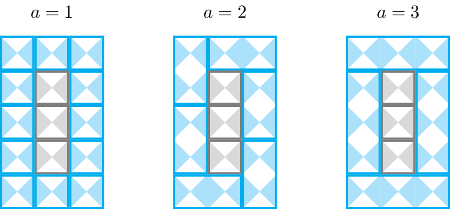

<h1 style='text-align: center;'> H. Boundary</h1>

<h5 style='text-align: center;'>time limit per test: 2 seconds</h5>
<h5 style='text-align: center;'>memory limit per test: 256 megabytes</h5>

Bethany would like to tile her bathroom. The bathroom has width $w$ centimeters and length $l$ centimeters. If Bethany simply used the basic tiles of size $1 \times 1$ centimeters, she would use $w \cdot l$ of them. 

However, she has something different in mind. 

* On the interior of the floor she wants to use the $1 \times 1$ tiles. She needs exactly $(w-2) \cdot (l-2)$ of these.
* On the floor boundary she wants to use tiles of size $1 \times a$ for some positive integer $a$. The tiles can also be rotated by $90$ degrees.

For which values of $a$ can Bethany tile the bathroom floor as described? 
## Note

 that $a$ can also be $1$. 

### Input

Each test contains multiple test cases. The first line contains an integer $t$ ($1\le t\le 100$) — the number of test cases. The descriptions of the $t$ test cases follow.

Each test case consist of a single line, which contains two integers $w$, $l$ ($3 \leq w, l \leq 10^{9}$) — the dimensions of the bathroom.

### Output

For each test case, print an integer $k$ ($0\le k$) — the number of valid values of $a$ for the given test case — followed by $k$ integers $a_1, a_2,\dots, a_k$ ($1\le a_i$) — the valid values of $a$. The values $a_1, a_2, \dots, a_k$ have to be sorted from smallest to largest.

It is guaranteed that under the problem constraints, the output contains at most $200\,000$ integers. 

## Example

### Input


```text
33 512 12314159265 358979323
```
### Output

```text

3 1 2 3
3 1 2 11
2 1 2

```
## Note

In the first test case, the bathroom is $3$ centimeters wide and $5$ centimeters long. There are three values of $a$ such that Bethany can tile the floor as described in the statement, namely $a=1$, $a=2$ and $a=3$. The three tilings are represented in the following pictures. 

  

#### Tags 

#NOT OK #brute_force #math 

## Blogs
- [All Contest Problems](../SWERC_2021-2022_-_Online_Mirror_(Unrated,_ICPC_Rules,_Teams_Preferred).md)
- [SWERC 2021-2022 (en)](../blogs/SWERC_2021-2022_(en).md)
- [Tutorial (en)](../blogs/Tutorial_(en).md)
