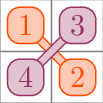
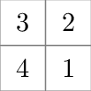
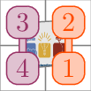
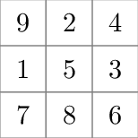
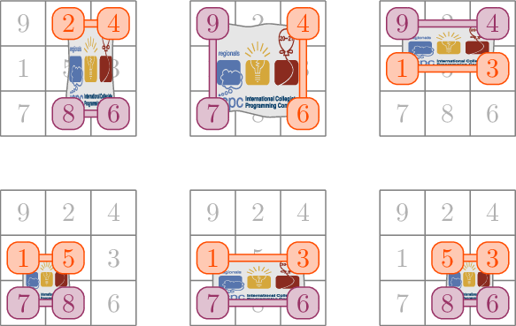

<h1 style='text-align: center;'> N. Drone Photo</h1>

<h5 style='text-align: center;'>time limit per test: 2 seconds</h5>
<h5 style='text-align: center;'>memory limit per test: 512 megabytes</h5>

Today, like every year at SWERC, the $n^2$ contestants have gathered outside the venue to take a drone photo. Jennifer, the social media manager for the event, has arranged them into an $n\times n$ square. Being very good at her job, she knows that the contestant standing on the intersection of the $i$-th row with the $j$-th column is $a_{i,j}$ years old. Coincidentally, she notices that no two contestants have the same age, and that everyone is between $1$ and $n^2$ years old.

Jennifer is planning to have some contestants hold a banner with the ICPC logo parallel to the ground, so that it is clearly visible in the aerial picture. Here are the steps that she is going to follow in order to take the perfect SWERC drone photo.

* First of all, Jennifer is going to select four contestants standing on the vertices of an axis-aligned rectangle.
* Then, she will have the two younger contestants hold one of the poles, while the two older contestants will hold the other pole.
* Finally, she will unfold the banner, using the poles to support its two ends. Obviously, this can only be done if the two poles are parallel and do not cross, as shown in the pictures below.

   Being very indecisive, Jennifer would like to try out all possible arrangements for the banner, but she is worried that this may cause the contestants to be late for the competition. How many different ways are there to choose the four contestants holding the poles in order to take a perfect photo? Two choices are considered different if at least one contestant is included in one but not the other.

##### Input

The first line contains a single integer $n$ ($2\le n \le 1500$).

The next $n$ lines describe the ages of the contestants. Specifically, the $i$-th line contains the integers $a_{i,1},a_{i,2},\ldots,a_{i,n}$ ($1\le a_{i,j}\le n^2$).

It is guaranteed that $a_{i,j}\neq a_{k,l}$ if $i\neq k$ or $j\neq l$.

##### Output

Print the number of ways for Jennifer to choose the four contestants holding the poles.

## Examples

##### Input


```text
2
1 3
4 2
```
##### Output


```text
0
```
##### Input


```text
2
3 2
4 1
```
##### Output


```text
1
```
##### Input


```text
3
9 2 4
1 5 3
7 8 6
```
##### Output


```text
6
```
## Note

In the first sample, there are $4$ contestants, arranged as follows. 

  There is only one way to choose four contestants, with one pole held by contestants aged $1$ and $2$ and the other one by contestants aged $3$ and $4$. But then, as we can see in the picture, the poles cross. 

  Since there is no valid way to choose four contestants, the answer is $0$.

In the second sample, the $4$ contestants are arranged as follows. 

  Once again, there is only one way to choose four contestants, but this time the poles don't cross. 

  Therefore, the answer is $1$.

In the third sample, the $9$ contestants are arranged as follows. 

  There are $6$ ways of choosing four contestants so that the poles don't cross, as shown in the following pictures. 

  

#### Tags 

#NOT OK #combinatorics #math #sortings 

## Blogs
- [All Contest Problems](../SWERC_2021-2022_-_Online_Mirror_(Unrated,_ICPC_Rules,_Teams_Preferred).md)
- [SWERC 2021-2022 (en)](../blogs/SWERC_2021-2022_(en).md)
- [Tutorial (en)](../blogs/Tutorial_(en).md)
