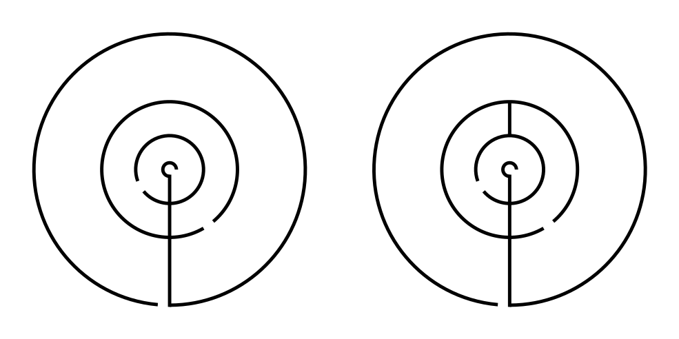

<h1 style='text-align: center;'> O. Circular Maze</h1>

<h5 style='text-align: center;'>time limit per test: 2 seconds</h5>
<h5 style='text-align: center;'>memory limit per test: 256 megabytes</h5>

You are given a circular maze such as the ones shown in the figures. 

   Determine if it can be solved, i.e., if there is a path which goes from the center to the outside of the maze which does not touch any wall. The maze is described by $n$ walls. Each wall can be either circular or straight. * Circular walls are described by a radius $r$, the distance from the center, and two angles $\theta_1, \theta_2$ describing the beginning and the end of the wall in the clockwise direction. Notice that swapping the two angles changes the wall.
* Straight walls are described by an angle $\theta$, the direction of the wall, and two radii $r_1 < r_2$ describing the beginning and the end of the wall.

Angles are measured in degrees; the angle $0$ corresponds to the upward pointing direction; and angles increase clockwise (hence the east direction corresponds to the angle $90$).

### Input

Each test contains multiple test cases. The first line contains an integer $t$ ($1\le t\le 20$) — the number of test cases. The descriptions of the $t$ test cases follow.

The first line of each test case contains an integer $n$ ($1 \leq n \leq 5000$) — the number of walls. 

Each of the following $n$ lines each contains a character (C for circular, and S for straight) and three integers: 

* either $r, \theta_1, \theta_2$ ($1 \leq r \leq 20$ and $0 \leq \theta_1,\theta_2 < 360$ with $\theta_1 \neq \theta_2$) if the wall is circular,
* or $r_1$, $r_2$ and $\theta$ ($1 \leq r_1 < r_2 \leq 20$ and $0 \leq \theta < 360$) if the wall is straight.

It is guaranteed that circular walls do not overlap (but two circular walls may intersect at one or two points), and that straight walls do not overlap (but two straight walls may intersect at one point). However, circular and straight walls can intersect arbitrarily.

### Output

For each test case, print YES if the maze can be solved and NO otherwise. 

## Example

### Input


```text
2
5
C 1 180 90
C 5 250 230
C 10 150 140
C 20 185 180
S 1 20 180
6
C 1 180 90
C 5 250 230
C 10 150 140
C 20 185 180
S 1 20 180
S 5 10 0
```
### Output


```text
YES
NO
```
## Note

The two sample test cases correspond to the two mazes in the picture.


#### Tags 

#NOT OK #brute_force #dfs_and_similar #graphs #implementation 

## Blogs
- [All Contest Problems](../SWERC_2021-2022_-_Online_Mirror_(Unrated,_ICPC_Rules,_Teams_Preferred).md)
- [SWERC 2021-2022 (en)](../blogs/SWERC_2021-2022_(en).md)
- [Tutorial (en)](../blogs/Tutorial_(en).md)
