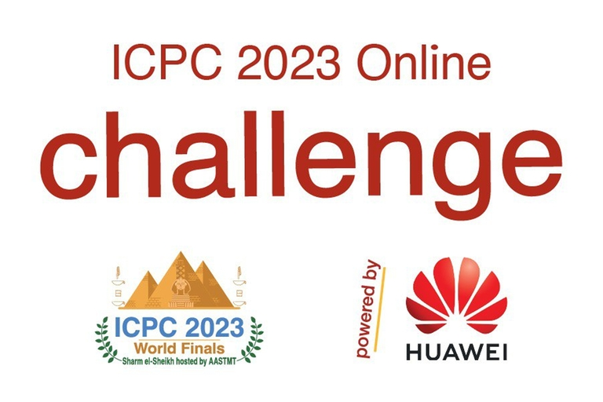

# Announcement_(en)

#### Hello, Codeforces!

From the ICPC 2023 World Finals, we are happy to bring you an exciting online event: **The ICPC 2023 Online Challenge powered by Huawei**，which will start on November 20, 2023 15:00 UTC (UTC+8)

In this Challenge, you will have a unique chance:

 * to **compete with top programmers globally**
* to **solve 1 exciting problem** prepared by Huawei
* to **win amazing prizes** from Huawei!

**It is an individual competition.** 

#### The ICPC 2023 Online Challenge powered by Huawei:

**Start:** [November 20, 2023 15:00 (UTC+8)](https://codeforces.com/https://www.timeanddate.com/worldclock/fixedtime.html?day=20&month=11&year=2023&hour=10&min=0&sec=0&p1=166)

**Finish:** [December 4, 2023 15:00 (UTC+8)](https://codeforces.com/https://www.timeanddate.com/worldclock/fixedtime.html?day=04&month=12&year=2023&hour=10&min=0&sec=0&p1=166) 

**We hope you'll enjoy this complex yet very exciting Challenge!**

#### Problem

We are glad to propose to you an exciting challenge **“Deterministic Scheduling for Extended Reality over 5G and Beyond”**, which is prepared by Huawei Wireless Product Line.

In this contest, we focus on a XR-service scheduling problem to maximize the total number of successfully transformed XR-data frames under specific transmission requirements. Extended reality (XR) is an umbrella term for different types of realities such as virtual reality (VR), augmented reality (AR), and mixed reality (MR), which can provide people with immersive experience. To achieve better user-experience, scheduling algorithm should be proposed to efficiently utilize the limited radio resources, e.g., time resource, frequency resource, and power resource. Due to several practical constraints, the scheduling task is a typical NP-hard problem.

  [REGISTER](https://codeforces.com/contests/1885) 
#### Prizes from Huawei

 

| Rank | Prize |
| --- | --- |
|
| Grand Prize (Rank 1) | € 12 000 EUR +  [the travel trip to the 48th Annual ICPC World Finals in a guest role](https://codeforces.com/https://docs.google.com/document/d/15SF0FQd6xdrPz8OBnNhCSD5iJ8b2vAMe/) |
|
| First Prize (Rank 2-10) | € 6,000 EUR |
| Second Prize (Rank 11-30) | € 3,000 EUR |
| Third Prize (Rank 31-60): | € 800 EUR |
| TOP 200 Participants | Souvenir T-shirt |
| * If for any reason, Huawei cannot deliver the allocated prize to your region, the prize may be replaced by another prize (if no legal restrictions), at the discretion of the Huawei.. | | |
|

#### Challenge Rules and Conditions

By participating in this Challenge, you agree to the [Challenge Rules and Conditions of Participation](https://codeforces.com/https://docs.google.com/document/d/14HqjtRzvBmwZEdqC-U2UpVs8GWOt3l61/edit#heading=h.3lzaqq2j3zpu)

**Good luck, we hope this will be fun!** 

