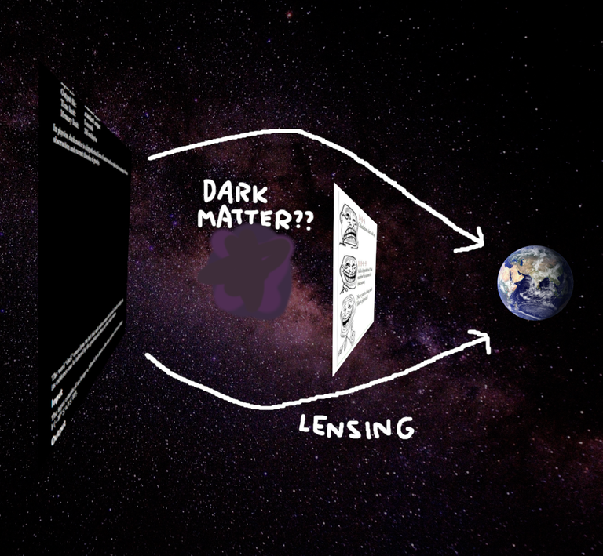
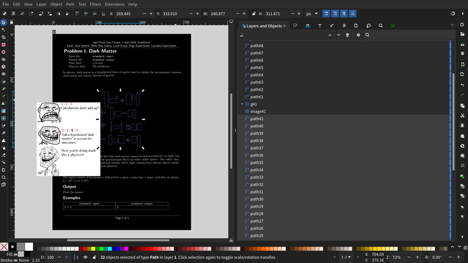
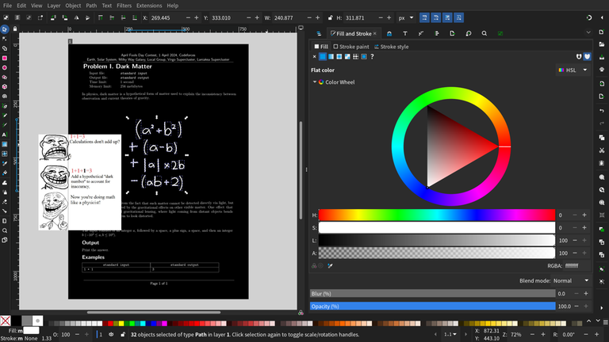
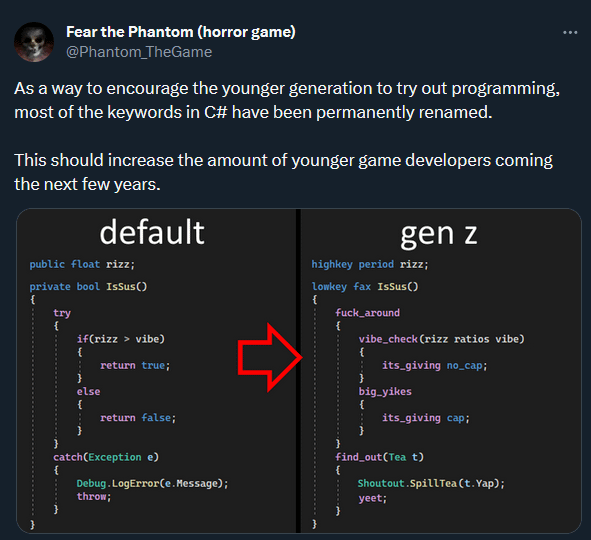

# Tutorial_(en)

Thank you for participating in our contest! We hope you enjoyed it.

Please let us know what you thought of the problems by voting!

[1952A - Ты снова робот?](../problems/A._Are_You_a_Robot,_Again_.md "April Fools Day Contest 2024")

Idea: [flamestorm](https://codeforces.com/profile/flamestorm "Кандидат в мастера flamestorm")

 **Hint**Have you seen the "are you a robot" boxes on websites?

 **Solution**[1952A - Ты снова робот?](../problems/A._Are_You_a_Robot,_Again_.md "April Fools Day Contest 2024")
--------------------------------------------------------------------------------------------------------

If you select all the squares with traffic lights and read the corresponding letters from left-to-right, top-to-bottom, you get the text "print safetyprint safety". So all you need to do is print the word safetysafety.

 **Feedback*** [*433*](https://codeforces.com/data/like?action=like "I like this")


 Based problem
* [*20*](https://codeforces.com/data/like?action=like "I like this")


 Based problem
* [*34*](https://codeforces.com/data/like?action=like "I like this")


 Based problem
[1952B - Is it stated?](../problems/B._Is_it_stated_.md "April Fools Day Contest 2024")

Idea: [willy108](https://codeforces.com/profile/willy108 "Мастер willy108")

 **Hint**Can you interpret the question in the title another way?

 **Solution**[1952B - Is it stated?](../problems/B._Is_it_stated_.md "April Fools Day Contest 2024")
------------------------------------------------------------------------------------------------------

You just need to check if there is a substring itit in the string. (That is, the question is asking, "is itit stated?")

 **Feedback*** [*262*](https://codeforces.com/data/like?action=like "I like this")


 Based problem
* [*20*](https://codeforces.com/data/like?action=like "I like this")


 Based problem
* [*24*](https://codeforces.com/data/like?action=like "I like this")


 Based problem
[1952C - Они дурачились](../problems/C._They_Have_Fooled.md "April Fools Day Contest 2024")

Idea: [AlperenT](https://codeforces.com/profile/AlperenT "Мастер AlperenT")

 **Hint 1**They have fooled? Who have fooled?

 **Hint 2**The image says April. Could it be about April Fools?

 **Hint 3**The problem has n≤12n≤12. Where did you see the number 1212 before?

 **Solution**[1952C - Они дурачились](../problems/C._They_Have_Fooled.md "April Fools Day Contest 2024")
-------------------------------------------------------------------------------------------------------

Looking at the announcement blog, it can be seen that the first April Fools Day Contest was 1212 years ago.

The problem asks for the problem count of the April Fools Day Contest that was nn years ago.

The sample that has n=9n=9 is also given as a hint as there was not an April Fools Day Contest on 20152015.

 **Feedback*** [*215*](https://codeforces.com/data/like?action=like "I like this")


 Based problem
* [*49*](https://codeforces.com/data/like?action=like "I like this")


 Based problem
* [*90*](https://codeforces.com/data/like?action=like "I like this")


 Based problem
[1952D - Вы прокрастинатор?](../problems/D._Are_You_a_Procrastinator_.md "April Fools Day Contest 2024")

Idea: [AlperenT](https://codeforces.com/profile/AlperenT "Мастер AlperenT")

 **Hint 1**Are you a procrastinator?

 **Hint 2**You should be.

 **Hint 3**What? The checker does not trust you after you say yes? How can you make it believe you?

 **Solution**[1952D - Вы прокрастинатор?](../problems/D._Are_You_a_Procrastinator_.md "April Fools Day Contest 2024")
-----------------------------------------------------------------------------------------------------------

The problem asks you if you are procrastinator or not. You should output "yes" (or any other confirmation word that the checker can understand) to solve the problem. However, it does not seem to be enough as the checker responds with "I have no reason to believe you."

You should prove to the checker that you are a procrastinator. You can do this by submitting "yes" in the last 1515 mins of the contest.

Furthermore, the checker can give different responses depending on your output. Feel free to share what funny responses you got (there are many of them).

 **Feedback*** [*329*](https://codeforces.com/data/like?action=like "I like this")


 Based problem
* [*23*](https://codeforces.com/data/like?action=like "I like this")


 Based problem
* [*34*](https://codeforces.com/data/like?action=like "I like this")


 Based problem
[1952E - Линейное сканирование](../problems/E._Sweep_Line.md "April Fools Day Contest 2024")

Idea: [AlperenT](https://codeforces.com/profile/AlperenT "Мастер AlperenT")

 **Hint 1**Almost everything in this problem is a hint.

 **Hint 2**The problem name is "Sweep Line". Does it sound familiar?

 **Hint 3**Look at the quote in the statement. When does a mistake force you to start all over again?

 **Hint 4**Why are the numbers in the note section are colored?

 **Hint 5**Why does the note section contain "I had to take a guess." and "I am literally going to explode."

 **Hint 6**Minesweeper. This is a slightly different version, since all cells are numbered. Why do the numbers only go up to 22?

 **Solution**[1952E - Линейное сканирование](../problems/E._Sweep_Line.md "April Fools Day Contest 2024")
--------------------------------------------------------------------------------------------------------------

The theme of the problem is [Minesweeper](https://codeforces.com/https://w.wiki/5ZRi).

In Minesweeper, the numbers represent the count of mines around them.

The array given in the input represents a Minesweeper game that is only a line (hence the name **Sweep Line**). The problem asks you to output the number of possible mine placements that is consistent with the given array.

Note that here each cell refers to the number of mines in the neighboring cells, but **not** including itself (since the input is only up to 22).

The modulo 2024040120240401 part is unnecessary as the answer can be at most 22 (try to prove this).

 **Feedback*** [*135*](https://codeforces.com/data/like?action=like "I like this")


 Based problem
* [*15*](https://codeforces.com/data/like?action=like "I like this")


 Based problem
* [*18*](https://codeforces.com/data/like?action=like "I like this")


 Based problem
[1952F - Сетка](../problems/F._Grid.md "April Fools Day Contest 2024")

Idea: [flamestorm](https://codeforces.com/profile/flamestorm "Кандидат в мастера flamestorm")

 **Hint 1**Can you convert a grid of 0s and 1s into a useful piece of data?

 **Hint 2**Look in the top-left, top-right, and bottom-left corners. What do you notice?

 **Hint 2.2**Namely, look at the the top-left, top-right, and bottom-left 7×77×7 subgrids. They form a pattern. Have you seen this pattern elsewhere? (It is well-known.)

 **Solution**[1952F - Сетка](../problems/F._Grid.md "April Fools Day Contest 2024")
----------------------------------------------------------------------------------------------

Replace 0 with white and 1 with black to get this QR code:


Scanning it tells you that you need to find the 4×44×4 grid with the maximum sum.

 **Feedback*** [*238*](https://codeforces.com/data/like?action=like "I like this")


 Based problem
* [*23*](https://codeforces.com/data/like?action=like "I like this")


 Based problem
* [*28*](https://codeforces.com/data/like?action=like "I like this")


 Based problem
[1952G - Захват математиков](../problems/G._Mathematician_Takeover.md "April Fools Day Contest 2024")

Idea: [flamestorm](https://codeforces.com/profile/flamestorm "Кандидат в мастера flamestorm")

 **Hint 1**There is a function that has the same name but different definitions in math and computer science. What is it?

 **Hint 2**Try to fit a curve through the three points given in the problem. It can help you solve the previous question.

 **Solution**[1952G - Захват математиков](../problems/G._Mathematician_Takeover.md "April Fools Day Contest 2024")
-----------------------------------------------------------------------------------------------------------

The problem is a joke about the function loglog. For mathematicians, it means logeloge, but for computer scientists, it means log2log2. In particular, the samples all give the correct output for loge(x)loge⁡(x), but we really want to output log2(x)log2⁡(x).

 **Feedback*** [*86*](https://codeforces.com/data/like?action=like "I like this")


 Based problem
* [*13*](https://codeforces.com/data/like?action=like "I like this")


 Based problem
* [*35*](https://codeforces.com/data/like?action=like "I like this")


 Based problem
[1952H - Палиндром](../problems/H._Palindrome.md "April Fools Day Contest 2024")

Idea: [ToxicPie9](https://codeforces.com/profile/ToxicPie9 "Кандидат в мастера ToxicPie9")

 **Hint 1**Why are there two examples when each one already has multiple test cases?

 **Hint 2**A change of perspective might help you solve the problem.

 **Solution**[1952H - Палиндром](../problems/H._Palindrome.md "April Fools Day Contest 2024")
--------------------------------------------------------------------------------------------------

One obvious weird thing in the statement is that there are 2 sample tests despite the multi-test input format. This implies that the lines ("tests") in each input might not be independent tests and are related in some way.

If we read very closely we might notice two weird things about the statement. First, instead of the usual "Each test case contains a line...", it says "The following t lines each contain...". This is because one line does not correspond to one test case. Another is the unusual definition of palindromes: "in both directions".

This problem is solved by seeing it in a different direction. If we read the third and fourth columns, we may notice that they are palindromes — which read the same in both directions, up and down. The solution is to read tt strings, vertically, from the input and determine whether they are palindromes. Empty strings count as palindromes as you can see in sample 2.

 **Feedback*** [*100*](https://codeforces.com/data/like?action=like "I like this")


 Based problem
* [*11*](https://codeforces.com/data/like?action=like "I like this")


 Based problem
* [*10*](https://codeforces.com/data/like?action=like "I like this")


 Based problem
[1952I - Темная материя](../problems/I._Dark_Matter.md "April Fools Day Contest 2024")

Idea: [ToxicPie9](https://codeforces.com/profile/ToxicPie9 "Кандидат в мастера ToxicPie9")

 **Hint**Something looks off with the text (literally).

 **Solution**[1952I - Темная материя](../problems/I._Dark_Matter.md "April Fools Day Contest 2024")
-------------------------------------------------------------------------------------------------------

If you stare at the PDF hard enough, you'll notice that some of the text looks curved. Given the hint about "gravitational lensing", it should be clear that this is not a coincidence.

How can gravitational lensing distort text? If there's a lot of mass between you and the text, those matter can bend light going from text into your eyes, making straight text look curved. In addition, the meme image looks normal, implying such mass lies between the image and text (in other words, behind the image from your perspective). Here's a visualization of the configuration:



Now let's do the difficult and technical part: finding the dark matter. To do this we need to first grab some PDF/vector graphics editor like LibreOffice or Inkscape. We can see a lot of random objects behind the image:



These are probably the mass causing distorted text. Unfortunately, as the problem suggests, these objects are dark matter so are transparent because they don't interact with light. We can set their transparency to 0 (or opacity to max) and change their color to see them better:



Which gives the formula (a2+b2)+(a−b)+|a|×2b−(ab+2)(a2+b2)+(a−b)+|a|×2b−(ab+2). If we plug in aa and bb from the samples, we get 11, which corresponds to the missing number in the image. Therefore the solution is to output a+b+((a2+b2)+(a−b)+|a|×2b−(ab+2))a+b+((a2+b2)+(a−b)+|a|×2b−(ab+2)).

 **Feedback*** [*200*](https://codeforces.com/data/like?action=like "I like this")


 Based problem
* [*17*](https://codeforces.com/data/like?action=like "I like this")


 Based problem
* [*35*](https://codeforces.com/data/like?action=like "I like this")


 Based problem
[1952J - Помогите, что значит быть <>](../problems/J._Help,_what_does_it_mean_to_be_"Based".md "April Fools Day Contest 2024")

Idea: [ToxicPie9](https://codeforces.com/profile/ToxicPie9 "Кандидат в мастера ToxicPie9")

 **Solution**[1952J - Помогите, что значит быть <>](../problems/J._Help,_what_does_it_mean_to_be_"Based".md "April Fools Day Contest 2024")
-----------------------------------------------------------------------------------------------------------------------

Update: You can find checker implementations [here](https://codeforces.com/https://github.com/toxicpie/based-language).

The recent April Fools contests all have problems related to mysterious languages. In this one, you are given several samples in a new, never been seen before constructed language, and your task is to learn it and solve a simple task with it. The idea of using internet slangs as a language was inspired by [this meme](https://codeforces.com/https://twitter.com/Phantom_TheGame/status/1745935918832275881). The problem format is similar to some Linguistics Olympiad problems.

 **If you can't access the twitter post**

This problem is rather straightforward: simply figure out what each line of code does, and try to combine known operations to solve the last task. Knowing the meaning of slangs might help in understanding them.

In task 1, we learn 4 operations:

 1. `yoink a`: Input an integer `a`.
2. `*slaps a on top of b*`: Add `a` to `b`.
3. `yeet b`: Output the integer `b`.
4. `go touch some grass`: Return/exit the program.

In task 2 we learn:

 1. `bruh b is lowkey just 0`: Assign the variable `b` to 0.
2. `rip this b fell off by a`: Subtract `a` from `b`.

And the less obvious:

 1. `vibe check a ratios b`: Check if `a` is larger than `b`. If yes, execute the next line, otherwise don't.
2. `simp for 7`: Goto line 7.

In task 3 we learn new things:

 1. `yoink a`: Input an entire array `a`.
2. Indexing operations: `a[0]`. We can also see that arrays are 0-indexed.

These are enough to solve task 4. There are two simple approaches.

 * Sort the array and output a[k−1]a[k−1]. We may use bubble sort for easier implementation.

 
```cpp
yoink n
yoink a
bruh i is lowkey just n
vibe check i ratios 1
simp for 7
simp for 22
bruh j is lowkey just 1
vibe check i ratios j
simp for 11
simp for 20
bruh k is lowkey just j
*slaps -1 on top of k*
vibe check a[k] ratios a[j]
simp for 18
bruh tmp is lowkey just a[j]
bruh a[j] is lowkey just a[k]
bruh a[k] is lowkey just tmp
*slaps 1 on top of j*
simp for 8
rip this i fell off by 1
simp for 4
yoink k
rip this k fell off by 1
yeet a[k]
go touch some grass
```
 * Since the input integers are distinct, we can loop over each element to see whether exactly k−1k−1 elements are smaller than it.

 
```cpp
yoink n
yoink a
yoink k
bruh i is lowkey just 0
bruh m is lowkey just 1
bruh j is lowkey just 0
vibe check n ratios j
simp for 10
simp for 13
vibe check a[j] ratios a[i]
*slaps 1 on top of m*
simp for 19
vibe check m ratios k
simp for 21
vibe check k ratios m
simp for 21
yeet a[i]
go touch some grass
*slaps 1 on top of j*
simp for 7
*slaps 1 on top of i*
simp for 5
```
 **Feedback*** [*166*](https://codeforces.com/data/like?action=like "I like this")


 Based problem
* [*13*](https://codeforces.com/data/like?action=like "I like this")


 Based problem
* [*14*](https://codeforces.com/data/like?action=like "I like this")


 Based problem
