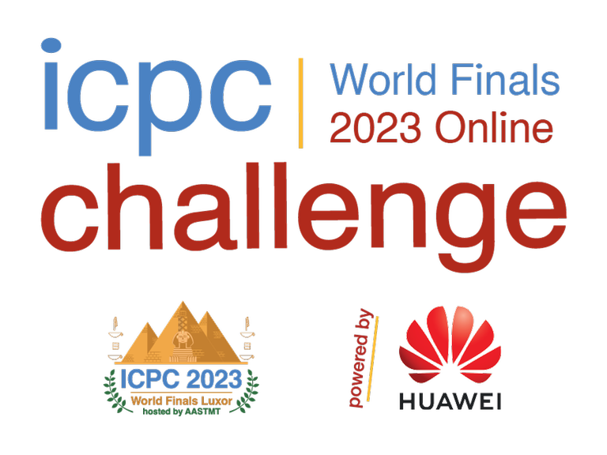

# Announcement\_(en)

#### Hello, Codeforces!

The ICPC Challenge World Finals in Luxor is approaching for some of you, and we are delighted to provide an additional exciting opportunity to compete open to all!

We are happy to invite you to the 2023 Post World Finals Online ICPC Challenge, powered by Huawei starting on **_May 6, 2024 at 15:00 UTC and ending on May 20, 2024 at 14:59 UTC._**

In this Challenge, you will have a unique chance:

- to compete with top programmers globally
- to solve 1 exciting problem prepared by Huawei
- to win amazing prizes from Huawei!

**It is an individual competition.**

**2023 Post World Finals Online ICPC Challenge powered by Huawei**:

Start: [May 6, 2024 15:00 UTC](https://codeforces.com/https://www.timeanddate.com/worldclock/fixedtime.html?msg=The+2023+Post+World+Finals+Online+ICPC+Challenge+&iso=20240506T15&p1=1440)

Finish: [May 20, 2024 14:59 UTC](https://codeforces.com/https://www.timeanddate.com/worldclock/fixedtime.html?msg=The+2023+Post+World+Finals+Online+ICPC+Challenge%3A+finish+time&iso=20240520T1459&p1=1440)

We hope you'll enjoy this complex Challenge!

#### Problem

We are glad to propose to you an exciting challenge **“Accuracy-preserving summation algorithm”**, which is prepared by Huawei Computing Product Line.

With this challenge, we focus on summation algorithms of floating point numbers in different precisions with the goal to use the lowest possible precision without losing too much of the accuracy of the end result. This problem arises in high-performance computing as lower precision can be computed faster. At the same time it also loses accuracy faster and can even lose it completely. Finding the right balance between fast low precision calculations and higher precision intermediate summations is a challenging task on modern architectures, and you would have an opportunity to try addressing this challenge

[REGISTER](https://codeforces.com/contestRegistration/1953)

#### Prizes from Huawei

| Rank | Prize |
| ---- | ----- |

|
| Grand Prize (Rank 1) | € 12 000 EUR + [a travel trip to the 48th Annual ICPC World Finals in a guest role](https://codeforces.com/https://docs.google.com/document/d/1SPsOEWI_6JoAk9uYDSxA7WcIXws1VfkP/) |
|
| First Prize (Rank 2-10) | € 8,000 EUR |
| Second Prize (Rank 11-30) | € 3,000 EUR |
| Third Prize (Rank 31-60): | € 800 EUR |
| TOP 200 Participants | Souvenir T-shirt |
| \* If the allocated Huawei Challenge prize cannot be delivered to your region for any reason it may be replaced by another prize (if no legal restrictions), at the discretion of the Sponsor. | | |
|

#### Challenge Rules and Conditions

By participating in this Challenge, you agree to the [Challenge Rules and Conditions of Participation](https://codeforces.com/https://docs.google.com/document/d/1VSc-SF23fA0MkrVzPeNQeTrn7GgCbhn8)

**Good luck, we hope this will be fun!**
