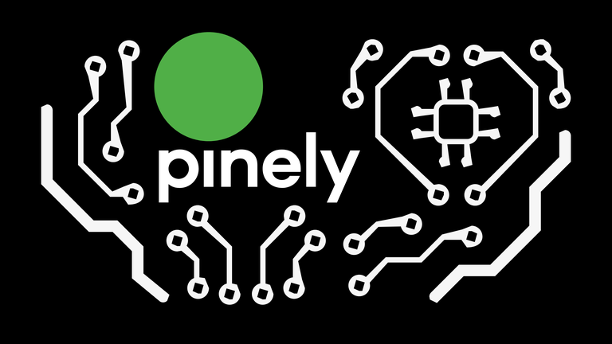
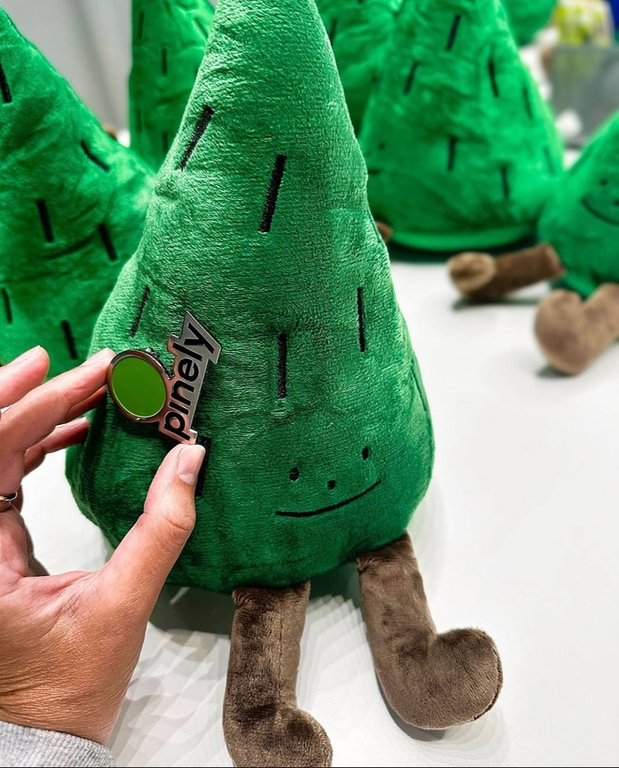

# Announcement_(en)

 Hello, Codeforces!

We are pleased to invite you to [Pinely Round 4 (Div. 1 + Div. 2)](https://codeforces.com/contest/1991), which will start on [Sunday, July 28, 2024 at 20:35UTC+6](https://codeforces.com/https://www.timeanddate.com/worldclock/fixedtime.html?day=28&month=7&year=2024&hour=17&min=35&sec=0&p1=166). The round will be rated for **everyone**.

You will be given **9 problems** and **3 hours** to solve them. There is at least one interactive problem, so please read the [guide for interactive problems](https://codeforces.com/blog/entry/45307) if you are unfamiliar with it.

The problems were authored and prepared by me.

We would like to thank:

 * [errorgorn](https://codeforces.com/profile/errorgorn "International Grandmaster errorgorn") for the excellent coordination.
* [dXqwq](https://codeforces.com/profile/dXqwq "International Grandmaster dXqwq"), [StarSilk](https://codeforces.com/profile/StarSilk "International Grandmaster StarSilk"), [jiangbowen_](https://codeforces.com/profile/jiangbowen_ "International Grandmaster jiangbowen_"), [Endagorion](https://codeforces.com/profile/Endagorion "International Grandmaster Endagorion"), [JCY_](https://codeforces.com/profile/JCY_ "International Grandmaster JCY_"), [jiangbowen](https://codeforces.com/profile/jiangbowen "International Grandmaster jiangbowen"), [QwertyPi](https://codeforces.com/profile/QwertyPi "International Grandmaster QwertyPi"), [chen_zexing](https://codeforces.com/profile/chen_zexing "International Grandmaster chen_zexing"), [YocyCraft](https://codeforces.com/profile/YocyCraft "Grandmaster YocyCraft"), [zeliboba](https://codeforces.com/profile/zeliboba "Grandmaster zeliboba"), [HackerMonk](https://codeforces.com/profile/HackerMonk "Grandmaster HackerMonk"), [axs7384](https://codeforces.com/profile/axs7384 "Grandmaster axs7384"), [Vladithur](https://codeforces.com/profile/Vladithur "Grandmaster Vladithur"), [davi_bart](https://codeforces.com/profile/davi_bart "Grandmaster davi_bart"), [prvocislo](https://codeforces.com/profile/prvocislo "Grandmaster prvocislo"), [leinad2](https://codeforces.com/profile/leinad2 "International Master leinad2"), [Andyvanh1](https://codeforces.com/profile/Andyvanh1 "International Master Andyvanh1"), [stasio6](https://codeforces.com/profile/stasio6 "International Master stasio6"), [hychyc](https://codeforces.com/profile/hychyc "International Master hychyc"), [bitset](https://codeforces.com/profile/bitset "Master bitset"), [bonopo](https://codeforces.com/profile/bonopo "Master bonopo"), [Mucosolvan](https://codeforces.com/profile/Mucosolvan "Master Mucosolvan"), [RandomLB](https://codeforces.com/profile/RandomLB "Master RandomLB"), [CSQ31](https://codeforces.com/profile/CSQ31 "Master CSQ31"), [Myrcella](https://codeforces.com/profile/Myrcella "Master Myrcella"), [NamelessOIer](https://codeforces.com/profile/NamelessOIer "Candidate Master NamelessOIer"), [guapisolo](https://codeforces.com/profile/guapisolo "Candidate Master guapisolo"), [Enigmurl](https://codeforces.com/profile/Enigmurl "Candidate Master Enigmurl"), [satyam343](https://codeforces.com/profile/satyam343 "Expert satyam343"), [Vingying0](https://codeforces.com/profile/Vingying0 "Expert Vingying0"), [qinyuzhou](https://codeforces.com/profile/qinyuzhou "Expert qinyuzhou"), [7oSkaaa](https://codeforces.com/profile/7oSkaaa "Expert 7oSkaaa"), [Geisel.Library](https://codeforces.com/profile/Geisel.Library "Expert Geisel.Library"), [EpicChadGamer](https://codeforces.com/profile/EpicChadGamer "Specialist EpicChadGamer"), [AXXWTGST](https://codeforces.com/profile/AXXWTGST "Specialist AXXWTGST"), and [pengrui](https://codeforces.com/profile/pengrui "Specialist pengrui") for testing the round and providing valuable feedback.
* [Alexdat2000](https://codeforces.com/profile/Alexdat2000 "Master Alexdat2000") for translating the statements to Russian.
* [MikeMirzayanov](https://codeforces.com/profile/MikeMirzayanov "Headquarters, MikeMirzayanov") for the great Codeforces and Polygon platform.

We hope you will enjoy the round!

**Score distribution:** 250−500−1000−1500−2000−2500−3000−3500−4000

The editorial is [here](Tutorial_1_(en).md).

Congratulations to the winners! 

1. [tourist](https://codeforces.com/profile/tourist "Legendary Grandmaster tourist")
2. [jqdai0815](https://codeforces.com/profile/jqdai0815 "Legendary Grandmaster jqdai0815")
3. [Radewoosh](https://codeforces.com/profile/Radewoosh "Legendary Grandmaster Radewoosh")
4. [ksun48](https://codeforces.com/profile/ksun48 "Legendary Grandmaster ksun48")
5. [Rewinding](https://codeforces.com/profile/Rewinding "Legendary Grandmaster Rewinding")
6. [hos.lyric](https://codeforces.com/profile/hos.lyric "Legendary Grandmaster hos.lyric")
7. [jiangly](https://codeforces.com/profile/jiangly "Legendary Grandmaster jiangly")
8. [Benq](https://codeforces.com/profile/Benq "Legendary Grandmaster Benq")
9. [BurnedChicken](https://codeforces.com/profile/BurnedChicken "Legendary Grandmaster BurnedChicken")
10. [Szoboszlai10](https://codeforces.com/profile/Szoboszlai10 "International Grandmaster Szoboszlai10")

#### This round is made possible with the support of Pinely!

 Pinely is a dynamic algorithmic trading firm with a presence in Singapore, the Netherlands, and Cyprus. We specialize in high-frequency and ultra-low latency trading. Our team of mathematicians, programmers, engineers, and computer scientists tackles everyday challenges like developing trading strategies, optimizing systems for minimal latency, saving and processing large volumes of historical data.

Working at Pinely demands exceptional C++ coding, algorithmic thinking, and mathematical intuition, attracting top talent, including winners and awardees of such competitions as ICPC, IMC, HITB PRO CTF, Google HashCode, etc.

Learn more about us on our [website](https://codeforces.com/http://pinely.com) or find [our employees on CF](https://codeforces.com/ratings/organization/31353). To join our team, please send your CV to [hr@pinely.com](https://codeforces.com/mailto:hr@pinely.com), even if you are not participating in the contest.

**Prizes**: The top 30 contestants will receive a branded plush pine tree!

