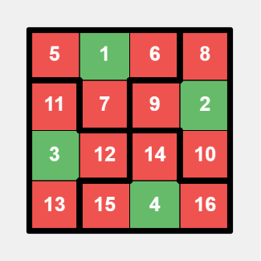
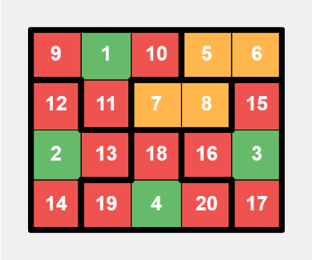
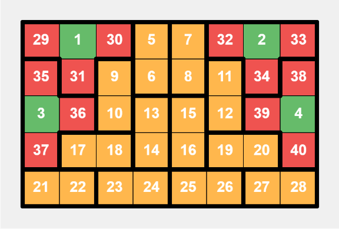
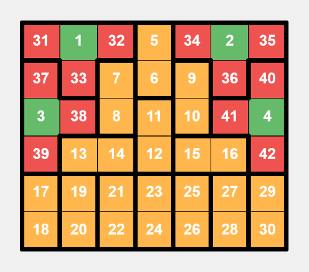

# Tutorial_1_(en)

[1991A — Maximize the Last Element](../problems/A._Maximize_the_Last_Element.md)
----------------------------------------------------------------------------------

 **Hint**Consider the parity of the position.

 **Solution**The answer is the maximum value of the elements at odd indices.

**Proof**

 1. Any element at an odd index can be preserved until the end.  
  
 Since each element at an odd index has an even number of elements on both sides, pairs of adjacent elements can be removed from left to right until only the element at the odd index remains. For example, if you want to keep the element at the i-th position, you can remove the elements at positions 1 and 2, 3 and 4, and so on, until the elements at positions i−2 and i−1 are removed. Then, continue removing elements at positions i+1 and i+2, and so on, until the elements at positions n−1 and n are removed. Therefore, any element at an odd index can be preserved through this method.
2. No element at an even index can be preserved until the end.  
  
 Since n is odd, there are more elements at odd indices than at even indices. Each operation removes one element at an odd index and one element at an even index. Since there are always more elements at odd indices, the last remaining element must be at an odd index.
 **Code**
```cpp
#include <bits/stdc++.h>
using namespace std;
const int MAX_N = 105;
int t, n, a[MAX_N];
int main() {
    cin >> t;
    while (t--) {
        cin >> n;
        for (int i = 1; i <= n; i++)
            cin >> a[i];
        int max_value = 0;
        for (int i = 1; i <= n; i += 2)
            max_value = max(max_value, a[i]);
        cout << max_value << 'n';
    }
}
```
[1991B — AND Reconstruction](../problems/B._AND_Reconstruction.md)
---------------------------------------------------------------------------

 **Hint**Consider bi−1|bi.

 **Solution**Let's construct an array a using the formula ai=bi−1|bi (assuming b0 and bn are 0). We then verify the condition bi=ai&ai+1 for 1≤i<n. If any condition fails, then such an array a does not exist.

**Explanation**

Using the above construction method, we get: ai&ai+1=(bi−1|bi)&(bi|bi+1)=bi|(bi−1&bi+1)

If for any i, bi|(bi−1&bi+1)≠bi, then the constructed array a does not satisfy the required condition. This indicates that there exists a bit in b where bi−1=1, bi=0, and bi+1=1, which can prove there is no solution. **Proof:** If ai−2&ai−1=bi−1=1, then ai−1=1. Similarly, since ai&ai+1=bi=1, then ai=1. However, ai−1&ai=1&1=1, which contradicts bi=0. Therefore, this configuration is unsolvable.

This shows that our construction method can construct a valid array a, except in cases where the above bit configuration in b makes it unsolvable.

 **Code**
```cpp
#include <bits/stdc++.h>
using namespace std;
const int MAX_N = 1e5 + 5;
int n, b[MAX_N], a[MAX_N];
void solve() {
    cin >> n;
    for (int i = 1; i < n; i++)
        cin >> b[i];
    b[0] = b[n] = 0;
    for (int i = 1; i <= n; i++)
        a[i] = b[i - 1] | b[i];
    bool valid = true;
    for (int i = 1; i < n; i++)
        if ((a[i] & a[i + 1]) != b[i]) {
            valid = false;
            break;
        }
    if (valid) {
        for (int i = 1; i <= n; i++)
            cout << a[i] << ' ';
        cout << 'n';
    } else
        cout << -1 << endl;
}
int main() {
    int t;
    cin >> t;
    while (t--)
        solve();
}
```
[1991C — Absolute Zero](../problems/C._Absolute_Zero.md)
----------------------------------------------------------------------

 **Hint 1**If the array contains both odd and even elements, it is impossible to zero the array.

 **Hint 2**Is there a method to narrow the range of elements after every operation?

 **Solution**If the array contains both odd and even numbers, it is impossible to zero the array. This is because any operation will maintain the presence of both odd and even elements.

Otherwise, if all elements in the array are either odd or even, it is feasible to zero the array in no more than 31 operations.

The operation strategy works by iteratively narrowing the range of all elements. Initially, the range of all elements is between [0,230]. Starting from x=229, we use each power of 2 as x, reducing the exponent by one each time (i.e., 229,228,…,20). After each operation, the range of all elements is halved, narrowed down to [0,x]. Continuing this process, after 30 operations, all elements will become 0 or 1. If all elements are 1 after 30 operations, perform one last operation with x=1 to turn all 1s into 0s.

 **Code**
```cpp
#include <bits/stdc++.h>
using namespace std;
const int MAX_N = 2e5 + 5;
int n, a[MAX_N];
void solve() {
    cin >> n;
    for (int i = 1; i <= n; i++)
        cin >> a[i];
    bool has_odd = false, has_even = false;
    for (int i = 1; i <= n; i++)
        if (a[i] % 2 == 1)
            has_odd = true;
        else
            has_even = true;
    if (has_even && has_odd)
        cout << -1 << 'n';
    else {
        vector<int> operations;
        for (int i = 29; i >= 0; i--)
            operations.push_back(1 << i);
        if (has_even)
            operations.push_back(1);
        cout << operations.size() << 'n';
        for (int x : operations)
            cout << x << ' ';
        cout << 'n';
    }
}
int main() {
    int t;
    cin >> t;
    while (t--)
        solve();
}
```
[1991D — Prime XOR Coloring](../problems/D._Prime_XOR_Coloring.md)
---------------------------------------------------------------------------

 **Hint**We can use only 4 colors for all n.

 **Solution**For n≥6, the minimum number of colors is always 4.

**Proof**

First, we can show that the number of colors cannot be less than 4. This is because vertices 1, 3, 4, and 6 form a clique, meaning they are all connected, so they must have different colors.

Next, we can provide a construction where the number of colors is 4. For the i-th vertex, assign the color imod4+1. This ensures that any two vertices of the same color have a difference that is a multiple of 4, so their XOR is a multiple of 4, which is not a prime number.

For n<6, the example provides the coloring for all cases: 

* n=1: A valid coloring is [1].
* n=2: A valid coloring is [1,2].
* n=3: A valid coloring is [1,2,2].
* n=4: A valid coloring is [1,2,2,3].
* n=5: A valid coloring is [1,2,2,3,3].
 **Code**
```cpp
#include <bits/stdc++.h>
using namespace std;
void solve() {
    int n;
    cin >> n;
    if (n < 6) {
        if (n == 1)
            cout << 1 << 'n' << "1" << 'n';
        else if (n == 2)
            cout << 2 << 'n' << "1 2" << 'n';
        else if (n == 3)
            cout << 2 << 'n' << "1 2 2" << 'n';
        else if (n == 4)
            cout << 3 << 'n' << "1 2 2 3" << 'n';
        else if (n == 5)
            cout << 3 << 'n' << "1 2 2 3 3" << 'n';
    } else {
        cout << 4 << 'n';
        for (int i = 1; i <= n; i++)
            cout << i % 4 + 1 << ' ';
        cout << 'n';
    }
}
int main() {
    int t;
    cin >> t;
    while (t--)
        solve();
}
```
[1991E — Coloring Game](../problems/E._Coloring_Game.md)
----------------------------------------------------------------------

 **Hint**Determine if the graph is bipartite.

 **Solution**If the graph is not bipartite, Alice will win. If the graph is bipartite, Bob will win.

If the graph is not bipartite, Alice can always choose colors 1 and 2. According to the definition of a non-bipartite graph, Bob cannot color the graph with two colors without having two adjacent vertices of the same color.

If the graph is bipartite, it can be divided into two parts, Part 1 and Part 2, with no edges within each part. If the colors chosen by Alice include color 1, Bob can paint vertices in part 1 with color 1. If the colors chosen by Alice include color 2, Bob can paint vertices in part 2 with color 2. Once one part is completely painted, Bob can use color 3 or continue using the original color of that part to paint the remaining vertices, ensuring no two adjacent vertices have the same color. In this way, Bob will win.

 **Code**
```cpp
#include <bits/stdc++.h>
using namespace std;
const int MAX_N = 1e4 + 5;
int n, m, color[MAX_N], isBipartite;
vector<int> graph[MAX_N];
void dfs(int vertex) {
    for (auto neighbor: graph[vertex])
        if (!color[neighbor]) {
            color[neighbor] = 3 — color[vertex];
            dfs(neighbor);
        } else if (color[neighbor] + color[vertex] != 3)
            isBipartite = 0;
}
void solve() {
    cin >> n >> m;
    for (int i = 1; i <= n; i++) {
        graph[i].clear();
        color[i] = 0;
    }
    for (int i = 1; i <= m; i++) {
        int u, v;
        cin >> u >> v;
        graph[u].push_back(v);
        graph[v].push_back(u);
    }
    isBipartite = 1;
    color[1] = 1;
    dfs(1);
    if (!isBipartite) {
        cout << "Alice" << endl;
        for (int i = 1; i <= n; i++) {
            cout << 1 << ' ' << 2 << endl;
            int vertex, chosenColor;
            cin >> vertex >> chosenColor;
        }
    } else {
        cout << "Bob" << endl;
        vector<int> part1, part2;
        for (int i = 1; i <= n; i++)
            if (color[i] == 1)
                part1.push_back(i);
            else
                part2.push_back(i);
        for (int i = 1; i <= n; i++) {
            int color1, color2;
            cin >> color1 >> color2;
            if ((color1 == 1 || color2 == 1) && part1.size()) {
                cout << part1.back() << ' ' << 1 << endl;
                part1.pop_back();
            } else if ((color1 == 2 || color2 == 2) && part2.size()) {
                cout << part2.back() << ' ' << 2 << endl;
                part2.pop_back();
            } else if (!part1.size()) {
                int chosenColor = (color1 == 1 ? color2 : color1);
                cout << part2.back() << ' ' << chosenColor << endl;
                part2.pop_back();
            } else {
                int chosenColor = (color1 == 2 ? color2 : color1);
                cout << part1.back() << ' ' << chosenColor << endl;
                part1.pop_back();
            }
        }
    }
}
int main() {
    int t;
    cin >> t;
    while (t--)
        solve();
}
```
[1991F — Triangle Formation](../problems/F._Triangle_Formation.md)
---------------------------------------------------------------------------

 **Hint**Under the constraints of the problem, there exists a (small) integer C such that for intervals longer than C, it is guaranteed to form two triangles.

 **Solution**If there are at least 45 sticks, it is guaranteed to form a triangle. **Proof:** For any sequence of stick lengths that cannot form a triangle, we can replace it with the Fibonacci sequence. By replacing the sticks in increasing order, the sequence will remain incapable of forming a triangle. This implies that the Fibonacci sequence is one of the longest sequences that cannot form a triangle. The 45th Fibonacci number exceeds 109. Therefore, having at least 45 sticks ensures that it is possible to form a triangle.

If there are at least 48 sticks, it is guaranteed to form two triangles. **Proof:** We can first form the first triangle and remove those sticks. The remaining number of sticks is still at least 45, which is sufficient to form the second triangle.

Therefore, only for intervals with fewer than 48 sticks, we need to check whether it is possible to form two triangles.

First, we sort the sticks within the interval. Then we use the following algorithm to find two triangles:

**Algorithm 1:** Enumerate all possible sets of 6 consecutive sticks and check if they can form two triangles.

**Algorithm 2:** Identify all possible sets of 3 consecutive sticks that can form a triangle, and check if there exist two disjoint sets among them.

If neither algorithm can find two triangles, then it is impossible to form two triangles within the given interval. **Proof:** Consider an interval where Algorithm 1 cannot find two triangles. Suppose it is indeed possible to form two triangles; the six sticks must be non-consecutive. For any unselected sticks between the chosen sticks, if there exists a stick to its left and a stick to its right that belongs to the same triangle, we can replace the leftmost stick of this triangle with the unselected stick. Continuing this process, either the six sticks will become consecutive, or the left side will form one triangle and the right side will form another, which can be detected by Algorithm 2.

 **Code**
```cpp
#include <bits/stdc++.h>
using namespace std;
const int MAX_N = 1e5 + 5;
int n, q, a[MAX_N], p[MAX_N];
bool canFormTwoTriangles(int l, int r) {
    int t = 0;
    for (int i = l; i <= r; i++)
        p[++t] = a[i];
    sort(p + 1, p + t + 1);
    for (int i = 1; i <= t - 5; i++)
        for (int j = i + 1; j <= i + 5; j++)
            for (int k = j + 1; k <= i + 5; k++) {
                int q[4], c = 0;
                for (int m = i + 1; m <= i + 5; m++)
                    if (m != j && m != k)
                        q[++c] = p[m];
                if (p[i] + p[j] > p[k] && q[1] + q[2] > q[3])
                    return true;
            }
    int triangleCount = 0;
    for (int i = 1; i <= t - 2; i++)
        if (p[i] + p[i + 1] > p[i + 2]) {
            i += 2;
            triangleCount++;
        }
    return triangleCount > 1;
}
int main() {
    cin >> n >> q;
    for (int i = 1; i <= n; i++)
        cin >> a[i];
    while (q--) {
        int l, r;
        cin >> l >> r;
        if (r — l + 1 >= 48 || canFormTwoTriangles(l, r))
            cout << "YES" << 'n';
        else
            cout << "NO" << 'n';
    }
}
```
[1991G — Grid Reset](../problems/G._Grid_Reset.md)
-------------------------------------------------------------------

 **Hint 1**Perform horizontal operations only on the leftmost k columns and vertical operations only on the topmost k rows.

 **Hint 2**Prioritize operations that will lead to a reset.

 **Solution**Here is a strategy to ensure you can perform operations infinitely: 

1. Perform horizontal operations only on the leftmost k columns and vertical operations only on the topmost k rows.
2. Prioritize operations that will lead to a reset. If multiple operations can cause a reset, perform any of them; if no operations can cause a reset, perform any available operation.

 The correctness of this strategy is intuitive but not straightforward to prove.**Proof of Correctness**

For a n×m grid, we define it to be in a horizontal state if its black cells can be covered by non-overlapping 1×m rectangles without gaps. Similarly, the grid is in a vertical state if its black cells can be covered by non-overlapping n×1 rectangles without gaps.

Our strategy ensures the grid always satisfies the following properties: 

1. The k×k region in the top-left corner, the (n−k)×k region in the bottom-left corner, and the k×(m−k) region in the top-right corner are either in a horizontal state, vertical state, or both.
2. The top-left and bottom-left regions cannot both be purely in a vertical state; similarly, the top-left and top-right regions cannot both be purely in a horizontal state.

We will prove two points: first, when these properties are satisfied, there is always a valid operation; second, after performing operations according to our strategy, the grid still satisfies these properties.

**Existence of Valid Operations**

Assume the current operation is horizontal (the proof for vertical operations is similar). If the top-left and bottom-left regions cannot perform a horizontal operation, they must be completely black or in a purely vertical state. If one region is completely black, the other cannot be completely black or purely vertical, because that would have led to a reset earlier. According to the second property, the top-left and bottom-left regions cannot both be in a purely vertical state. Therefore, there is always a valid operation.

**Maintaining the First Property** 

* For the bottom-left and top-right regions, they always satisfy the first property. **Proof:** Consider the bottom-left region (the proof for the top-right region is similar). It starts as completely white, turning black row by row, maintaining a horizontal state. Once it is completely black, it resets column by column, maintaining a vertical state. Thus, it alternates between horizontal and vertical states.
* For the top-left region, it always satisfies the first property. **Proof:** After coloring and before resetting, the top-left region still satisfies the first property. Suppose it is in a horizontal state before resetting (the proof for a vertical state is similar). Since it cannot reset vertically, it remains at least in a horizontal state after resetting. If it becomes completely black and resets horizontally (the proof for a vertical reset is similar), it remains in a horizontal state. Unless k=1, rows and columns cannot reset simultaneously. Suppose both rows and columns can reset, and assume the current operation is horizontal in the top-left region (the proof for a vertical operation is similar). This means the top-left region was in a purely horizontal state before turning completely black. The row in the top-right region was completely black, while other rows were white, contradicting the second property before the operation.

**Maintaining the Second Property** 

* Assume the current operation is horizontal (the proof for vertical operations is similar) and causes a reset, the second property still holds. **Proof:** If the operation is in the bottom-left region, it was completely black before resetting. After resetting, the top-left region turns completely white, maintaining the second property. We previously proved that unless k=1, rows and columns cannot reset simultaneously. If the horizontal operation is in the top-left region and columns reset, the top-left region was completely black before resetting. After resetting, the top-left region becomes vertical, while the bottom-left region turns white, maintaining the second property. If the horizontal operation is in the top-left region and rows reset, the top-left region remains unchanged, while the row in the top-right region turns white. If the top-right region's state changes and resets to a purely horizontal state (the only possible violation of the second property), the top-right region is completely black before resetting. Thus, the top-left region was not in a purely horizontal state before resetting. Since the top-left region remains unchanged, it cannot be in a purely horizontal state, maintaining the second property.
* Assume the current operation is horizontal (the proof for vertical operations is similar) and does not cause a reset, the second property still holds. **Proof:** If the operation is in the bottom-left region, it remains in a horizontal state, maintaining the second property. If the operation is in the top-left region, the only possible violation of the second property is if the top-right region remains in a purely horizontal state while the top-left region becomes purely horizontal. This means the top-left region was completely white before the operation. In this case, we can choose to reset any completely black row in the top-right region. According to the strategy, we prioritize resets, leading to a contradiction. Thus, the second property still holds.
 **Code**
```cpp
#include <bits/stdc++.h>
using namespace std;
const int MAX_SIZE = 105;
char operationType;
int n, m, k, q, grid[MAX_SIZE][MAX_SIZE];
string s;
int calculateSum(int x1, int y1, int x2, int y2) {
    int sum = 0;
    for (int i = x1; i <= x2; i++)
        for (int j = y1; j <= y2; j++)
            sum += grid[i][j];
    return sum;
}
void performOperation(int x, int y) {
    cout << x << ' ' << y << 'n';
    for (int i = 1; i <= k; i++) {
        grid[x][y] = 1;
        if (operationType == 'H')
            y++;
        else
            x++;
    }
    int rowSums[MAX_SIZE] = {}, colSums[MAX_SIZE] = {};
    for (int i = 1; i <= n; i++)
        for (int j = 1; j <= m; j++) {
            rowSums[i] += grid[i][j];
            colSums[j] += grid[i][j];
        }
    for (int i = 1; i <= n; i++)
        for (int j = 1; j <= m; j++)
            if (rowSums[i] == m || colSums[j] == n)
                grid[i][j] = 0;
}
void solve() {
    cin >> n >> m >> k >> q >> s;
    s = ' ' + s;
    memset(grid, 0, sizeof(grid));
    for (int i = 1; i <= q; i++) {
        operationType = s[i];
        if (operationType == 'H') {
            int row = -1;
            for (int j = 1; j <= n; j++)
                if (calculateSum(j, 1, j, k) == 0) {
                    row = j;
                    if (calculateSum(j, 1, j, m) == m - k) {
                        break;
                    }
                }
            performOperation(row, 1);
        } else {
            int col = -1;
            for (int j = 1; j <= m; j++)
                if (calculateSum(1, j, k, j) == 0) {
                    col = j;
                    if (calculateSum(1, j, n, j) == n - k) {
                        break;
                    }
                }
            performOperation(1, col);
        }
    }
}
int main() {
    int t;
    cin >> t;
    while (t--)
        solve();
}
```
[1991H — Prime Split Game](../problems/H._Prime_Split_Game.md)
-------------------------------------------------------------------------

 **Hint 1**Consider which pairs of numbers an odd number can be split into. What about an even number?

 **Hint 2**Consider a simplified version of the game with only two piles of stones, where the first pile contains x stones, and the second pile contains one stone. Determine all winning positions for this game configuration.

 **Hint 3**For the simplified version of the game, given that we have calculated the odd x which are losing positions, we can quickly determine the winning positions for even x using Fast Fourier Transform or bitset operations.

 **Hint 4**We can determine the winner of most games by considering how many ai are in winning positions and whether n is odd or even.

 **Hint 5**For games where we currently cannot determine the winner, we can use the number of ai that can be split into two winning positions to determine the final winner.

 **Solution**Let's analyze this problem from simple to complex scenarios.

First, let's consider how to split a single number x: 

* For an odd number x, it can only be split into x−2 and 2. **Proof:** An odd number can only be split into an odd and an even number, and the only even prime is 2.
* For an even number x, apart from x=4 which can be split into 2 and 2, it can only be split into two odd numbers. **Proof:** An even number can only be split into odd and odd, or even and even. The only even prime is 2, thus only 4 can be split into even and even.

Next, let's consider a simplified version of the game with only two piles of stones, where the first pile contains x stones, and the second pile contains one stone. If Alice wins in this setup, we call x a winning position; otherwise, it is a losing position. We first determine whether an odd x is a winning position, then determine whether an even x is a winning position: 

* For an odd x, we need to calculate how many times 2 stones can be split from x until x−2 is not a prime. If the number of splits is odd, then it is a winning position; otherwise, it is a losing position.
* For an even x, if x can be split into two losing positions, then x is a winning position; otherwise, x is a losing position. Apart from x=4 (a winning position), other even numbers can only be split into two odd numbers. **Optimization:** Directly checking all ways to split each even number will time out. However, we can use the Fast Fourier Transform (FFT) or bitset operations, based on the losing positions of odd numbers, to determine the winning positions of even numbers. If you are not familiar with this optimization technique, it is recommended to first solve [2014 ICPC SWERC](https://codeforces.com/gym/100783) Problem C Golf Bot, the [tutorial](https://codeforces.com/https://archive.algo.is/icpc/swerc/2014/discussion.pdf) is here.

In summary, the characteristics of winning and losing positions are: losing positions either cannot be split, or they must split out at least one winning position. Winning positions can be split into two losing positions.

Let's return to the original game. If all ai are in losing positions, Bob will win. **Proof:** No matter how Alice moves, Bob can always turn all ai back to losing positions. Suppose Alice splits to produce 2⋅k new piles in one move, then at least k of them will be in winning positions. Bob can split these k piles into 2⋅k losing positions and remove the remaining k new piles. As a result, all piles will be back in losing positions. This process will continue until no more losing positions can be split, which will lead to Bob's win.

Since we now have a general scenario where Bob wins, we can discuss all scenarios that can turn into this scenario with one move. In these scenarios, Alice will win: 

- When n is even and the number of winning positions ai ranges between [1,n], Alice will win. **Proof:** Assuming the number of winning positions is w, Alice can choose k=⌈w2⌉ to select k winning positions and split them into 2⋅k losing positions. She then removes other winning positions and may remove one extra pile, to sum up k piles. After the move, all piles will be turned into losing positions, ensuring Alice's win.
 - When n is odd and the number of winning positions ai ranges between [1,n−1], Alice will win. **Proof:** Similar to the previous proof, Alice can turn all piles into losing positions in one move.
 The only unresolved case is when n is odd and the number of winning positions ai equals n. Alice cannot turn all positions into losing positions in one move because at most 2⋅k positions can be changed in a single move. Since 2⋅k<n, it is impossible to change all n positions. In this case, if someone splits a winning position into a losing position, the number of winning positions will drop to [1,n−1], leading to failure. However, winning positions can sometimes be split into two winning positions. Therefore, we only need to consider this splitting case.

A number is called a good position if it can be split into two winning positions; otherwise, it is called a bad position. We find that odd numbers cannot be good positions because they can only be split into x−2 and 2, and 2 is not a winning position. Thus, only even numbers can be good positions if they can be split into two odd winning positions. **Optimization:** Directly checking ways to split each even number will time out. We can use FFT or bitset operations to identify good positions among even numbers.

Note that good positions can only be split into two bad positions because even numbers can only be split into odd numbers or 2, both of which are considered bad positions. Thus, when n is odd and all ai are in winning positions, we only need to determine the winner based on the number of good positions: 

- If the number of good positions ai is 0, Bob will win. **Proof:** Any move by Alice will produce losing positions, as analyzed earlier, leading to failure.
 - If the number of good positions ai is between [1,n−1], Alice will win. **Proof:** In one move, Alice can turn all numbers into bad positions using a method similar to when n is odd and winning positions are between [1,n−1].
 - If the number of good positions ai is n, Bob will win. **Proof:** Any move by Alice will produce losing or bad positions, ultimately leading to the previous scenario and resulting in failure.
  **Code**
```cpp
#include <bits/stdc++.h>
using namespace std;
const int MAX_N = 2e5 + 5;
bitset<MAX_N + 1> isComposite, isWinning, isPrimeLosing, isPrimeWinning, isGoodPosition;
void initialize() {
    isComposite[1] = true;
    for (int i = 2; i <= MAX_N; i++)
        for (int j = 2 * i; j <= MAX_N; j += i)
            isComposite[j] = true;
    for (int i = 3; i <= MAX_N; i += 2) {
        int count = 0, j = i;
        while (!isComposite[j - 2]) {
            count++;
            j -= 2;
        }
        isWinning[i] = count % 2;
        isPrimeLosing[i] = !isComposite[i] && !isWinning[i];
    }
    isWinning[4] = true;
    for (int i = 3; i <= MAX_N; i += 2)
        if (isPrimeLosing[i])
            isWinning |= isPrimeLosing << i;
    for (int i = 1; i <= MAX_N; ++i)
        isPrimeWinning[i] = (i % 2) && isWinning[i] && !isComposite[i];
    for (int i = 3; i <= MAX_N; i += 2)
        if (isPrimeWinning[i])
            isGoodPosition |= isPrimeWinning << i;
}
void solve() {
    int n, x, totalWinning = 0, totalGood = 0;
    cin >> n;
    for (int i = 1; i <= n; ++i) {
        cin >> x;
        totalWinning += isWinning[x];
        totalGood += isGoodPosition[x];
    }
    if (totalWinning <= n - n % 2)
        cout << (totalWinning ? "Alice" : "Bob") << endl;
    else
        cout << (totalGood && totalGood < n ? "Alice" : "Bob") << endl;
}
int main() {
    initialize();
    int t;
    cin >> t;
    while (t--)
        solve();
}
```
[1991I — Grid Game](../problems/I._Grid_Game.md)
------------------------------------------------------------------

 **Hint 1**Notice that if the problem requires our selected numbers' sum to be greater than the interactor's sum, instead of smaller, the essence of the problem changes.

 **Hint 2**Depending on whether n⋅m is odd or even, we can use different methods to fill the grid and adapt our game strategy.

 **Hint 3**When n⋅m is odd, we can adopt a strategy that forces the interactor to choose the largest number, n⋅m.

 **Hint 4**When n⋅m is even, we can divide the grid into several tiles. After the interactor chooses a number from a tile, we immediately choose from the same tile.

 **Hint 5**We set each tile size to be even, ensuring we always select the second number from each tile.

 **Hint 6**When n⋅m is even, we can create some T-shaped tiles at the edges of the grid, where each T-shaped tile consists of a cell on the edge and three cells surrounding it.

 **Hint 7**Place a small number in the center of each T-shaped tile, and fill the surrounding three cells with large numbers. This way, we can always select the smallest number from each T-shaped tile, except for the interactor's first choice.

 **Hint 8**When n⋅m is even, we only need to create 4 T-shaped tiles and divide the remaining cells into several dominos, each containing two adjacent numbers. This method of filling numbers is sufficient to ensure that the sum of the numbers we choose is smaller.

 **Solution**Notice that if the problem requires our selected numbers' sum to be greater than the interactor's sum, instead of smaller, the essence of the problem changes. Specifically, when n⋅m is odd, the interactor will select one more number than us. If the goal is to have a greater sum of numbers, the interactor will have an advantage; conversely, if the goal is to have a smaller sum, we will have an advantage.

Depending on whether n⋅m is odd or even, we can use different methods to fill the grid and adapt our game strategy. Here, we will explain these two methods and strategies in detail.

When n⋅m is odd, we can adopt a strategy that forces the interactor to choose the largest number, n⋅m. Specifically, we can divide the grid into: 

* ⌊n⋅m2⌋ dominos (1×2 or 2×1 tiles), each containing two adjacent numbers.
* In the remaining single cell, we place the largest number.

Our strategy is as follows: If the interactor chooses a number from a domino and the other number has not yet been chosen, we choose that number; otherwise, we choose any valid number from the dominos. This ensures that: 

* In each domino, both we and the interactor select one number. **Proof:** The interactor cannot choose both numbers in a domino because as soon as they choose the first one, we immediately choose the second one. Therefore, we select at least one number in each domino. We cannot select two numbers in any domino because our total number of selections would exceed the number of dominos, which equals our total number of selections. Hence, we exactly select one number in each domino.
* The interactor will inevitably choose the largest number. **Proof:** Since we only choose numbers from the dominos, the remaining largest number will not be selected by us.

In the worst case, we will choose the larger number in each domino. However, the interactor will always select the largest number. Therefore, in this scenario, our sum will be less than the interactor's sum by n⋅m−⌊n⋅m2⌋=⌈n⋅m2⌉.

When n⋅m is even, we can divide the grid into several tiles. After the interactor chooses a number from a tile, we immediately choose from the same tile. We set each tile size to be even, ensuring we always select the second number from each tile.

If a small number is surrounded by large numbers in a tile, as the second chooser we can choose the small number. We place the small numbers on the edges of the grid, where the number of surrounding cells is odd, ensuring that each tile has an even number of cells. This tiling arrangement gives us a significant advantage; only a few such tiles are needed, while the rest of the grid can be filled with dominos containing adjacent numbers, making our sum of numbers smaller. Here are the detailed descriptions of grid filling and game strategy:

We divide the grid into: 

* 4 T-shaped tiles, each with a small number at the edge of the grid, surrounded by three large numbers.
* n⋅m−162 dominos, each containing two adjacent numbers.

Specifically, we define [1,4] as small numbers, and [n⋅m−11,n⋅m] as large numbers. Numbers [n⋅m−11,n⋅m−9] surround number 1, [n⋅m−8,n⋅m−6] surround number 2, [n⋅m−5,n⋅m−3] surround number 3, and [n⋅m−2,n⋅m] surround number 4.

Assuming n≤m, we divide the grid as follows: 

* For n=4 and m=4, as well as n=4 and m=5, we manually divide the grid.    This is a specific layout for a 4×4 grid, with bold lines indicating tiles division, green cells representing small numbers, and red cells representing large numbers.    This is a specific layout for a 4×5 grid, with additional settings, where yellow cells represent adjacent numbers in dominos.
* For m≥6, we place two T-shaped tiles and two dominos in the top left and top right 4×3 areas. The remaining part of the top four rows can be filled with vertical dominos. For rows beyond the top four, if m is even, we fill them with horizontal dominos; if m is odd, we fill them with vertical dominos.    This is a specific layout for a 5×8 grid, an example where m is even.    This is a specific layout for a 6×7 grid, an example where m is odd.

Our strategy is as follows: After the interactor chooses a number from a tile, we will immediately choose the smallest valid number from the same tile. This ensures that the interactor can only start choosing from the large numbers in each T-shaped tile, allowing us to choose the small number, except for the small number that the interactor initially chooses.

Next, we will analyze why this strategy ensures a smaller sum. For each T-shaped tile, if the interactor did not initially choose from this tile, we can at least choose the smallest and largest numbers; if the interactor initially chose from this tile, we can at least choose the second smallest and largest numbers. We find that if the interactor chooses to start from the T-shaped tile, they take away our smallest number and give us the second smallest number. Thus, in the worst case, the interactor starts choosing from number 4, where the difference between the smallest and second smallest numbers in that tile is the largest. In dominos, we assume we will choose the larger number.

In the worst case, the calculation of our sum of numbers minus the interactor's sum of numbers is: (1−(n⋅m−11)−(n⋅m−10)+(n⋅m−9))+  
 (2−(n⋅m−8)−(n⋅m−7)+(n⋅m−6))+  
 (3−(n⋅m−5)−(n⋅m−4)+(n⋅m−3))+  
 (−4+(n⋅m−2)−(n⋅m−1)+n⋅m)+  
 (n⋅m−16)/2=  
 20−1.5⋅n⋅m

When n and m are at their minimum, this value is the largest and unfavorable for us. However, when n and m are at their minimum of 4, our sum of numbers is still 4 less than the interactor's (20−1.5⋅4⋅4=−4).

 **Code**
```cpp
#include <bits/stdc++.h>
using namespace std;
const int MAX_N = 15, dx[] = {-1, 0, 0, 1}, dy[] = {0, -1, 1, 0};
int n, m, x, y, grid[MAX_N][MAX_N], color[MAX_N][MAX_N], visited[MAX_N][MAX_N], currentValue, currentColor, flipCoords;
bool isAdjacent(int x, int y) {
    int nx, ny;
    for (int i = 0; i < 4; i++) {
        nx = x + dx[i];
        ny = y + dy[i];
        if (1 <= nx && nx <= n && 1 <= ny && ny <= m && visited[nx][ny])
            return true;
    }
    return false;
}
void interact() {
    cin >> x >> y;
    if (flipCoords)
        swap(x, y);
    visited[x][y] = 1;
}
void output(int x, int y) {
    visited[x][y] = 1;
    if (flipCoords)
        cout << y << ' ' << x << endl;
    else
        cout << x << ' ' << y << endl;
}
void placePair(int x1, int y1, int x2, int y2) {
    grid[x1][y1] = ++currentValue;
    grid[x2][y2] = ++currentValue;
    color[x1][y1] = color[x2][y2] = ++currentColor;
}
void placeTShape(int x, int y) {
    int largestValue = n * m - 12 + currentColor * 3;
    grid[x][y] = ++currentValue;
    color[x][y] = ++currentColor;
    int nx, ny;
    for (int i = 0; i < 4; i++) {
        nx = x + dx[i];
        ny = y + dy[i];
        if (1 <= nx && nx <= n && 1 <= ny && ny <= m) {
            grid[nx][ny] = ++largestValue;
            color[nx][ny] = currentColor;
        }
    }
}
void printGrid() {
    if (!flipCoords)
        for (int i = 1; i <= n; i++) {
            for (int j = 1; j <= m; j++) {
                cout << grid[i][j] << ' ';
            }
            cout << endl;
        }
    else
        for (int i = 1; i <= m; i++) {
            for (int j = 1; j <= n; j++) {
                cout << grid[j][i] << ' ';
            }
            cout << endl;
        }
}
void fillHorizontalPairs() {
    for (int i = 1; i <= n; i++)
        for (int j = 1; j < m; j++)
            if (!grid[i][j] && !grid[i][j + 1])
                placePair(i, j, i, j + 1);
}
void fillVerticalPairs() {
    for (int i = 1; i < n; i++)
        for (int j = 1; j <= m; j++)
            if (!grid[i][j] && !grid[i + 1][j])
                placePair(i, j, i + 1, j);
}
void solve() {
    cin >> n >> m;
    memset(grid, 0, sizeof(grid));
    memset(color, 0, sizeof(color));
    memset(visited, 0, sizeof(visited));
    currentColor = currentValue = flipCoords = 0;
    if (n % 2 == 1 && m % 2 == 1) {
        for (int i = 1; i <= n; i++)
            for (int j = 1; j < m; j += 2)
                placePair(i, j, i, j + 1);
        for (int i = 1; i <= n; i += 2)
            placePair(i, m, i + 1, m);
        grid[n][m] = n * m;
        printGrid();
        for (int i = 1; i < n * m; i += 2) {
            interact();
            bool selected = false;
            for (int i = 1; i <= n; i++) {
                for (int j = 1; j <= m; j++)
                    if (!visited[i][j] && color[i][j] == color[x][y]) {
                        output(i, j);
                        selected = true;
                        break;
                    }
                if (selected)
                    break;
            }
            if (selected)
                continue;
            for (int i = 1; i <= n; i++)
                for (int j = 1; j <= m; j++)
                    if (!visited[i][j] && isAdjacent(i, j) && grid[i][j] != n * m) {
                        output(i, j);
                        i = n;
                        j = m;
                    }
        }
        cin >> x >> y;
        return;
    }
    if (n > m) {
        swap(n, m);
        flipCoords = 1;
    }
    if (n == 4 && m == 4) {
        placeTShape(1, 2);
        placeTShape(2, 4);
        placeTShape(3, 1);
        placeTShape(4, 3);
    } else if (n == 4 && m == 5) {
        placeTShape(1, 2);
        placeTShape(3, 1);
        placeTShape(3, 5);
        placeTShape(4, 3);
        fillHorizontalPairs();
    } else {
        placeTShape(1, 2);
        placeTShape(3, 1);
        placeTShape(1, m — 1);
        placeTShape(3, m);
        placePair(2, 3, 3, 3);
        placePair(4, 2, 4, 3);
        placePair(2, m — 2, 3, m — 2);
        placePair(4, m — 2, 4, m — 1);
        if (m % 2 == 0)
            fillHorizontalPairs();
        else
            fillVerticalPairs();
    }
    printGrid();
    for (int i = 1; i <= n * m; i += 2) {
        interact();
        pair bestMove = {-1,-1};
        for (int i = 1; i <= n; i++)
            for (int j = 1; j <= m; j++)
                if (!visited[i][j] && color[i][j] == color[x][y] && (bestMove.first == -1 || grid[i][j] < grid[bestMove.first][bestMove.second]))
                    bestMove = {i,j};
        output(bestMove.first, bestMove.second);
    }
}
int main() {
    int t;
    cin >> t;
    while (t--)
        solve();
}
```
