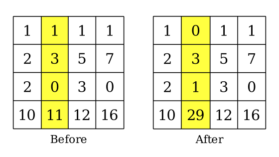

<h1 style='text-align: center;'> E. Xor-Grid Problem</h1>

<h5 style='text-align: center;'>time limit per test: 5 seconds</h5>
<h5 style='text-align: center;'>memory limit per test: 256 megabytes</h5>

Given a matrix $a$ of size $n \times m$, each cell of which contains a non-negative integer. The integer lying at the intersection of the $i$-th row and the $j$-th column of the matrix is called $a_{i,j}$.

Let's define $f(i)$ and $g(j)$ as the [XOR](https://en.wikipedia.org/wiki/Exclusive_or) of all integers in the $i$-th row and the $j$-th column, respectively. In one operation, you can either: 

* Select any row $i$, then assign $a_{i,j} := g(j)$ for each $1 \le j \le m$; or
* Select any column $j$, then assign $a_{i,j} := f(i)$ for each $1 \le i \le n$.

  An example of applying an operation on column $2$ of the matrix. In this example, as we apply an operation on column $2$, all elements in this column are changed: 

* $a_{1,2} := f(1) = a_{1,1} \oplus a_{1,2} \oplus a_{1,3} \oplus a_{1,4} = 1 \oplus 1 \oplus 1 \oplus 1 = 0$
* $a_{2,2} := f(2) = a_{2,1} \oplus a_{2,2} \oplus a_{2,3} \oplus a_{2,4} = 2 \oplus 3 \oplus 5 \oplus 7 = 3$
* $a_{3,2} := f(3) = a_{3,1} \oplus a_{3,2} \oplus a_{3,3} \oplus a_{3,4} = 2 \oplus 0 \oplus 3 \oplus 0 = 1$
* $a_{4,2} := f(4) = a_{4,1} \oplus a_{4,2} \oplus a_{4,3} \oplus a_{4,4} = 10 \oplus 11 \oplus 12 \oplus 16 = 29$

You can apply the operations any number of times. Then, we calculate the $\textit{beauty}$ of the final matrix by summing the absolute differences between all pairs of its adjacent cells.

More formally, $\textit{beauty}(a) = \sum|a_{x,y} - a_{r,c}|$ for all cells $(x, y)$ and $(r, c)$ if they are adjacent. Two cells are considered adjacent if they share a side.

Find the minimum $\textit{beauty}$ among all obtainable matrices.

### Input

The first line contains a single integer $t$ ($1 \le t \le 250$) — the number of test cases.

The first line of each test case contains two integers $n$ and $m$ ($1 \le n, m \le 15$) — the number of rows and columns of $a$, respectively.

The next $n$ lines, each containing $m$ integers $a_{i,1}, a_{i,2}, \ldots, a_{i,m}$ ($0 \le a_{i,j} < 2^{20}$) — description of the matrix $a$.

It is guaranteed that the sum of $(n^2 + m^2)$ over all test cases does not exceed $500$.

### Output

For each test case, print a single integer $b$ — the smallest possible $\textit{beauty}$ of the matrix.

## Example

### Input


```text
41 21 32 30 1 05 4 42 30 2 44 5 13 31 2 34 5 67 8 9
```
### Output

```text

1
3
13
24

```
## Note

Let's denote $r(i)$ as the first type operation applied on the $i$-th row, and $c(j)$ as the second type operation applied on the $j$-th column.

In the first test case, you can apply an operation $c(1)$, which assigns $a_{1,1} := 1 \oplus 3 = 2$. Then, we'll receive this matrix: 

 

| 2 | 3 |
| --- | --- |

 In the second test case, you can apply an operation $r(1)$, which assigns: 

* $a_{1,1} := g(1) = 0 \oplus 5 = 5$
* $a_{1,2} := g(2) = 1 \oplus 4 = 5$
* $a_{1,3} := g(3) = 0 \oplus 4 = 4$

The resulting matrix after performing the operation is: 

 

| 5 | 5 | 4 |
| --- | --- | --- |
| 5 | 4 | 4 |

 In the third test case, the best way to achieve minimum $\textit{beauty}$ is applying three operations: $c(3)$, $r(2)$, and $c(2)$. The resulting matrix is: 

 

| 0 | 4 | 6 |
| --- | --- | --- |
| 4 | 5 | 6 |

 

#### Tags 

#NOT OK #bitmasks #constructive_algorithms #dp #implementation 

## Blogs
- [All Contest Problems](../Codeforces_Round_963_(Div._2).md)
- [Announcement (en)](../blogs/Announcement_(en).md)
- [Tutorial (en)](../blogs/Tutorial_(en).md)
