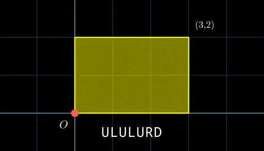
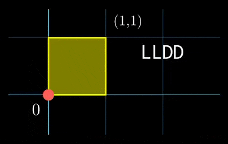
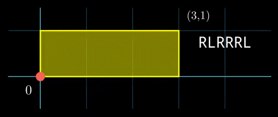

<h1 style='text-align: center;'> F2. Dyn-scripted Robot (Hard Version)</h1>

<h5 style='text-align: center;'>time limit per test: 3 seconds</h5>
<h5 style='text-align: center;'>memory limit per test: 256 megabytes</h5>

This is the hard version of the problem. The only difference is that in this version $k \le 10^{12}$. You can make hacks only if both versions of the problem are solved.

Given a $w \times h$ rectangle on the $Oxy$ plane, with points $(0, 0)$ at the bottom-left and $(w, h)$ at the top-right of the rectangle.

You also have a robot initially at point $(0, 0)$ and a script $s$ of $n$ characters. Each character is either L, R, U, or D, which tells the robot to move left, right, up, or down respectively.

The robot can only move inside the rectangle; otherwise, it will change the script $s$ as follows:

* If it tries to move outside a vertical border, it changes all L characters to R's (and vice versa, all R's to L's).
* If it tries to move outside a horizontal border, it changes all U characters to D's (and vice versa, all D's to U's).

Then, it will execute the changed script starting from the character which it couldn't execute.

  An example of the robot's movement process, $s = \texttt{"ULULURD"}$ The script $s$ will be executed for $k$ times continuously. All changes to the string $s$ will be retained even when it is repeated. During this process, how many times will the robot move to the point $(0, 0)$ in total? 
## Note

 that the initial position does NOT count.

### Input

The first line contains a single integer $t$ ($1 \le t \le 10^4$) — the number of test cases.

The first line of each test case contains four integers $n$, $k$, $w$, and $h$ ($1 \le n, w, h \le 10^6$; $1 \le k \le 10^{12}$).

The second line contains a single string $s$ of size $n$ ($s_i \in \{\texttt{L}, \texttt{R}, \texttt{U}, \texttt{D}\}$) — the script to be executed.

It is guaranteed that the sum of $n$ over all test cases does not exceed $10^6$.

### Output

For each test case, print a single integer — the number of times the robot reaches $(0, 0)$ when executing script $s$ for $k$ times continuously.

## Example

### Input


```text
62 4 2 2UR4 2 1 1LLDD6 3 3 1RLRRRL5 6 3 3RUURD7 5 3 4RRDLUUU7 123456789999 3 2ULULURD
```
### Output

```text

1
4
3
1
1
41152263332

```
## Note

In the first test case, the robot only moves up and right for the first two executions. After that, it occupies the position $(2, 2)$. For the next two executions, it moves down and left and finishes at $(0, 0)$. So the answer is $1$.

In the second test case, each time executing the script the robot visits the origin twice. And since $k=2$, it visits the origin $2 \cdot 2 = 4$ times overall. 

  In the third test case, the visualization is shown as below: 

  

#### Tags 

#NOT OK #chinese_remainder_theorem #math #number_theory 

## Blogs
- [All Contest Problems](../Codeforces_Round_963_(Div._2).md)
- [Announcement (en)](../blogs/Announcement_(en).md)
- [Tutorial (en)](../blogs/Tutorial_(en).md)
