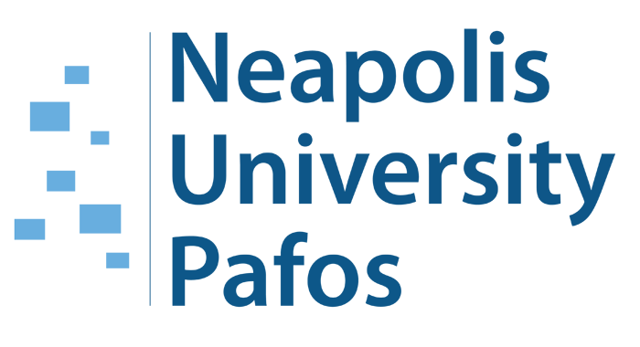

# Announcement

Hello Codeforces!

The series of Educational Rounds continues thanks to the support of the [Neapolis University Pafos](https://codeforces.com/https://www.nup.ac.cy/bsc-in-computer-science-and-artificial-intelligence).

On [Tuesday, July 30, 2024 at 20:35UTC+6](https://codeforces.com/https://www.timeanddate.com/worldclock/fixedtime.html?day=30&month=7&year=2024&hour=17&min=35&sec=0&p1=166) [Educational Codeforces Round 168 (Rated for Div. 2)](https://codeforces.com/contest/1997 "Educational Codeforces Round 168 (Rated for Div. 2)") will start.

This round will be **rated for the participants with rating lower than 2100**. It will be held on extended ICPC rules. The penalty for each incorrect submission until the submission with a full solution is 10 minutes. After the end of the contest, you will have 12 hours to hack any solution you want. You will have access to copy any solution and test it locally.

You will be given **6 or 7 problems** and **2 hours** to solve them.

The problems were invented and prepared by Adilbek [adedalic](https://codeforces.com/profile/adedalic "International Master adedalic") Dalabaev, Ivan [BledDest](https://codeforces.com/profile/BledDest "International Grandmaster BledDest") Androsov, Maksim [Neon](https://codeforces.com/profile/Neon "Candidate Master Neon") Mescheryakov and me. Also, huge thanks to Mike [MikeMirzayanov](https://codeforces.com/profile/MikeMirzayanov "Headquarters, MikeMirzayanov") Mirzayanov for great systems Polygon and Codeforces.

Good luck to all the participants!

**UPD:** [Editorial is out](Tutorial_1.md)

