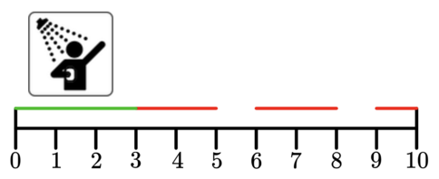

<h1 style='text-align: center;'> C. Showering</h1>

<h5 style='text-align: center;'>time limit per test: 2 seconds</h5>
<h5 style='text-align: center;'>memory limit per test: 256 megabytes</h5>

As a computer science student, Alex faces a hard challenge — showering. He tries to shower daily, but despite his best efforts there are always challenges. He takes $s$ minutes to shower and a day only has $m$ minutes! 

He already has $n$ tasks planned for the day. Task $i$ is represented as an interval $(l_i$, $r_i)$, which means that Alex is busy and can not take a shower in that time interval (at any point in time strictly between $l_i$ and $r_i$). No two tasks overlap.

Given all $n$ time intervals, will Alex be able to shower that day? In other words, will Alex have a free time interval of length at least $s$?

 In the first test case, Alex can shower for the first $3$ minutes of the day and not miss any of the tasks. 

### Input

The first line contains a single integer $t$ ($1 \leq t \leq 10^4$) — the number of test cases.

The first line of each test case contains three integers $n$, $s$, and $m$ ($1 \leq n \leq 2 \cdot 10^5$; $1 \leq s, m \leq 10^9$) — the number of time intervals Alex already has planned, the amount of time Alex takes to take a shower, and the amount of minutes a day has.

Then $n$ lines follow, the $i$-th of which contains two integers $l_i$ and $r_i$ ($0 \leq l_i < r_i \leq m$) — the time interval of the $i$-th task. No two tasks overlap.

Additional constraint on the input: $l_i > r_{i-1}$ for every $i > 1$.

The sum of $n$ over all test cases does not exceed $2 \cdot 10^5$. 

### Output

For each test case output "YES" (without quotes) if Alex can take a shower for that given test case, and "NO" (also without quotes) otherwise.

You can output "YES" and "NO" in any case (for example, strings "yEs", "yes", and "Yes" will be recognized as a positive response).

## Example

### Input


```text
43 3 103 56 89 103 3 101 23 56 73 3 101 23 56 83 4 101 26 78 9
```
### Output

```text

YES
YES
NO
YES

```


#### Tags 

#NOT OK #greedy #implementation 

## Blogs
- [All Contest Problems](../Codeforces_Round_964_(Div._4).md)
- [Announcement (en)](../blogs/Announcement_(en).md)
- [Video Tutorial (en)](../blogs/Video_Tutorial_(en).md)
- [Tutorial #2 (en)](../blogs/Tutorial_2_(en).md)
