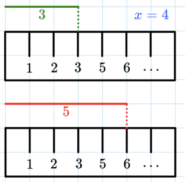

<h1 style='text-align: center;'> G2. Ruler (hard version)</h1>

<h5 style='text-align: center;'>time limit per test: 1 second</h5>
<h5 style='text-align: center;'>memory limit per test: 256 megabytes</h5>

This is the hard version of the problem. The only difference between the two versions is that in this version, you can make at most $\mathbf{7}$ queries.

This is an interactive problem. If you are unsure how interactive problems work, then it is recommended to read [the guide for participants](https://codeforces.com/blog/entry/45307).

We have a secret ruler that is missing one number $x$ ($2 \leq x \leq 999$). When you measure an object of length $y$, the ruler reports the following values: 

* If $y < x$, the ruler (correctly) measures the object as having length $y$.
* If $y \geq x$, the ruler incorrectly measures the object as having length $y+1$.

 The ruler above is missing the number $4$, so it correctly measures the first segment as length $3$ but incorrectly measures the second segment as length $6$ even though it is actually $5$. 

You need to find the value of $x$. To do that, you can make queries of the following form:

* $\texttt{?}~a~b$ — in response, we will measure the side lengths of an $a \times b$ rectangle with our ruler and multiply the results, reporting the measured area of the rectangle back to you. For example, if $x=4$ and you query a $3 \times 5$ rectangle, we will measure its side lengths as $3 \times 6$ and report $18$ back to you.

Find the value of $x$. You can ask at most $\mathbf{7}$ queries.

### Input

Each test contains multiple test cases. The first line of input contains a single integer $t$ ($1 \leq t \leq 1000$) — the number of test cases.

## Interaction

There is no initial input for each test case. You should begin the interaction by asking a query.

To make a query, output a single line of the form $\texttt{?}~a~b$ ($1 \leq a, b \leq 1000$). In response, you will be told the measured area of the rectangle, according to our secret ruler.

When you are ready to print the answer, output a single line of the form $\texttt{!}~x$ ($2 \leq x \leq 999$). After that, proceed to process the next test case or terminate the program if it was the last test case. Printing the answer does not count as a query.

The interactor is not adaptive, meaning that the answer is known before the participant asks the queries and doesn't depend on the queries asked by the participant.

If your program makes more than $7$ queries for one set of input data, makes an invalid query, or prints the wrong value of $x$, then the response to the query will be $-1$. After receiving such a response, your program should immediately terminate to receive the verdict Wrong Answer. Otherwise, you can get an arbitrary verdict because your solution will continue to read from a closed stream.

After printing a query do not forget to output the end of line and flush the output. Otherwise, you may get Idleness limit exceeded verdict. To do this, use: 

* fflush(stdout) or cout.flush() in C++;
* System.out.flush() in Java;
* flush(output) in Pascal;
* stdout.flush() in Python;
* see the documentation for other languages.

Hacks

To make a hack, use the following format.

The first line should contain a single integer $t$ ($1 \leq t \leq 1000$) — the number of test cases.

The only line of each test case should contain a single integer $x$ ($2 \leq x \leq 999$) — the missing number on the ruler.

## Example

### Input


```text

2

18

25


9999
```
#Output
```text

? 3 5

? 4 4

! 4
? 99 100

! 100
```
## Note

In the first test, the interaction proceeds as follows.

 

| Solution | Jury | Explanation |
| --- | --- | --- |
|  | $\texttt{2}$ | There are 2 test cases. |
| $\texttt{? 3 5}$ | $\texttt{18}$ | Secretly, the jury picked $x=4$. The solution requests the $3 \times 5$ rectangle, and the jury responds with $3 \times 6 = 18$, as described in the statement. |
| $\texttt{? 4 4}$ | $\texttt{25}$ | The solution requests the $4 \times 4$ rectangle, which the jury measures as $5 \times 5$ and responds with $25$. |
| $\texttt{! 4}$ |  | The solution has somehow determined that $x=4$, and outputs it. Since the output is correct, the jury continues to the next test case. |
| $\texttt{? 99 100}$ | $\texttt{1}$ | Secretly, the jury picked $x=100$. The solution requests the $99 \times 100$ rectangle, which the jury measures as $99 \times 101$ and responds with $9999$. |
| $\texttt{! 100}$ |  | The solution has somehow determined that $x=100$, and outputs it. Since the output is correct and there are no more test cases, the jury and the solution exit. |

 
## Note

 that the line breaks in the example input and output are for the sake of clarity, and do not occur in the real interaction.


#### Tags 

#NOT OK #binary_search #interactive #ternary_search 

## Blogs
- [All Contest Problems](../Codeforces_Round_964_(Div._4).md)
- [Announcement (en)](../blogs/Announcement_(en).md)
- [Video Tutorial (en)](../blogs/Video_Tutorial_(en).md)
- [Tutorial #2 (en)](../blogs/Tutorial_2_(en).md)
