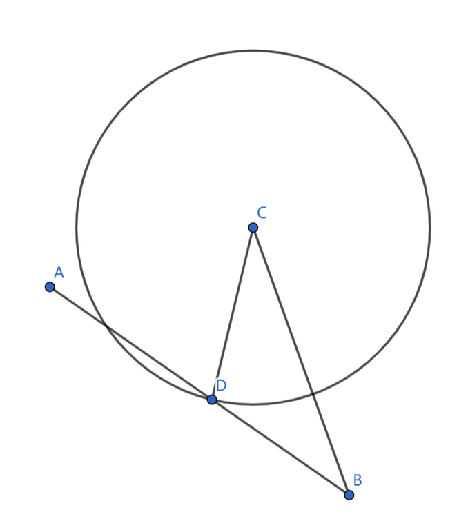

# Tutorial_(en)

[2002A — Distanced Coloring](../problems/A._Distanced_Coloring.md)

idea & solution: [xcyle](https://codeforces.com/profile/xcyle "International Grandmaster xcyle")

 **Hint 1**Consider the case with n=m=k.

 **Hint 2**Generalize the solution for all n,m,k.

 **Tutorial**It can be shown that for any k×k subgrid, the colors we use must be pairwise distinct. Thus, we have an lower bound of min(n,k)⋅min(m,k). We can show that this lower bound is indeed achievable by coloring the upper-left min(n,k)⋅min(m,k) subgrid with distinct colors, and copy-pasting it to fill the rest of the grid.

Time complexity: O(1).

 **Solution**
```cpp
#include <bits/stdc++.h>
using namespace std;
int t, n, m, k;
int main() {
    scanf("%d", &t);

    while (t--) {
        scanf("%d%d%d", &n, &m, &k);
        printf("%dn", min(n, k)*min(m, k));
    }

    return 0;
}
```
[2002B — Removals Game](../problems/B._Removals_Game.md)

idea & solution: [xcyle](https://codeforces.com/profile/xcyle "International Grandmaster xcyle")

 **Hint**Find some conditions that Bob need to win.

 **Tutorial**A general idea is that it is very difficult for Bob to win. We make some observations regarding the case where Bob wins. It is intuitive to see that for any subarray [Al,Al+1,⋯,Ar], the elements' positions in B must also form an interval. From here, it is easy to prove by induction that for Bob to win, either A=B or A=rev(B).

Time complexity: O(n).

 **Solution**
```cpp
#include <bits/stdc++.h>
#define ll long long
#define lc(x) ((x) << 1)
#define rc(x) ((x) << 1 | 1)
#define ru(i, l, r) for (int i = (l); i <= (r); i++)
#define rd(i, r, l) for (int i = (r); i >= (l); i--)
#define mid ((l + r) >> 1)
#define pii pair<int, int>
#define mp make_pair
#define fi first
#define se second
#define sz(s) (int)s.size()
#include <ext/pb_ds/assoc_container.hpp>
#include <ext/pb_ds/tree_policy.hpp>
using namespace __gnu_pbds;
#define ordered_set tree<int, null_type, less<int>, rb_tree_tag, tree_order_statistics_node_update>
using namespace std;
mt19937 Rand(chrono::steady_clock::now().time_since_epoch().count());
int read() {
    int x = 0, w = 0;
    char ch = getchar();

    while (!isdigit(ch))
        w |= ch == '-', ch = getchar();

    while (isdigit(ch))
        x = x * 10 + ch - '0', ch = getchar();

    return w ? -x : x;
}
int main() {
    int T = read();

    while (T--) {
        int n = read();
        vector<int> a, b;
        ru(i, 1, n) a.push_back(read());
        ru(i, 1, n) b.push_back(read());

        if (a == b) {
            printf("Bobn");
            continue;
        }

        reverse(a.begin(), a.end());

        if (a == b) {
            printf("Bobn");
            continue;
        }

        printf("Alicen");
    }

    return 0;
}
```
[2002C — Black Circles](../problems/C._Black_Circles.md)

idea: [Flamire](https://codeforces.com/profile/Flamire "International Grandmaster Flamire"), solution: [le0n](https://codeforces.com/profile/le0n "International Grandmaster le0n")

 **Hint**The problem can't be that hard, find some simple strategy.

 **Tutorial**We consider a simple strategy: walk towards the goal in a straight line.

If some circle reaches the goal first, it is obvious that we have no chance of succeeding, no matter what path we take.

Otherwise, it can be proven that we will not pass any circles on our way to the goal.



Suppose we start at A, our goal is B, and we got intercepted by some circle C at the point D. It follows that CD=AD. According to the triangle inequality, CD>CB−DB should hold. Thus, we have CB−DB≤AD, which means CB≤AB, proof by contradiction.

Time complexity: O(n).

 **Solution**
```cpp
#include <bits/stdc++.h>
#define ll long long
using namespace std;
int t, n, x[100011], y[100011], xs, ys, xt, yt;
ll dis(int x1, int y1, int x2, int y2) {
    return 1ll * (x2 - x1) * (x2 - x1) + 1ll * (y2 - y1) * (y2 - y1);
}
int main() {
    scanf("%d", &t);

    while (t--) {
        scanf("%d", &n);

        for (int i = 1; i <= n; ++i)
            scanf("%d%d", x + i, y + i);

        scanf("%d%d%d%d", &xs, &ys, &xt, &yt);
        bool ok = 1;

        for (int i = 1; i <= n; ++i) {
            if (dis(xt, yt, x[i], y[i]) <= dis(xt, yt, xs, ys)) {
                ok = 0;
                break;
            }
        }

        printf(ok ? "YESn" : "NOn");
    }

    fclose(stdin);
    fclose(stdout);
    return 0;
}
```
[2002D1 — DFS Checker (Easy Version)](../problems/D1._DFS_Checker_(Easy_Version).md) and [2002D2 — DFS Checker (Hard Version)](../problems/D1._DFS_Checker_(Easy_Version).md)

idea & solution: [xcyle](https://codeforces.com/profile/xcyle "International Grandmaster xcyle")

 **Hint**Try to find some easy checks that can be maintained.

 **Tutorial**The problem revolves around finding a check for dfs orders that's easy to maintain. We have discovered several such checks, a few checks and their proofs are described below, any one of these checks suffices to tell whether a dfs order is valid.

 **Check 1**For every u, all of its children v satisfies [posv,posv+sizv−1]∈[posu,posu+sizu−1]. We can maintain this check by keeping track of the number of u which violates this condition, and check for each u using sets.

Proof: We prove by induction. When u's children only consists of leaves, it is easy to see that this check ensures [posu,posu+sizu−1] is a valid dfs order of the subtree of u. Then, we can merge the subtree of u into a large node with size sizu, and continue the analysis above.

 **Check 2**Check 2: First we check p1=1. Then, for each pair of adjacent elements pi,pi+1, fa(pi+1) must be an ancestor of pi. We can maintain this check by keeping track of the number of u which violates this condition, and check for each i by checking whether pi is in the subtree of fa(pi+1).

Proof: For any subtree u, we take any pi,pi+1 such that pi does not belong in subtree u, but pi+1 does. It follows that pi+1=u, since only the subtree of fa(u) has nodes that does not belong in subtree u. From this, we can gather that each subtree will be entered at most once (and form a continuous interval), and that the first visited node will be u, which is sufficient to say that p is a dfs order.

Time complexity: O((n+q)logn)/O(n+q).

 **Solution (Check 1)**
```cpp
#include <bits/stdc++.h>
#define ll long long
#define lc(x) ((x) << 1)
#define rc(x) ((x) << 1 | 1)
#define ru(i, l, r) for (int i = (l); i <= (r); i++)
#define rd(i, r, l) for (int i = (r); i >= (l); i--)
#define mid ((l + r) >> 1)
#define pii pair<int, int>
#define mp make_pair
#define fi first
#define se second
#define sz(s) (int)s.size()
#include <ext/pb_ds/assoc_container.hpp>
#include <ext/pb_ds/tree_policy.hpp>
using namespace __gnu_pbds;
#define ordered_set tree<int, null_type, less<int>, rb_tree_tag, tree_order_statistics_node_update>
using namespace std;
#define maxn 500005
mt19937 Rand(chrono::steady_clock::now().time_since_epoch().count());
int read() {
    int x = 0, w = 0; char ch = getchar();
    while(!isdigit(ch)) w |= ch == '-', ch = getchar();
    while(isdigit(ch)) x = x * 10 + ch - '0', ch = getchar();
    return w ? -x : x;
}
int n, Q, fa[maxn], p[maxn], q[maxn], siz[maxn];
set<int> son[maxn];
int chk(int x) {
    return son[x].empty() ? 1 : (q[x] < *son[x].begin() && *--son[x].end() + siz[p[*--son[x].end()]] <= q[x] + siz[x]);
}
void solve() {
    n = read(), Q = read();
    ru(i, 1, n) siz[i] = 1, son[i].clear();
    ru(i, 2, n) fa[i] = read();
    rd(i, n, 2) siz[fa[i]] += siz[i];
    ru(i, 1, n) son[fa[p[i] = read()]].insert(i), q[p[i]] = i;
    int cnt = 0;
    ru(i, 1, n) cnt += chk(i);
    while(Q--) {
        int i = read(), j = read(), x = p[i], y = p[j];
        set<int> s; s.insert(x), s.insert(y), s.insert(fa[x]), s.insert(fa[y]);
        for (auto x: s) if(x) cnt -= chk(x);
        son[fa[x]].erase(i), son[fa[y]].erase(j);
        swap(p[i], p[j]), swap(q[x], q[y]);
        son[fa[x]].insert(j), son[fa[y]].insert(i);
        for (auto x: s) if(x) cnt += chk(x);
        puts(cnt == n ? "YES" : "NO");
    }
}
int main() {
    int T = read();
    while(T--) solve();
    return 0;
}
```
 **Solution (Check 2, LipArcanjo)**
```cpp
#include <bits/stdc++.h>
using namespace std;
#define pb push_back
#define mp make_pair
#define fi first
#define se second
#define int long long
void dbg_out() { cerr << endl; }
template <typename H, typename... T>
void dbg_out(H h, T... t) { cerr << ' ' << h; dbg_out(t...); }
#define dbg(...) { cerr << #__VA_ARGS__ << ':'; dbg_out(__VA_ARGS__); }
using ll = long long;
mt19937_64 rng(chrono::steady_clock::now().time_since_epoch().count());
 
const int MAXN = 3e5 + 5;
const int MOD = 1e9+7; //998244353;
const int INF = 0x3f3f3f3f;
const ll INF64 = ll(4e18) + 5;
 
 
vector<int> g[MAXN];
 
int tin[MAXN];
int tout[MAXN];
int id[MAXN];
int par[MAXN];
int T = 0;
void dfs(int u, int p){
	id[u] = tin[u] = tout[u] = T++;
	for(auto v : g[u]) if(v != p){
		dfs(v,u);
		par[v] = u;
		tout[u] = tout[v];
	}
}
 
void solve(){
	int n,q;
	cin >> n >> q;
	vector<int> p(n+1);
	for(int i = 0; i <= n; i++) g[i].clear();
	T = 0;
	for(int i = 2; i <= n; i++){
		int pi;
		cin >> pi;
		g[pi].push_back(i);
	}
	for(int i = 1; i <= n; i++){
		cin >> p[i];
	}
	dfs(1,1);
	int cnt = 0;
	auto ok = [&](int i){
		if(p[i] == 1){
			if(i == 1) return 1;
			return 0;
		}
		int ant = p[i-1];
		if(par[p[i]] == ant) return 1;
		if(tin[ant] != tout[ant]) return 0;
		int pa = par[p[i]];
		if(tin[ant] < tin[pa] || tin[ant] > tout[pa]) return 0;
		return 1;
	};
	for(int i = 1; i <= n; i++){
		cnt += ok(i);
	}
	for(int qw = 0; qw < q; qw++){
		int x,y;
		cin >> x >> y;
		set<int> in;
		in.insert(x);
		in.insert(y);
		if(x-1 >= 1) in.insert(x-1);
		if(x+1 <= n) in.insert(x+1);
		if(y-1 >= 1) in.insert(y-1);
		if(y+1 <= n) in.insert(y+1);
		for(auto v : in){
			cnt -= ok(v);
		}
		swap(p[x],p[y]);
		for(auto v : in){
			cnt += ok(v);
		}
		cout << (cnt == n ? "YES": "NO") << 'n';
	}
	
}
 
signed main(){
 
    ios::sync_with_stdio(false); cin.tie(NULL);
 
    int t = 1;
    cin >> t;
    while(t--){
        solve();
    }
 
    return 0;
}
```
[2002E — Cosmic Rays](../problems/E._Cosmic_Rays.md)

idea: [le0n](https://codeforces.com/profile/le0n "International Grandmaster le0n"), solution: [Flamire](https://codeforces.com/profile/Flamire "International Grandmaster Flamire")

 **Hint 1**Consider an incremental solution.

 **Hint 2**Use stacks.

 **Tutorial**The problems asks for the answer for every prefix, which hints at an incremental solution.

To add a new pair to the current prefix, we need to somehow process the new block merging with old ones. Thus, we should use some structure to store the information on the last block over time.

Namely, we use a stack to keep track of all blocks that became the last. For each block, we keep two values: its color c and its lifetime l (the times it takes for the block to disappear).

When inserting a new block, we pop all blocks that would be shadowed by the current one (i.e. with lifetime shorter than the current block), and merging blocks with the same a. When merging two blocks with length x and z, and the maximum lifetime of blocks between them is y, y≤min(x,z) should hold, and the new block will have lifetime x+z−y.

For more details, please refer to the solution code.

There also exists O(nlogn) solutions using ordered sets or heaps.

Time complexity: O(n).

 **Solution**
```cpp
#include <bits/stdc++.h>
#define N 1000011
#define ll long long
#define pii pair<ll,int>
#define s1 first
#define s2 second
using namespace std;
int t, n, b[N];
ll a[N];
pii s[N];
int sn;
int main() {
    scanf("%d", &t);

    while (t--) {
        scanf("%d", &n);

        for (int i = 1; i <= n; ++i)
            scanf("%lld%d", a + i, b + i);

        sn = 0;
        ll x = 0;

        for (int i = 1; i <= n; ++i) {
            ll mx = 0;

            while (sn) {
                if (s[sn].s2 == b[i])
                    a[i] += s[sn--].s1 - mx;
                else if (s[sn].s1 <= a[i])
                    mx = max(mx, s[sn--].s1);
                else
                    break;
            }

            ++sn;
            s[sn] = pii(a[i], b[i]);
            x = max(x, s[sn].s1);
            printf("%lld ", x);
        }

        putchar(10);
    }

    return 0;
}
```
 **Solution (priority_queue)**
```cpp
#include <bits/stdc++.h>
#define ll long long
#define N 3000011
#define pii pair<ll,int>
#define s1 first
#define s2 second
using namespace std;
int t, n, prv[N], nxt[N], b[N];
ll a[N];
priority_queue<pair<ll, int>> pq, del;
ll sum = 0, ans[N];
int main() {
    scanf("%d", &t);

    while (t--) {
        scanf("%d", &n);

        for (int i = 1; i <= n; ++i)
            scanf("%lld%d", a + i, b + i);

        while (!pq.empty())
            pq.pop();

        while (!del.empty())
            del.pop();

        nxt[0] = 1;
        prv[n + 1] = n;

        for (int i = 1; i <= n; ++i)
            pq.push({-a[i], i}), prv[i] = i - 1, nxt[i] = i + 1;
        ll tim = 0;
        int lst = 1;

        for (int _ = 1; _ <= n; ++_) {
            while (!del.empty() && pq.top() == del.top())
                pq.pop(), del.pop();

            pii p = pq.top();
            pq.pop();
            int id = p.s2;
            tim = -p.s1;

            if (nxt[id] <= n && b[id] == b[nxt[id]]) {
                a[nxt[id]] += tim;
                pq.push({-a[nxt[id]], nxt[id]});
            }

            if (prv[id] && nxt[id] <= n && b[prv[id]] == b[nxt[id]]) {
                del.push({-a[nxt[id]], nxt[id]});
                a[nxt[id]] -= tim;
            }

            prv[nxt[id]] = prv[id];
            nxt[prv[id]] = nxt[id];

            while (lst < nxt[0])
                ans[lst++] = tim;
        }

        for (int i = 1; i <= n; ++i)
            printf("%lld ", ans[i]);

        putchar(10);
    }

    return 0;
}
```
[2002F1 — Court Blue (Easy Version)](../problems/F1._Court_Blue_(Easy_Version).md)

idea: [Flamire](https://codeforces.com/profile/Flamire "International Grandmaster Flamire"), solution: [le0n](https://codeforces.com/profile/le0n "International Grandmaster le0n")

 **Hint 1**Primes are powerful.

 **Hint 2**Prime gaps are small.

 **Tutorial**We view the problem as a walk on grid, starting at (1,1). WLOG, we suppose l>f, thus only cells (a,b) where a<b would be considered.

Notice that when n is large enough, the largest prime p≤n satisfies 2p>n. As such, all cells (p,i) where i<p will be unblocked and reachable.

However, we've only bounded one side of the final result. We take this a step further, let q be the second-largest prime q≤n. By the same logic, we assume that 2q>n. As such, all cells (i,q), where p≤i≤n will be unblocked and reachable.

Thus, we have constructed an area where the optimal solution must be, with its dimensions bounded by n−p and n−q. We just need to run any brute force solution (dfs with memorization or dp) on this area to find the result.

If we assume the asymptotic of prime gap is O(P(n)), this yields a O(n⋅P(n)2⋅logP(n)) solution, where the loglogn is from taking the gcd of two numbers which differ by O(P(n)). This can also be optimized to O(n⋅P(n)2) by preprocessing gcd.

We added the constraints that n's are pairwise distinct to avoid forcing participants to write memorizations. In fact, under the constraints of the problem, the maximum area is 39201, and the sum of the 103 largest areas is 2.36×107.

Time complexity: O(P(n)2logP(n))/O(P(n)2)

 **Solution**
```cpp
#include <bits/stdc++.h>

using namespace std;
typedef long long ll;

const int N = 2e7 + 5;
bool ntp[N];
int di[405][405];
bool bad[405][405];
int pos[N], g = 0, m = 3;
int prime[2000005], cnt = 0;
void sieve(int n) {
    int i, j;

    for (i = 2; i <= n; i++) {
        if (!ntp[i])
            prime[++cnt] = i;

        for (j = 1; j <= cnt && i * prime[j] <= n; j++) {
            ntp[i * prime[j]] = 1;

            if (!(i % prime[j]))
                break;
        }
    }
}
int gcd(int x, int y) {
    if (!x)
        return y;

    if (x <= g && y <= g)
        return di[x][y];

    return gcd(y % x, x);
}

int main() {
    sieve(2e7);
    int i, j = 1, T, n, a, b, c, u, v;
    ll ans;

    for (i = 3; i <= 2e7; i++) {
        while (j < cnt - 1 && prime[j + 2] <= i)
            j++;

        g = max(g, i - prime[j] + 1);

        if (prime[j] * 2 <= i)
            m = i;

        pos[i] = j;
    }

    for (i = 0; i <= g; i++)
        for (j = 0; j <= g; j++)
            if (!i)
                di[i][j] = j;
            else
                di[i][j] = di[j % i][i];

    scanf("%d", &T);

    while (T--) {
        scanf("%*d%d%d%d", &n, &a, &b);

        if (n <= m)
            u = v = 1;
        else {
            u = prime[pos[n] + 1];
            v = prime[pos[n]];
        }

        ans = 0;

        for (i = u; i <= n; i++)
            for (j = v; j <= i; j++) {
                bad[i - u + 1][j - v + 1] = (gcd(i, j) > 1 || (bad[i - u][j - v + 1] && bad[i - u + 1][j - v]));

                if (!bad[i - u + 1][j - v + 1])
                    ans = max(ans, max((ll)a * i + (ll)b * j, (ll)a * j + (ll)b * i));
            }

        printf("%lldn", ans);
    }

    return 0;
}
```
[2002F2 — Court Blue (Hard Version)](../problems/F2._Court_Blue_(Hard_Version).md)

idea: [le0n](https://codeforces.com/profile/le0n "International Grandmaster le0n"), solution: [xcyle](https://codeforces.com/profile/xcyle "International Grandmaster xcyle")

 **Hint**Try generalizing the solution of F1.

 **Hint (alternate version)**Write anything and pray that it will pass because of number theory magic.

 **Tutorial**We generalize the solution in F1. Let p be the largest prime ≤m and q be the largest prime ≤min(n,p−1). The problem is that there might be gcd(q,i)≠1 for some p+1≤i≤m, thus invalidating our previous analysis.

To solve this, we simply choose q to be the largest integer such that q≤n and gcd(q,i)=1 for all p+1≤i≤m. An asymptotic analysis of this solution is as follows:

As the length of [p+1,m] is O(P(m)), and each of these integers have at most O(lognm) prime divisors of O(m) magnitude, which means that if we only restrict q to primes, we will have to skip at most O(P(n)lognm) primes to find the largest q. As the density of primes is O(1P(n)), the asymptotic of n−q will be O(P(m)lognm⋅P(n))=O(P(m)2), our actual q (which is not restricted to primes) will not be worse than this. Thus, our total area will be O(P(m)3), times the gcd complexity gives us an O(P(m)3logm) solution. However, the actual area is much lower than this.

Under the constraints of the problem, when forcing p,q to take primes, the maximum area is 39960, and the sum of the 103 largest areas is 3.44×107. The actual solution will not be worse than this.

Because we only need to check whether gcd(x,y)=1, the complexity can actually be optimized to O(P(m)3) with some sieves. Namely, iterating over prime divisors d of [p,m] and [q,n] and marking all cells which has d as its common divisor.

This solution is by far from optimal. We invite you to continue optimizing your solutions and try to minimize the number of cells visited in each query :)

Time complexity: O(P(m)3logm)

 **Select solutions from paticipants and testers****Solution 1**Keep p the same, set q to p−L and only keep reachable cells in [p,n]×[q,m]. L is some constant (100 should work).

We found this solution during testing, tried, and failed to hack it.

 **Solution 2**Keep p the same, do dfs from each cell (n,p),(n−1,p),⋯, prioritizing increasing WL over increasing WF, and stop the process the first time you reach any cell (x,m), take the maximum of all cells visited.

This should not be worse than the intended solution, and actually runs quite fast.

 **Solution 3**Simply take all cells in [n−L,n]×[m−L,m] and mark everything outside as reachable. L=50 works.

We found this solution the day before the round, we don't know how to hack it either.

 **Solution 4**Do dfs with pruning. Run dfs starting at (n,m), return when the cell is (p,i) (i.e. obviously reachable because of primes), or when the value of the cell is smaller than the current answer. Add some memorization and it passes. 

 **Solution**
```cpp
#include <bits/stdc++.h>

using namespace std;
typedef long long ll;

const int N = 2e7 + 5;
bool ntp[N];
bool bad[405][405];
int pos[N];
int prime[2000005], mn[N], cnt;
void sieve(int n) {
    int i, j;

    for (i = 2; i <= n; i++) {
        if (!ntp[i])
            prime[++cnt] = i, mn[i] = i;

        for (j = 1; j <= cnt && i * prime[j] <= n; j++) {
            mn[i * prime[j]] = prime[j];
            ntp[i * prime[j]] = 1;

            if (!(i % prime[j]))
                break;
        }
    }
}
int gcd(int x, int y) {
    return x ? gcd(y % x, x) : y;
}
bool no(int l, int r, int k) {
    while (k > 1) {
        int x = mn[k];

        while (k % x == 0)
            k /= x;

        if (((l + x - 1) / x) * x <= r)
            return 0;
    }

    return 1;
}

int main() {
    sieve(20000000);
    int i, j = 0, T, n, m, a, b, u, v, g = 0, S = 0, px, py, qwq = 0;
    ll ans;
    prime[0] = 1;

    for (i = 2; i <= 20000000; i++) {
        while (j < cnt && prime[j + 1] <= i)
            j++;

        pos[i] = j;
    }

    scanf("%d", &T);

    while (T--) {
        scanf("%d%d%d%d", &n, &m, &a, &b);

        if (n < m) {
            swap(n, m);
            swap(a, b);
        }

        u = prime[pos[n]];
        v = m;

        while (v && !no(u, n, v))
            v--;

        ans = 0;
        px = py = 0;

        for (i = u; i <= n; i++)
            for (j = v; j <= m && j <= i; j++) {
                bad[i - u + 1][j - v + 1] = ((bad[i - u][j - v + 1] && bad[i - u + 1][j - v]) || gcd(i, j) > 1);

                if (!bad[i - u + 1][j - v + 1]) {
                    ans = max(ans, (ll)a * i + (ll)b * j);

                    if ((ll)a * i + (ll)b * j == ans) {
                        px = i;
                        py = j;
                    }

                    if (i <= m)
                        ans = max(ans, (ll)a * j + (ll)b * i);
                }
            }

        qwq = max(qwq, (n - px) + (m - py));
        printf("%lldn", ans);
    }
    return 0;
}
```
 **Solution (dfs)**
```cpp
#include <bits/stdc++.h>
#define ll long long
#define N 20000011
using namespace std;
int t, n, m, a, b;
bool is[N];
int pr[N / 10];
int gcd(int a, int b) {
    while (b)
        a %= b, swap(a, b);

    return a;
}
ll ans = 0;
bool vis[1011][1011];
pair<int, int> vv[200011];
int vn, c;
bool flg = 0;
inline ll V(int i, int j) {
    return i <= n ? 1ll * max(i, j) * max(a, b) + 1ll * min(i, j) * min(a, b) : 1ll * i * b + 1ll * j * a;
}
void dfs(int i, int j) {
    ++c;
    bool mk = gcd(i, j) == 1;

    if (!mk)
        return;

    ans = max(ans, V(i, j));
    vis[m - i][n - j] = 1;
    vv[++vn] = {i, j};

    if (j < n && !vis[m - i][n - j - 1])
        dfs(i, j + 1);

    if (i == m || flg) {
        flg = 1;
        return;
    }

    if (i < m && !vis[m - i - 1][n - j])
        dfs(i + 1, j);
}
int main() {
    is[0] = is[1] = 1;

    for (int i = 2; i < N; ++i) {
        if (!is[i])
            pr[++pr[0]] = i;

        for (int j = 1; j <= pr[0] && i * pr[j] < N; ++j) {
            is[i * pr[j]] = 1;

            if (i % pr[j] == 0)
                break;
        }
    }

    scanf("%d", &t);

    while (t--) {
        scanf("%d%d%d%d", &n, &m, &a, &b);
        int p;

        if (m <= 10)
            p = 1;
        else {
            p = m;

            while (is[p])
                --p;
        }

        vn = 0;
        ans = 0;
        flg = 0;
        c = 0;

        for (int i = min(n, p - (p > 1));; --i) {
            assert(i > 0);
            ans = max(ans, V(p, i));

            if (p < m)
                dfs(p + 1, i);
            else
                break;

            if (flg)
                break;
        }

        for (int i = 1; i <= vn; ++i)
            vis[m - vv[i].first][n - vv[i].second] = 0;

        printf("%lldn", ans);
    }

    return 0;
}
```
[2002G — Lattice Optimizing](../problems/G._Lattice_Optimizing.md)

idea & solution: [xcyle](https://codeforces.com/profile/xcyle "International Grandmaster xcyle")

We apologize for unintended solutions passing, and intended solutions failing with large constants. Brute force runs very fast on n=18n=18, which forced us to increase constraints.

 **Hint 1**Meet in the middle with a twist.

 **Hint 2**Union of sets is hard. Disjoint union of sets is easy.

 **Tutorial**The problem hints strongly at meet in the middle, at each side, there will be O(2n) paths. The twist is on merging: we are given two sequence of sets S1,S2,⋯ and T1,T2,⋯, we have to find the maximum MEX(Si∪Tj). 

If we enumerate over the maximum MEX P, we only need to check whether there exists two sets such that 0,1,⋯,P−1⊆Si∪Tj.

Instead of meeting at n, we perform meet in the middle at the partition of Bn and (2−B)n. For each Si, we put all its subsets S′i into a hashmap. When checking MEX P, we iterate over all Tj, and check whether 0,1,⋯,P−1−Tj is in the hashmap. This gives us a O((22Bn+2(2−B)n)⋅n) solution, which is optimal at B=23, where the complexity is O(243⋅n).

We can substitute enumerating P with binary search, yielding O(243n⋅logn), or checking whether P can be increased each time, yielding O(243n).

Instead of hashmaps, you can also insert all S and T's into a trie, and run a brute force dfs to search for MEX P. It can be proven that the complexity is also O(243n⋅n).

The intended solution is O(243n), however solutions that have slightly higher complexity can pass with good optimizations.

Time complexity: O(243n).

 **Solution**
```cpp
#include <bits/stdc++.h>
#define ll long long
using namespace std;
int D[111][111], R[111][111], n;
const int P = 30000019;
struct custom_hash {
    static uint64_t splitmix64(uint64_t x) {
        // http://xorshift.di.unimi.it/splitmix64.c
        x += 0x9e3779b97f4a7c15;
        x = (x ^ (x >> 30)) * 0xbf58476d1ce4e5b9;
        x = (x ^ (x >> 27)) * 0x94d049bb133111eb;
        return x ^ (x >> 31);
    }

    size_t operator()(uint64_t x) const {
        static const uint64_t FIXED_RANDOM = chrono::steady_clock::now().time_since_epoch().count();
        return splitmix64(x + FIXED_RANDOM);
    }
} HH;
int sta[P], top;
struct uset {
    struct edge {
        pair<int, ll> v;
        int next;
        edge() {} edge(pair<int, ll> _v, int _next) {
            v = _v;
            next = _next;
        }
    } e[20000011];
    int head[P], sz;
    uset() {
        memset(head, -1, sizeof(head));
        sz = 0;
    }
    void insert(pair<int, ll> x) {
        int u = HH(x.second * n + x.first) % P;
        sta[++top] = u;

        for (int i = head[u]; ~i; i = e[i].next)
            if (e[i].v == x)
                return;

        e[++sz] = edge(x, head[u]);
        head[u] = sz;
    }
    bool find(pair<int, ll> x) {
        int u = HH(x.second * n + x.first) % P;

        for (int i = head[u]; ~i; i = e[i].next)
            if (e[i].v == x)
                return 1;

        return 0;
    }
} st;
int B;
void dfs1(int x, int y, ll S, int tp) {
    if (x + y == B) {
        st.insert({x, S});
        return;
    }

    if (y < n) {
        dfs1(x, y + 1, S, 0);
        dfs1(x, y + 1, S | 1ll << R[x][y], -1);
    }

    if (x < n) {
        if (tp != 0)
            dfs1(x + 1, y, S, 1);

        dfs1(x + 1, y, S | 1ll << D[x][y], -1);
    }
}
int ans = 0;
void dfs2(int x, int y, ll S) {
    if (x + y == B) {
        int res = 0;

        while (ans <= 2 * n - 2) {
            if (st.find({x, (~S) & (1ll << (ans + 1)) - 1}))
                ans++;
            else
                break;
        }

        return;
    }

    if (x > 1)
        dfs2(x - 1, y, S | 1ll << D[x - 1][y]);

    if (y > 1)
        dfs2(x, y - 1, S | 1ll << R[x][y - 1]);
}
void solve() {
    while (top)
        st.head[sta[top--]] = -1;

    st.sz = 0;
    ans = 0;
    scanf("%d", &n);

    for (int i = 1; i < n; ++i)
        for (int j = 1; j <= n; ++j)
            scanf("%d", D[i] + j);

    for (int i = 1; i <= n; ++i)
        for (int j = 1; j < n; ++j)
            scanf("%d", R[i] + j);

    B = 2 * n / 3 + 2;
    dfs1(1, 1, 0, -1);
    dfs2(n, n, 0);
    printf("%dn", ans);
}
int main() {
    int T;
    scanf("%d", &T);

    while (T--)
        solve();

    return 0;
}
```
 **Solution (trie, LipArcanjo)**
```cpp
#include <bits/stdc++.h>
using namespace std;
#define pb push_back
#define mp make_pair
#define fi first
#define se second
#define int long long
void dbg_out() {
    cerr << endl;
}
template <typename H, typename... T>
void dbg_out(H h, T... t) {
    cerr << ' ' << h;
    dbg_out(t...);
}
#define dbg(...) { cerr << #__VA_ARGS__ << ':'; dbg_out(__VA_ARGS__); }
using ll = long long;
mt19937_64 rng(chrono::steady_clock::now().time_since_epoch().count());

const int MAXN = 3e7 + 5;
const int MOD = 1e9 + 7; //998244353;
const int INF = 0x3f3f3f3f;
const ll INF64 = ll(4e18) + 5;

int D[40][40];
int R[40][40];

int L;

int32_t trie[MAXN][2];
int n;
int li = 1;
void add(int x) {
    int at = 0;
    int K = 2 * n - 2;

    for (int i = 0; i <= K; i++) {
        int id = (x >> i) & 1;

        if (trie[at][id] == 0) {
            trie[at][id] = li++;
        }

        at = trie[at][id];
    }
}

void limpa() {
    for (int i = 0; i < li; i++) {
        trie[i][0] = trie[i][1] = 0;
    }

    li = 1;
}

int query(int at, int x, int dep) {
    int id = (x >> dep) & 1;

    if (id == 0) {
        if (trie[at][1]) {
            return query(trie[at][1], x, dep + 1);
        }

        return dep;
    }

    int ans = dep;

    if (trie[at][0])
        ans = max(ans, query(trie[at][0], x, dep + 1));

    if (trie[at][1])
        ans = max(ans, query(trie[at][1], x, dep + 1));

    while ((x >> ans) & 1)
        ans++;

    return ans;
}

void rec_in(int i, int j, int tar1, int tar2, int v) {
    if (i > tar1 || j > tar2)
        return;

    if (i == tar1 && j == tar2) {
        add(v);
    }

    int right = v | (1ll << R[i][j]);
    int down = v | (1ll << D[i][j]);
    rec_in(i + 1, j, tar1, tar2, down);
    rec_in(i, j + 1, tar1, tar2, right);
}

int ANS = 0;
void rec_out(int i, int j, int tar1, int tar2, int v) {
    if (i < tar1 || j < tar2)
        return;

    if (i == tar1 && j == tar2) {
        ANS = max(ANS, query(0, v, 0));
        return;
    }

    int left = v | (1ll << R[i][j - 1]);
    int up = v | (1ll << D[i - 1][j]);
    rec_out(i - 1, j, tar1, tar2, up);
    rec_out(i, j - 1, tar1, tar2, left);
}

void solve() {
    ANS = 0;

    for (int i = 1; i <= li; i++)
        trie[i][0] = trie[i][1] = 0;

    li = 1;
    cin >> n;
    L = 4 * n / 3;

    for (int i = 0; i < n - 1; i++) {
        for (int j = 0; j < n; j++) {
            cin >> D[i][j];
        }
    }

    if (L > n) {
        L--;
    }

    if (L > n) {
        L--;
    }

    if (L > n) {
        L--;
    }

    for (int i = 0; i < n; i++) {
        for (int j = 0; j < n - 1; j++) {
            cin >> R[i][j];
        }
    }

    for (int i = 0; i < n; i++)
        for (int j = 0; j < n; j++)
            if (i + j == L) {
                limpa();
                rec_in(0, 0, i, j, 0);
                rec_out(n - 1, n - 1, i, j, 0);
            }

    cout << ANS << 'n';

}

signed main() {
    ios::sync_with_stdio(false);
    cin.tie(NULL);

    int t = 1;
    cin >> t;

    while (t--) {
        solve();
    }

    return 0;
}
```
[2002H — Counting 101](../problems/H._Counting_101.md)

TBA

