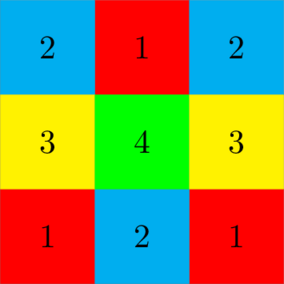

<h1 style='text-align: center;'> A. Distanced Coloring</h1>

<h5 style='text-align: center;'>time limit per test: 1 second</h5>
<h5 style='text-align: center;'>memory limit per test: 256 megabytes</h5>

You received an $n\times m$ grid from a mysterious source. The source also gave you a magic positive integer constant $k$.

The source told you to color the grid with some colors, satisfying the following condition:

* If $(x_1,y_1)$, $(x_2,y_2)$ are two distinct cells with the same color, then $\max(|x_1-x_2|,|y_1-y_2|)\ge k$.

You don't like using too many colors. Please find the minimum number of colors needed to color the grid.

### Input

Each test contains multiple test cases. The first line contains the number of test cases $t$ ($1\le t\le1000$). The description of the test cases follows.

The only line of each test case consists of three positive integers $n$, $m$, $k$ ($1\le n,m,k\le10^4$) — the dimensions of the grid and the magic constant.

### Output

For each test case, print a single integer — the minimum number of colors needed to color the grid.

## Example

### Input


```text
63 3 25 1 100007 3 43 2 78 9 62 5 4
```
### Output

```text

4
5
12
6
36
8

```
## Note

In the first test case, one of the optimal constructions is:

  In the second test case, the color of all cells must be pairwise different, so the answer is $5$.


#### Tags 

#NOT OK #constructive_algorithms #implementation #math 

## Blogs
- [All Contest Problems](../EPIC_Institute_of_Technology_Round_August_2024_(Div._1_+_Div._2).md)
- [Announcement](../blogs/Announcement.md)
- [Tutorial (en)](../blogs/Tutorial_(en).md)
