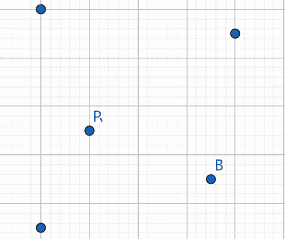

<h1 style='text-align: center;'> C. Black Circles</h1>

<h5 style='text-align: center;'>time limit per test: 2 seconds</h5>
<h5 style='text-align: center;'>memory limit per test: 256 megabytes</h5>

There are $n$ circles on a two-dimensional plane. The $i$-th circle is centered at $(x_i,y_i)$. Initially, all circles have a radius of $0$.

The circles' radii increase at a rate of $1$ unit per second.

You are currently at $(x_s,y_s)$; your goal is to reach $(x_t,y_t)$ without touching the circumference of any circle (including the moment you reach $(x_t,y_t)$). You can move in any direction you want. However, your speed is limited to $1$ unit per second.

Please determine whether this is possible.

### Input

Each test contains multiple test cases. The first line contains the number of test cases $t$ ($1\le t\le10^4$). The description of the test cases follows.

The first line of each test case contains a single integer $n$ ($1\le n\le10^5$) — the number of circles.

The next $n$ lines each contain two integers $x_i$, $y_i$ ($1\le x_i,y_i\le10^9$) — the center of each circle.

The final line contains four integers $x_s$, $y_s$, $x_t$, $y_t$ ($1\le x_s,y_s,x_t,y_t\le10^9$) — the coordinates of the starting point and the goal, respectively.

It is guaranteed that these $n+2$ points are distinct.

It is guaranteed that the sum of $n$ over all testcases does not exceed $10^5$.

### Output

For each test case, output $\texttt{YES}$ if it is possible to reach the goal without touching the circle boundaries, and output $\texttt{NO}$ otherwise.

You can output $\texttt{Yes}$ and $\texttt{No}$ in any case (for example, strings $\texttt{yEs}$, $\texttt{yes}$, $\texttt{Yes}$, and $\texttt{YES}$ will be recognized as a positive response).

## Example

### Input


```text
732 52 1410 134 9 9 7310 116 912 1214 13 4 815 712 6 11 1321000000000 22 10000000001 1 2 21999999998 1000000000999999999 999999999 1 111000000000 11 1000000000 1 110989237121 2397081206669655 527238537522705783 380636165532545346 320061691207818728 199485303884520552 315781807992311437 802563521205138355 324818663223575704 395073023281560523 236279118216941610 572010615 323956540 794523071
```
### Output

```text

YES
NO
YES
YES
YES
NO
YES

```
## Note

In the first test case, a feasible way of movement is as follows. 

  

#### Tags 

#NOT OK #brute_force #constructive_algorithms #geometry #greedy #math 

## Blogs
- [All Contest Problems](../EPIC_Institute_of_Technology_Round_August_2024_(Div._1_+_Div._2).md)
- [Announcement](../blogs/Announcement.md)
- [Tutorial (en)](../blogs/Tutorial_(en).md)
