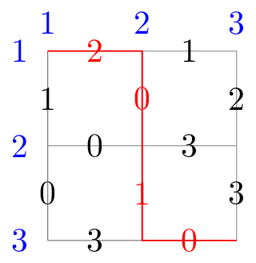
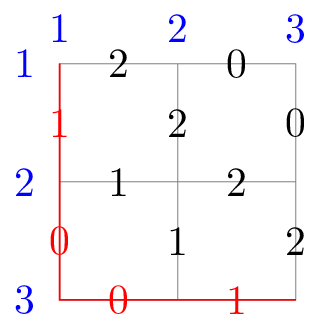

<h1 style='text-align: center;'> G. Lattice Optimizing</h1>

<h5 style='text-align: center;'>time limit per test: 7 seconds</h5>
<h5 style='text-align: center;'>memory limit per test: 1024 megabytes</h5>

Consider a grid graph with $n$ rows and $n$ columns. Let the cell in row $x$ and column $y$ be $(x,y)$. There exists a directed edge from $(x,y)$ to $(x+1,y)$, with non-negative integer value $d_{x,y}$, for all $1\le x < n, 1\le y \le n$, and there also exists a directed edge from $(x,y)$ to $(x,y+1)$, with non-negative integer value $r_{x,y}$, for all $1\le x \le n, 1\le y < n$.

Initially, you are at $(1,1)$, with an empty set $S$. You need to walk along the edges and eventually reach $(n,n)$. Whenever you pass an edge, its value will be inserted into $S$. Please maximize the MEX$^{\text{∗}}$ of $S$ when you reach $(n,n)$.

$^{\text{∗}}$The MEX (minimum excluded) of an array is the smallest non-negative integer that does not belong to the array. For instance: 

* The MEX of $[2,2,1]$ is $0$, because $0$ does not belong to the array.
* The MEX of $[3,1,0,1]$ is $2$, because $0$ and $1$ belong to the array, but $2$ does not.
* The MEX of $[0,3,1,2]$ is $4$, because $0, 1, 2$, and $3$ belong to the array, but $4$ does not.
#### Input

Each test contains multiple test cases. The first line contains the number of test cases $t$ ($1\le t\le100$). The description of the test cases follows. 

The first line of each test case contains a single integer $n$ ($2\le n\le20$) — the number of rows and columns.

Each of the next $n-1$ lines contains $n$ integers separated by single spaces — the matrix $d$ ($0\le d_{x,y}\le 2n-2$).

Each of the next $n$ lines contains $n-1$ integers separated by single spaces — the matrix $r$ ($0\le r_{x,y}\le 2n-2$).

It is guaranteed that the sum of all $n^3$ does not exceed $8000$.

#### Output

For each test case, print a single integer — the maximum MEX of $S$ when you reach $(n,n)$.

## Examples

#### Input


```text
231 0 20 1 32 10 33 031 2 00 1 22 01 20 1
```
#### Output

```text

3
2

```
#### Input


```text
11016 7 3 15 9 17 1 15 9 04 3 1 12 13 10 10 14 6 123 1 3 9 5 16 0 12 7 1211 4 8 7 13 7 15 13 9 22 3 9 9 4 12 17 7 10 1510 6 15 17 13 6 15 9 4 913 3 3 14 1 2 10 10 12 168 2 9 13 18 7 1 6 2 615 12 2 6 0 0 13 3 7 177 3 17 17 10 15 12 14 154 3 3 17 3 13 11 16 616 17 7 7 12 5 2 4 1018 9 9 3 5 9 1 16 71 0 4 2 10 10 12 2 14 14 15 16 15 5 8 4 187 18 10 11 2 0 14 8 182 17 6 0 9 6 13 5 115 15 7 11 6 3 17 14 51 3 16 16 13 1 0 13 11
```
#### Output

```text

14

```
## Note

In the first test case, the grid graph and one of the optimal paths are as follows:

  In the second test case, the grid graph and one of the optimal paths are as follows:

  

#### Tags 

#NOT OK #bitmasks #meet-in-the-middle 

## Blogs
- [All Contest Problems](../EPIC_Institute_of_Technology_Round_August_2024_(Div._1_+_Div._2).md)
- [Announcement](../blogs/Announcement.md)
- [Tutorial (en)](../blogs/Tutorial_(en).md)
