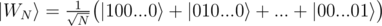
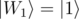

<h1 style='text-align: center;'> A4. Generate W state</h1>

<h5 style='text-align: center;'>time limit per test: 1 second</h5>
<h5 style='text-align: center;'>memory limit per test: 256 megabytes</h5>

You are given *N* = 2*k* qubits (0 ≤ *k* ≤ 4) in zero state . Your task is to create a generalized [W state](https://en.wikipedia.org/wiki/W_state) on them. Generalized W state is an equal superposition of all basis states on *N* qubits that have Hamming weight equal to 1:

For example, for *N* = 1, .

You have to implement an operation which takes an array of *N* qubits as an input and has no output. The "output" of the operation is the state in which it leaves the qubits.

Your code should have the following signature:


```
namespace Solution {  
    open Microsoft.Quantum.Primitive;  
    open Microsoft.Quantum.Canon;  
  
    operation Solve (qs : Qubit[]) : ()  
    {  
        body  
        {  
            // your code here  
        }  
    }  
}
```


#### tags 

#1900 