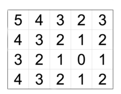

<h1 style='text-align: center;'> D. Sonya and Matrix</h1>

<h5 style='text-align: center;'>time limit per test: 2 seconds</h5>
<h5 style='text-align: center;'>memory limit per test: 256 megabytes</h5>

Since Sonya has just learned the basics of matrices, she decided to play with them a little bit.

Sonya imagined a new type of matrices that she called rhombic matrices. These matrices have exactly one zero, while all other cells have the Manhattan distance to the cell containing the zero. The cells with equal numbers have the form of a rhombus, that is why Sonya called this type so.

The Manhattan distance between two cells ($x_1$, $y_1$) and ($x_2$, $y_2$) is defined as $|x_1 - x_2| + |y_1 - y_2|$. For example, the Manhattan distance between the cells $(5, 2)$ and $(7, 1)$ equals to $|5-7|+|2-1|=3$.

  Example of a rhombic matrix. ## Note

 that rhombic matrices are uniquely defined by $n$, $m$, and the coordinates of the cell containing the zero.

She drew a $n\times m$ rhombic matrix. She believes that you can not recreate the matrix if she gives you only the elements of this matrix in some arbitrary order (i.e., the sequence of $n\cdot m$ numbers). ## Note

 that Sonya will not give you $n$ and $m$, so only the sequence of numbers in this matrix will be at your disposal.

Write a program that finds such an $n\times m$ rhombic matrix whose elements are the same as the elements in the sequence in some order.

## Input

The first line contains a single integer $t$ ($1\leq t\leq 10^6$) — the number of cells in the matrix.

The second line contains $t$ integers $a_1, a_2, \ldots, a_t$ ($0\leq a_i< t$) — the values in the cells in arbitrary order.

## Output

In the first line, print two positive integers $n$ and $m$ ($n \times m = t$) — the size of the matrix.

In the second line, print two integers $x$ and $y$ ($1\leq x\leq n$, $1\leq y\leq m$) — the row number and the column number where the cell with $0$ is located.

If there are multiple possible answers, print any of them. If there is no solution, print the single integer $-1$.

## Examples

## Input


```
20  
1 0 2 3 5 3 2 1 3 2 3 1 4 2 1 4 2 3 2 4  

```
## Output


```
4 5  
2 2  

```
## Input


```
18  
2 2 3 2 4 3 3 3 0 2 4 2 1 3 2 1 1 1  

```
## Output


```
3 6  
2 3  

```
## Input


```
6  
2 1 0 2 1 2  

```
## Output


```
-1  

```
## Note

You can see the solution to the first example in the legend. You also can choose the cell $(2, 2)$ for the cell where $0$ is located. You also can choose a $5\times 4$ matrix with zero at $(4, 2)$.

In the second example, there is a $3\times 6$ matrix, where the zero is located at $(2, 3)$ there.

In the third example, a solution does not exist.


#### tags 

#2300 #brute_force #constructive_algorithms #implementation 