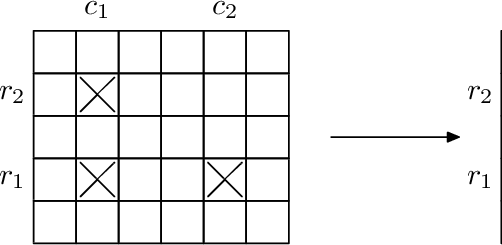
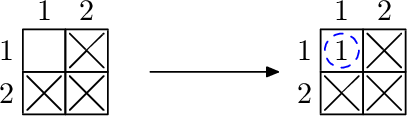
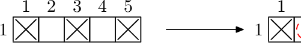
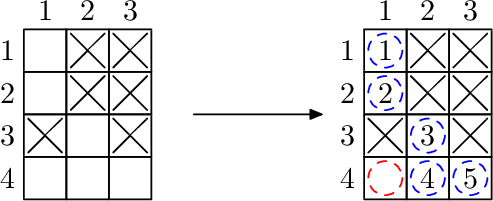

<h1 style='text-align: center;'> B. Chemical table</h1>

<h5 style='text-align: center;'>time limit per test: 1 second</h5>
<h5 style='text-align: center;'>memory limit per test: 512 megabytes</h5>

Innopolis University scientists continue to investigate the periodic table. There are *n*·*m* known elements and they form a periodic table: a rectangle with *n* rows and *m* columns. Each element can be described by its coordinates (*r*, *c*) (1 ≤ *r* ≤ *n*, 1 ≤ *c* ≤ *m*) in the table.

Recently scientists discovered that for every four different elements in this table that form a rectangle with sides parallel to the sides of the table, if they have samples of three of the four elements, they can produce a sample of the fourth element using nuclear fusion. So if we have elements in positions (*r*1, *c*1), (*r*1, *c*2), (*r*2, *c*1), where *r*1 ≠ *r*2 and *c*1 ≠ *c*2, then we can produce element (*r*2, *c*2).

  Samples used in fusion are not wasted and can be used again in future fusions. Newly crafted elements also can be used in future fusions.

Innopolis University scientists already have samples of *q* elements. They want to obtain samples of all *n*·*m* elements. To achieve that, they will purchase some samples from other laboratories and then produce all remaining elements using an arbitrary number of nuclear fusions in some order. Help them to find the minimal number of elements they need to purchase.

## Input

The first line contains three integers *n*, *m*, *q* (1 ≤ *n*, *m* ≤ 200 000; 0 ≤ *q* ≤ *min*(*n*·*m*, 200 000)), the chemical table dimensions and the number of elements scientists already have.

The following *q* lines contain two integers *r**i*, *c**i* (1 ≤ *r**i* ≤ *n*, 1 ≤ *c**i* ≤ *m*), each describes an element that scientists already have. All elements in the input are different.

## Output

Print the minimal number of elements to be purchased.

## Examples

## Input


```
2 2 3  
1 2  
2 2  
2 1  

```
## Output


```
0  

```
## Input


```
1 5 3  
1 3  
1 1  
1 5  

```
## Output


```
2  

```
## Input


```
4 3 6  
1 2  
1 3  
2 2  
2 3  
3 1  
3 3  

```
## Output


```
1  

```
## Note

For each example you have a picture which illustrates it.

The first picture for each example describes the initial set of element samples available. Black crosses represent elements available in the lab initially.

The second picture describes how remaining samples can be obtained. Red dashed circles denote elements that should be purchased from other labs (the optimal solution should minimize the number of red circles). Blue dashed circles are elements that can be produced with nuclear fusion. They are numbered in order in which they can be produced.

Test 1

We can use nuclear fusion and get the element from three other samples, so we don't need to purchase anything.

  Test 2

We cannot use any nuclear fusion at all as there is only one row, so we have to purchase all missing elements.

  Test 3

There are several possible solutions. One of them is illustrated below.

## Note

 that after purchasing one element marked as red it's still not possible to immidiately produce the middle element in the bottom row (marked as 4). So we produce the element in the left-top corner first (marked as 1), and then use it in future fusions.

  

#### tags 

#1900 #constructive_algorithms #dfs_and_similar #dsu #graphs #matrices 