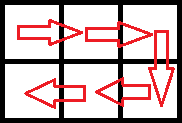
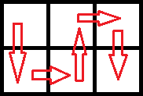

<h1 style='text-align: center;'> C. Vasya And The Mushrooms</h1>

<h5 style='text-align: center;'>time limit per test: 2 seconds</h5>
<h5 style='text-align: center;'>memory limit per test: 256 megabytes</h5>

Vasya's house is situated in a forest, and there is a mushroom glade near it. The glade consists of two rows, each of which can be divided into *n* consecutive cells. For each cell Vasya knows how fast the mushrooms grow in this cell (more formally, how many grams of mushrooms grow in this cell each minute). Vasya spends exactly one minute to move to some adjacent cell. Vasya cannot leave the glade. Two cells are considered adjacent if they share a common side. When Vasya enters some cell, he instantly collects all the mushrooms growing there.

Vasya begins his journey in the left upper cell. Every minute Vasya must move to some adjacent cell, he cannot wait for the mushrooms to grow. He wants to visit all the cells exactly once and maximize the total weight of the collected mushrooms. Initially, all mushrooms have a weight of 0. ## Note

 that Vasya doesn't need to return to the starting cell.

Help Vasya! Calculate the maximum total weight of mushrooms he can collect.

## Input

The first line contains the number *n* (1 ≤ *n* ≤ 3·105) — the length of the glade.

The second line contains *n* numbers *a*1, *a*2, ..., *a**n* (1 ≤ *a**i* ≤ 106) — the growth rate of mushrooms in the first row of the glade.

The third line contains *n* numbers *b*1, *b*2, ..., *b**n* (1 ≤ *b**i* ≤ 106) is the growth rate of mushrooms in the second row of the glade.

## Output

## Output

 one number — the maximum total weight of mushrooms that Vasya can collect by choosing the optimal route. Pay attention that Vasya must visit every cell of the glade exactly once.

## Examples

## Input


```
3  
1 2 3  
6 5 4  

```
## Output


```
70  

```
## Input


```
3  
1 1000 10000  
10 100 100000  

```
## Output


```
543210  

```
## Note

In the first test case, the optimal route is as follows: 

   Thus, the collected weight of mushrooms will be 0·1 + 1·2 + 2·3 + 3·4 + 4·5 + 5·6 = 70.In the second test case, the optimal route is as follows: 

   Thus, the collected weight of mushrooms will be 0·1 + 1·10 + 2·100 + 3·1000 + 4·10000 + 5·100000 = 543210.

#### tags 

#1800 #dp #implementation 