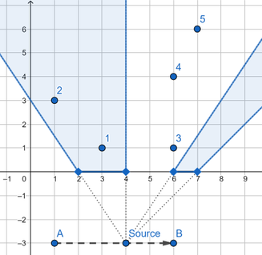

<h1 style='text-align: center;'> E. Rest In The Shades</h1>

<h5 style='text-align: center;'>time limit per test: 2 seconds</h5>
<h5 style='text-align: center;'>memory limit per test: 256 megabytes</h5>

There is a light source on the plane. This source is so small that it can be represented as point. The light source is moving from point $(a, s_y)$ to the $(b, s_y)$ $(s_y < 0)$ with speed equal to $1$ unit per second. The trajectory of this light source is a straight segment connecting these two points. 

There is also a fence on $OX$ axis represented as $n$ segments $(l_i, r_i)$ (so the actual coordinates of endpoints of each segment are $(l_i, 0)$ and $(r_i, 0)$). The point $(x, y)$ is in the shade if segment connecting $(x,y)$ and the current position of the light source intersects or touches with any segment of the fence.

  You are given $q$ points. For each point calculate total time of this point being in the shade, while the light source is moving from $(a, s_y)$ to the $(b, s_y)$.

## Input

First line contains three space separated integers $s_y$, $a$ and $b$ ($-10^9 \le s_y < 0$, $1 \le a < b \le 10^9$) — corresponding coordinates of the light source.

Second line contains single integer $n$ ($1 \le n \le 2 \cdot 10^5$) — number of segments in the fence.

Next $n$ lines contain two integers per line: $l_i$ and $r_i$ ($1 \le l_i < r_i \le 10^9$, $r_{i - 1} < l_i$) — segments in the fence in increasing order. Segments don't intersect or touch each other.

Next line contains single integer $q$ ($1 \le q \le 2 \cdot 10^5$) — number of points to check.

Next $q$ lines contain two integers per line: $x_i$ and $y_i$ ($1 \le x_i, y_i \le 10^9$) — points to process.

## Output

Print $q$ lines. The $i$-th line should contain one real number — total time of the $i$-th point being in the shade, while the light source is moving from $(a, s_y)$ to the $(b, s_y)$. The answer is considered as correct if its absolute of relative error doesn't exceed $10^{-6}$.

## Example

## Input


```
-3 1 6  
2  
2 4  
6 7  
5  
3 1  
1 3  
6 1  
6 4  
7 6  

```
## Output


```
5.000000000000000  
3.000000000000000  
0.000000000000000  
1.500000000000000  
2.000000000000000  

```
## Note

* The 1-st point is always in the shade;
* the 2-nd point is in the shade while light source is moving from $(3, -3)$ to $(6, -3)$;
* the 3-rd point is in the shade while light source is at point $(6, -3)$.
* the 4-th point is in the shade while light source is moving from $(1, -3)$ to $(2.5, -3)$ and at point $(6, -3)$;
* the 5-th point is in the shade while light source is moving from $(1, -3)$ to $(2.5, -3)$ and from $(5.5, -3)$ to $(6, -3)$;


#### tags 

#2400 #binary_search #geometry 