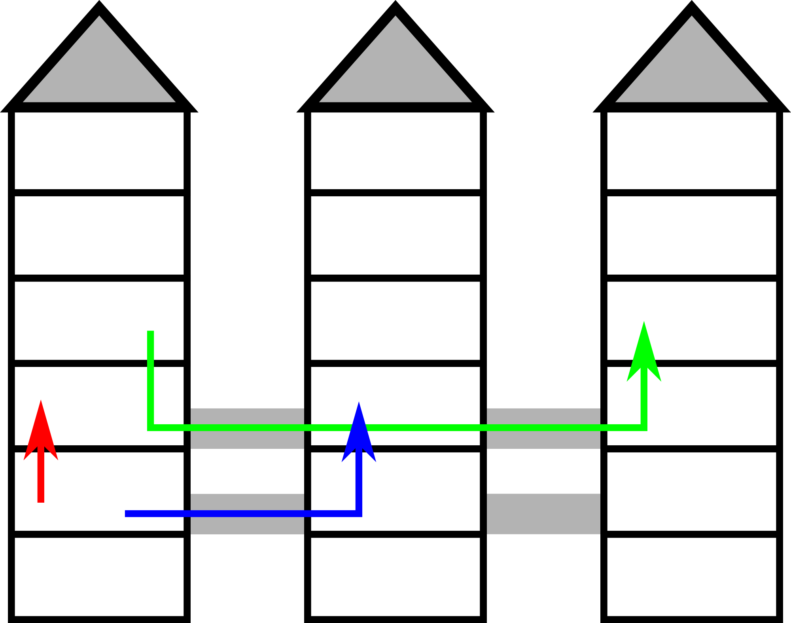

<h1 style='text-align: center;'> A. New Building for SIS</h1>

<h5 style='text-align: center;'>time limit per test: 1 second</h5>
<h5 style='text-align: center;'>memory limit per test: 256 megabytes</h5>

You are looking at the floor plan of the Summer Informatics School's new building. You were tasked with SIS logistics, so you really care about travel time between different locations: it is important to know how long it would take to get from the lecture room to the canteen, or from the gym to the server room.

The building consists of *n* towers, *h* floors each, where the towers are labeled from 1 to *n*, the floors are labeled from 1 to *h*. There is a passage between any two adjacent towers (two towers *i* and *i* + 1 for all *i*: 1 ≤ *i* ≤ *n* - 1) on every floor *x*, where *a* ≤ *x* ≤ *b*. It takes exactly one minute to walk between any two adjacent floors of a tower, as well as between any two adjacent towers, provided that there is a passage on that floor. It is not permitted to leave the building.

 The picture illustrates the first example. 

You have given *k* pairs of locations (*t**a*, *f**a*), (*t**b*, *f**b*): floor *f**a* of tower *t**a* and floor *f**b* of tower *t**b*. For each pair you need to determine the minimum walking time between these locations.

## Input

The first line of the input contains following integers:

* *n*: the number of towers in the building (1 ≤ *n* ≤ 108),
* *h*: the number of floors in each tower (1 ≤ *h* ≤ 108),
* *a* and *b*: the lowest and highest floor where it's possible to move between adjacent towers (1 ≤ *a* ≤ *b* ≤ *h*),
* *k*: total number of queries (1 ≤ *k* ≤ 104).

Next *k* lines contain description of the queries. Each description consists of four integers *t**a*, *f**a*, *t**b*, *f**b* (1 ≤ *t**a*, *t**b* ≤ *n*, 1 ≤ *f**a*, *f**b* ≤ *h*). This corresponds to a query to find the minimum travel time between *f**a*-th floor of the *t**a*-th tower and *f**b*-th floor of the *t**b*-th tower.

## Output

For each query print a single integer: the minimum walking time between the locations in minutes.

## Example

## Input


```
3 6 2 3 3  
1 2 1 3  
1 4 3 4  
1 2 2 3  

```
## Output


```
1  
4  
2  

```


#### tags 

#1000 #math 