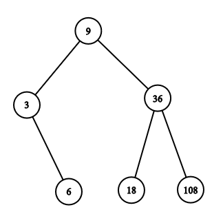
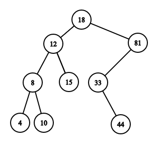

<h1 style='text-align: center;'> D. Recovering BST</h1>

<h5 style='text-align: center;'>time limit per test: 1 second</h5>
<h5 style='text-align: center;'>memory limit per test: 256 megabytes</h5>

Dima the hamster enjoys nibbling different things: cages, sticks, bad problemsetters and even trees!

Recently he found a binary search tree and instinctively nibbled all of its edges, hence messing up the vertices. Dima knows that if Andrew, who has been thoroughly assembling the tree for a long time, comes home and sees his creation demolished, he'll get extremely upset. 

To not let that happen, Dima has to recover the binary search tree. Luckily, he noticed that any two vertices connected by a direct edge had their greatest common divisor value exceed $1$.

Help Dima construct such a binary search tree or determine that it's impossible. The definition and properties of a binary search tree can be found [here.](https://en.wikipedia.org/wiki/Binary_search_tree)

## Input

The first line contains the number of vertices $n$ ($2 \le n \le 700$).

The second line features $n$ distinct integers $a_i$ ($2 \le a_i \le 10^9$) — the values of vertices in ascending order.

## Output

If it is possible to reassemble the binary search tree, such that the greatest common divisor of any two vertices connected by the edge is greater than $1$, print "Yes" (quotes for clarity).

Otherwise, print "No" (quotes for clarity).

## Examples

## Input


```
6  
3 6 9 18 36 108  

```
## Output


```
Yes  

```
## Input


```
2  
7 17  

```
## Output


```
No  

```
## Input


```
9  
4 8 10 12 15 18 33 44 81  

```
## Output


```
Yes  

```
## Note

The picture below illustrates one of the possible trees for the first example.

  The picture below illustrates one of the possible trees for the third example.

  

#### tags 

#2100 #brute_force #dp #math #number_theory #trees 