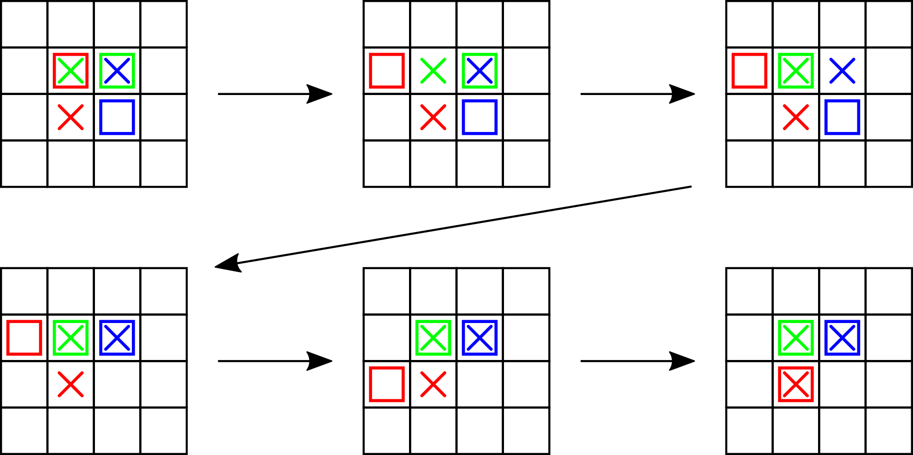

<h1 style='text-align: center;'> E. Colored Cubes</h1>

<h5 style='text-align: center;'>time limit per test: 1 second</h5>
<h5 style='text-align: center;'>memory limit per test: 256 megabytes</h5>

Vasya passes all exams! Despite expectations, Vasya is not tired, moreover, he is ready for new challenges. However, he does not want to work too hard on difficult problems.

Vasya remembered that he has a not-so-hard puzzle: $m$ colored cubes are placed on a chessboard of size $n \times n$. The fact is that $m \leq n$ and all cubes have distinct colors. Each cube occupies exactly one cell. Also, there is a designated cell for each cube on the board, the puzzle is to place each cube on its place. The cubes are fragile, so in one operation you only can move one cube onto one of four neighboring by side cells, if only it is empty. Vasya wants to be careful, so each operation takes exactly one second. 

Vasya used to train hard for VK Cup Final, so he can focus his attention on the puzzle for at most $3$ hours, that is $10800$ seconds. Help Vasya find such a sequence of operations that all cubes will be moved onto their designated places, and Vasya won't lose his attention.

## Input

The first line contains two integers $n$ and $m$ ($1 \leq m \leq n \leq 50$).

Each of the next $m$ lines contains two integers $x_i$, $y_i$ ($1 \leq x_i, y_i \leq n$), the initial positions of the cubes.

The next $m$ lines describe the designated places for the cubes in the same format and order. 

It is guaranteed that all initial positions are distinct and all designated places are distinct, however, it is possible that some initial positions coincide with some final positions.

## Output

In the first line print a single integer $k$ ($0 \le k \leq 10800$) — the number of operations Vasya should make.

In each of the next $k$ lines you should describe one operation: print four integers $x_1$, $y_1$, $x_2$, $y_2$, where $x_1, y_1$ is the position of the cube Vasya should move, and $x_2, y_2$ is the new position of the cube. The cells $x_1, y_1$ and $x_2, y_2$ should have a common side, the cell $x_2, y_2$ should be empty before the operation.

We can show that there always exists at least one solution. If there are multiple solutions, print any of them.

## Examples

## Input


```
2 1  
1 1  
2 2  

```
## Output


```
2  
1 1 1 2  
1 2 2 2  

```
## Input


```
2 2  
1 1  
2 2  
1 2  
2 1  

```
## Output


```
2  
2 2 2 1  
1 1 1 2  

```
## Input


```
2 2  
2 1  
2 2  
2 2  
2 1  

```
## Output


```
4  
2 1 1 1  
2 2 2 1  
1 1 1 2  
1 2 2 2  

```
## Input


```
4 3  
2 2  
2 3  
3 3  
3 2  
2 2  
2 3  

```
## Output


```
9  
2 2 1 2  
1 2 1 1  
2 3 2 2  
3 3 2 3  
2 2 1 2  
1 1 2 1  
2 1 3 1  
3 1 3 2  
1 2 2 2  

```
## Note

In the fourth example the printed sequence of movements (shown on the picture below) is valid, but not shortest. There is a solution in $3$ operations.

  

#### tags 

#2700 #constructive_algorithms #implementation #matrices 