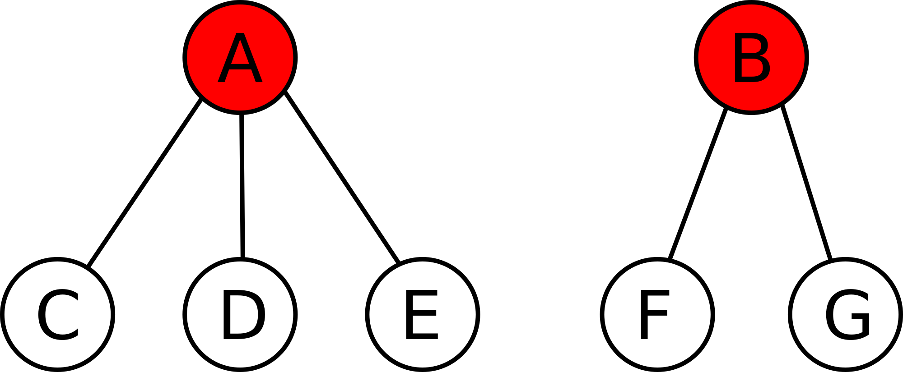
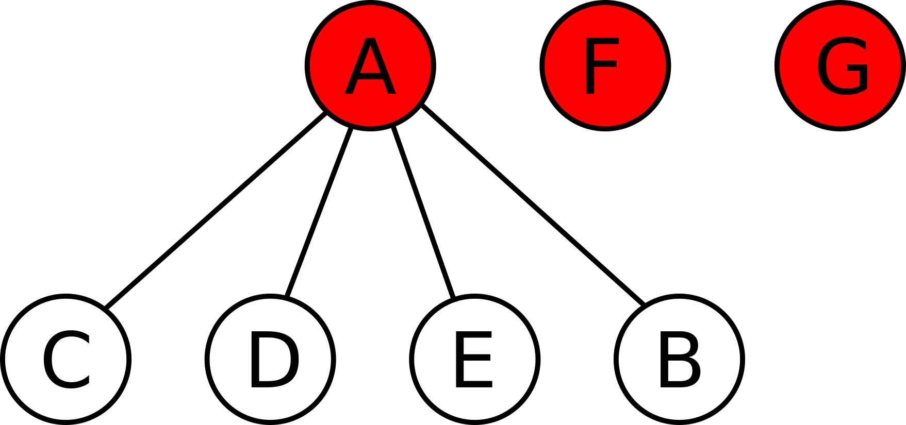
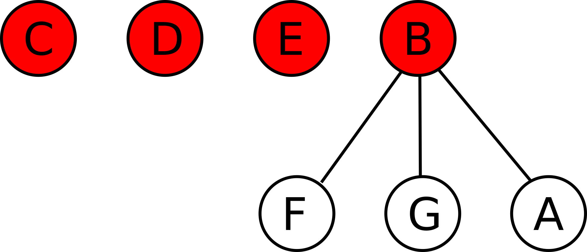

<h1 style='text-align: center;'> G. Company Acquisitions</h1>

<h5 style='text-align: center;'>time limit per test: 1 second</h5>
<h5 style='text-align: center;'>memory limit per test: 256 megabytes</h5>

There are $n$ startups. Startups can be active or acquired. If a startup is acquired, then that means it has exactly one active startup that it is following. An active startup can have arbitrarily many acquired startups that are following it. An active startup cannot follow any other startup.

The following steps happen until there is exactly one active startup. The following sequence of steps takes exactly 1 day.

1. Two distinct active startups $A$, $B$, are chosen uniformly at random.
2. A fair coin is flipped, and with equal probability, $A$ acquires $B$ or $B$ acquires $A$ (i.e. if $A$ acquires $B$, then that means $B$'s state changes from active to acquired, and its starts following $A$).
3. When a startup changes from active to acquired, all of its previously acquired startups become active.

For example, the following scenario can happen: Let's say $A$, $B$ are active startups. $C$, $D$, $E$ are acquired startups under $A$, and $F$, $G$ are acquired startups under $B$:

 Active startups are shown in red. 

If $A$ acquires $B$, then the state will be $A$, $F$, $G$ are active startups. $C$, $D$, $E$, $B$ are acquired startups under $A$. $F$ and $G$ have no acquired startups:

  If instead, $B$ acquires $A$, then the state will be $B$, $C$, $D$, $E$ are active startups. $F$, $G$, $A$ are acquired startups under $B$. $C$, $D$, $E$ have no acquired startups:

  You are given the initial state of the startups. For each startup, you are told if it is either acquired or active. If it is acquired, you are also given the index of the active startup that it is following.

You're now wondering, what is the expected number of days needed for this process to finish with exactly one active startup at the end.

It can be shown the expected number of days can be written as a rational number $P/Q$, where $P$ and $Q$ are co-prime integers, and $Q \not= 0 \pmod{10^9+7}$. Return the value of $P \cdot Q^{-1}$ modulo $10^9+7$.

## Input

The first line contains a single integer $n$ ($2 \leq n \leq 500$), the number of startups.

The next line will contain $n$ space-separated integers $a_1, a_2, \ldots, a_n$ ($a_i = -1$ or $1 \leq a_i \leq n$). If $a_i = -1$, then that means startup $i$ is active. Otherwise, if $1 \leq a_i \leq n$, then startup $i$ is acquired, and it is currently following startup $a_i$. It is guaranteed if $a_i \not= -1$, then $a_{a_i} =-1$ (that is, all startups that are being followed are active).

## Output

Print a single integer, the expected number of days needed for the process to end with exactly one active startup, modulo $10^9+7$.

## Examples

## Input


```
3  
-1 -1 -1  

```
## Output


```
3  

```
## Input


```
2  
2 -1  

```
## Output


```
0  

```
## Input


```
40  
3 3 -1 -1 4 4 -1 -1 -1 -1 -1 10 10 10 10 10 10 4 20 -1 -1 -1 -1 -1 -1 -1 -1 -1 -1 -1 -1 -1 3 3 3 3 3 3 3 3  

```
## Output


```
755808950  

```
## Note

In the first sample, there are three active startups labeled $1$, $2$ and $3$, and zero acquired startups. Here's an example of how one scenario can happen

1. Startup $1$ acquires startup $2$ (This state can be represented by the array $[-1, 1, -1]$)
2. Startup $3$ acquires startup $1$ (This state can be represented by the array $[3, -1, -1]$)
3. Startup $2$ acquires startup $3$ (This state can be represented by the array $[-1, -1, 2]$).
4. Startup $2$ acquires startup $1$ (This state can be represented by the array $[2, -1, 2]$).

At this point, there is only one active startup, and this sequence of steps took $4$ days. It can be shown the expected number of days is $3$.

For the second sample, there is only one active startup, so we need zero days.

For the last sample, remember to take the answer modulo $10^9+7$.


#### tags 

#3200 #constructive_algorithms #math 