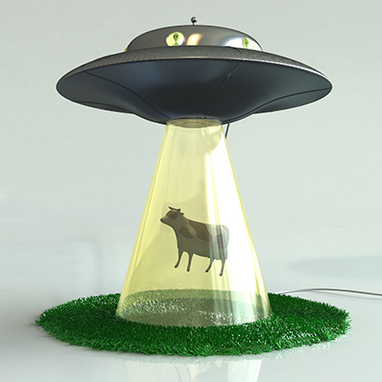

<h1 style='text-align: center;'> D. Time to Raid Cowavans</h1>

<h5 style='text-align: center;'>time limit per test: 4 seconds</h5>
<h5 style='text-align: center;'>memory limit per test: 70 megabytes</h5>

As you know, the most intelligent beings on the Earth are, of course, cows. This conclusion was reached long ago by the Martian aliens, as well as a number of other intelligent civilizations from outer space. 

Sometimes cows gather into cowavans. This seems to be seasonal. But at this time the cows become passive and react poorly to external stimuli. A cowavan is a perfect target for the Martian scientific saucer, it's time for large-scale abductions, or, as the Martians say, raids. Simply put, a cowavan is a set of cows in a row. 

If we number all cows in the cowavan with positive integers from 1 to *n*, then we can formalize the popular model of abduction, known as the (*a*, *b*)-Cowavan Raid: first they steal a cow number *a*, then number *a* + *b*, then — number *a* + 2·*b*, and so on, until the number of an abducted cow exceeds *n*. During one raid the cows are not renumbered. 

The aliens would be happy to place all the cows on board of their hospitable ship, but unfortunately, the amount of cargo space is very, very limited. The researchers, knowing the mass of each cow in the cowavan, made *p* scenarios of the (*a*, *b*)-raid. Now they want to identify the following thing for each scenario individually: what total mass of pure beef will get on board of the ship. All the scenarios are independent, in the process of performing the calculations the cows are not being stolen. 

  ## Input

The first line contains the only positive integer *n* (1 ≤ *n* ≤ 3·105) — the number of cows in the cowavan.

The second number contains *n* positive integer *w**i*, separated by spaces, where the *i*-th number describes the mass of the *i*-th cow in the cowavan (1 ≤ *w**i* ≤ 109).

The third line contains the only positive integer *p* — the number of scenarios of (*a*, *b*)-raids (1 ≤ *p* ≤ 3·105).

Each following line contains integer parameters *a* and *b* of the corresponding scenario (1 ≤ *a*, *b* ≤ *n*).

## Output

Print for each scenario of the (*a*, *b*)-raid the total mass of cows, that can be stolen using only this scenario.

Please, do not use the %lld specificator to read or write 64-bit integers in С++. It is recommended to use the cin, cout streams of the %I64d specificator.

## Examples

## Input


```
3  
1 2 3  
2  
1 1  
1 2  

```
## Output


```
6  
4  

```
## Input


```
4  
2 3 5 7  
3  
1 3  
2 3  
2 2  

```
## Output


```
9  
3  
10  

```


#### tags 

#2100 #brute_force #data_structures #sortings 