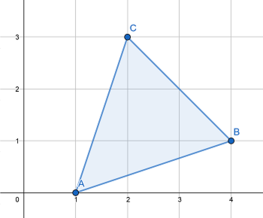

<h1 style='text-align: center;'> D. Vasya and Triangle</h1>

<h5 style='text-align: center;'>time limit per test: 1 second</h5>
<h5 style='text-align: center;'>memory limit per test: 256 megabytes</h5>

Vasya has got three integers $n$, $m$ and $k$. He'd like to find three integer points $(x_1, y_1)$, $(x_2, y_2)$, $(x_3, y_3)$, such that $0 \le x_1, x_2, x_3 \le n$, $0 \le y_1, y_2, y_3 \le m$ and the area of the triangle formed by these points is equal to $\frac{nm}{k}$.

Help Vasya! Find such points (if it's possible). If there are multiple solutions, print any of them.

## Input

The single line contains three integers $n$, $m$, $k$ ($1\le n, m \le 10^9$, $2 \le k \le 10^9$).

## Output

If there are no such points, print "NO".

Otherwise print "YES" in the first line. The next three lines should contain integers $x_i, y_i$ — coordinates of the points, one point per line. If there are multiple solutions, print any of them.

You can print each letter in any case (upper or lower).

## Examples

## Input


```
4 3 3  

```
## Output


```
YES  
1 0  
2 3  
4 1  

```
## Input


```
4 4 7  

```
## Output


```
NO  

```
## Note

In the first example area of the triangle should be equal to $\frac{nm}{k} = 4$. The triangle mentioned in the output is pictured below: 

  In the second example there is no triangle with area $\frac{nm}{k} = \frac{16}{7}$.


#### tags 

#1800 #geometry #number_theory 