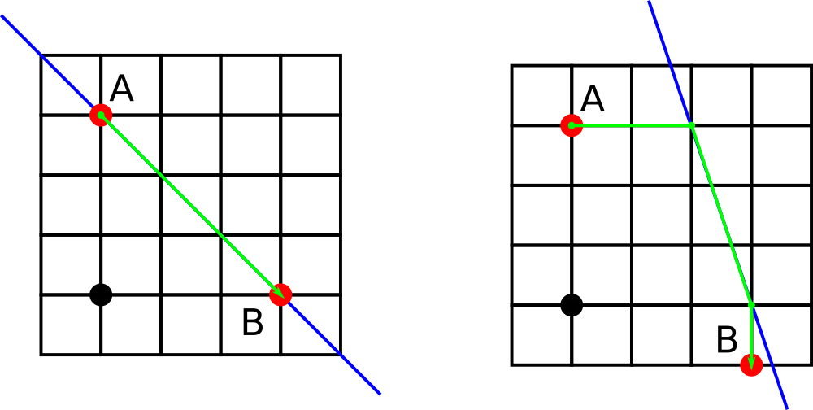

<h1 style='text-align: center;'> D. Barcelonian Distance</h1>

<h5 style='text-align: center;'>time limit per test: 1 second</h5>
<h5 style='text-align: center;'>memory limit per test: 256 megabytes</h5>

In this problem we consider a very simplified model of Barcelona city.

Barcelona can be represented as a plane with streets of kind $x = c$ and $y = c$ for every integer $c$ (that is, the rectangular grid). However, there is a detail which makes Barcelona different from Manhattan. There is an avenue called Avinguda Diagonal which can be represented as a the set of points $(x, y)$ for which $ax + by + c = 0$.

One can walk along streets, including the avenue. You are given two integer points $A$ and $B$ somewhere in Barcelona. Find the minimal possible distance one needs to travel to get to $B$ from $A$.

## Input

The first line contains three integers $a$, $b$ and $c$ ($-10^9\leq a, b, c\leq 10^9$, at least one of $a$ and $b$ is not zero) representing the Diagonal Avenue.

The next line contains four integers $x_1$, $y_1$, $x_2$ and $y_2$ ($-10^9\leq x_1, y_1, x_2, y_2\leq 10^9$) denoting the points $A = (x_1, y_1)$ and $B = (x_2, y_2)$.

## Output

Find the minimum possible travel distance between $A$ and $B$. Your answer is considered correct if its absolute or relative error does not exceed $10^{-6}$.

Formally, let your answer be $a$, and the jury's answer be $b$. Your answer is accepted if and only if $\frac{|a - b|}{\max{(1, |b|)}} \le 10^{-6}$.

## Examples

## Input


```

1 1 -3
0 3 3 0

```
## Output


```

4.2426406871

```
## Input


```

3 1 -9
0 3 3 -1

```
## Output


```

6.1622776602

```
## Note

The first example is shown on the left picture while the second example us shown on the right picture below. The avenue is shown with blue, the origin is shown with the black dot.

  

#### tags 

#1900 #geometry #implementation 