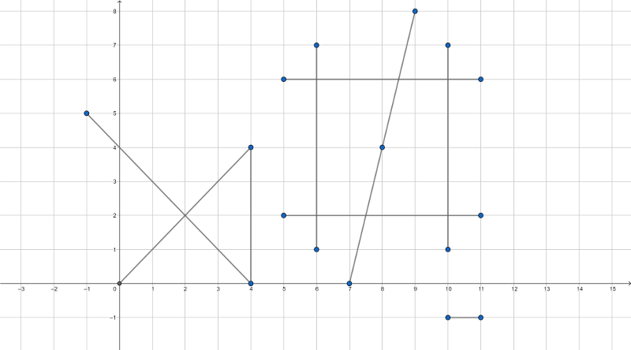
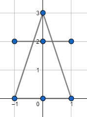

<h1 style='text-align: center;'> E. Covered Points</h1>

<h5 style='text-align: center;'>time limit per test: 2 seconds</h5>
<h5 style='text-align: center;'>memory limit per test: 256 megabytes</h5>

You are given $n$ segments on a Cartesian plane. Each segment's endpoints have integer coordinates. Segments can intersect with each other. No two segments lie on the same line.

Count the number of distinct points with integer coordinates, which are covered by at least one segment.

## Input

The first line contains a single integer $n$ ($1 \le n \le 1000$) — the number of segments.

Each of the next $n$ lines contains four integers $Ax_i, Ay_i, Bx_i, By_i$ ($-10^6 \le Ax_i, Ay_i, Bx_i, By_i \le 10^6$) — the coordinates of the endpoints $A$, $B$ ($A \ne B$) of the $i$-th segment.

It is guaranteed that no two segments lie on the same line.

## Output

Print a single integer — the number of distinct points with integer coordinates, which are covered by at least one segment.

## Examples

## Input


```
9  
0 0 4 4  
-1 5 4 0  
4 0 4 4  
5 2 11 2  
6 1 6 7  
5 6 11 6  
10 1 10 7  
7 0 9 8  
10 -1 11 -1  

```
## Output


```
42  

```
## Input


```
4  
-1 2 1 2  
-1 0 1 0  
-1 0 0 3  
0 3 1 0  

```
## Output


```
7  

```
## Note

The image for the first example:

  Several key points are marked blue, the answer contains some non-marked points as well.

The image for the second example:

  

#### tags 

#2400 #fft #geometry #number_theory 