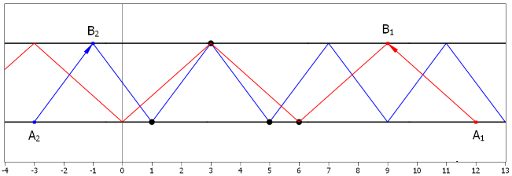

<h1 style='text-align: center;'> F. Ray in the tube</h1>

<h5 style='text-align: center;'>time limit per test: 2 seconds</h5>
<h5 style='text-align: center;'>memory limit per test: 256 megabytes</h5>

You are given a tube which is reflective inside represented as two non-coinciding, but parallel to $Ox$ lines. Each line has some special integer points — positions of sensors on sides of the tube.

You are going to emit a laser ray in the tube. To do so, you have to choose two integer points $A$ and $B$ on the first and the second line respectively (coordinates can be negative): the point $A$ is responsible for the position of the laser, and the point $B$ — for the direction of the laser ray. The laser ray is a ray starting at $A$ and directed at $B$ which will reflect from the sides of the tube (it doesn't matter if there are any sensors at a reflection point or not). A sensor will only register the ray if the ray hits exactly at the position of the sensor.

  ## Example

s of laser rays. ## Note

 that image contains two examples. The $3$ sensors (denoted by black bold points on the tube sides) will register the blue ray but only $2$ will register the red. Calculate the maximum number of sensors which can register your ray if you choose points $A$ and $B$ on the first and the second lines respectively.

## Input

The first line contains two integers $n$ and $y_1$ ($1 \le n \le 10^5$, $0 \le y_1 \le 10^9$) — number of sensors on the first line and its $y$ coordinate.

The second line contains $n$ integers $a_1, a_2, \ldots, a_n$ ($0 \le a_i \le 10^9$) — $x$ coordinates of the sensors on the first line in the ascending order.

The third line contains two integers $m$ and $y_2$ ($1 \le m \le 10^5$, $y_1 < y_2 \le 10^9$) — number of sensors on the second line and its $y$ coordinate. 

The fourth line contains $m$ integers $b_1, b_2, \ldots, b_m$ ($0 \le b_i \le 10^9$) — $x$ coordinates of the sensors on the second line in the ascending order.

## Output

Print the only integer — the maximum number of sensors which can register the ray.

## Example

## Input


```
3 1  
1 5 6  
1 3  
3  

```
## Output


```
3  

```
## Note

One of the solutions illustrated on the image by pair $A_2$ and $B_2$.


#### tags 

#2500 #data_structures #divide_and_conquer #dp #math 