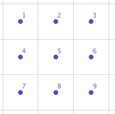
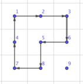
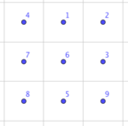

<h1 style='text-align: center;'> E. Grid Sort</h1>

<h5 style='text-align: center;'>time limit per test: 2 seconds</h5>
<h5 style='text-align: center;'>memory limit per test: 256 megabytes</h5>

You are given an $n \times m$ grid. Each grid cell is filled with a unique integer from $1$ to $nm$ so that each integer appears exactly once.

In one operation, you can choose an arbitrary cycle of the grid and move all integers along that cycle one space over. Here, a cycle is any sequence that satisfies the following conditions:

* There are at least four squares.
* Each square appears at most once.
* Every pair of adjacent squares, and also the first and last squares, share an edge.

For example, if we had the following grid:

  We can choose an arbitrary cycle like this one:

  To get the following grid:

  In this particular case, the chosen cycle can be represented as the sequence $[1, 2, 3, 6, 5, 8, 7, 4]$, the numbers are in the direction that we want to rotate them in.

Find any sequence of operations to sort the grid so that the array created by concatenating the rows from the highest to the lowest is sorted (look at the first picture above).

## Note

 you do not need to minimize number of operations or sum of cycle lengths. The only constraint is that the sum of all cycles lengths must not be greater than $10^5$. We can show that an answer always exists under the given constraints. ## Output

 any valid sequence of moves that will sort the grid.

## Input

The first line contains two integers $n$ and $m$ ($3 \leq n,m \leq 20$) — the dimensions of the grid.

Each of the next $n$ lines contains $m$ integers $x_{i,1}, x_{i,2}, \ldots, x_{i, m}$ ($1 \leq x_{i,j} \leq nm$), denoting the values of the block in row $i$ and column $j$. 

It is guaranteed that all $x_{i,j}$ are distinct.

## Output

First, print a single integer $k$, the number of operations ($k \geq 0$).

On each of the next $k$ lines, print a cycle as follows:

$$s\ y_1\ y_2\ \ldots\ y_s$$

Here, $s$ is the number of blocks to move ($s \geq 4$). Here we have block $y_1$ moving to where block $y_2$ is, block $y_2$ moving to where block $y_3$ is, and so on with block $y_s$ moving to where block $y_1$ is.

The sum of $s$ over all operations must be at most $10^5$.

## Examples

## Input


```
3 3  
4 1 2  
7 6 3  
8 5 9  

```
## Output


```
1  
8 1 4 7 8 5 6 3 2
```
## Input


```
3 5  
1 2 3 5 10  
11 6 4 14 9  
12 7 8 13 15  

```
## Output


```
3  
4 4 14 13 8  
4 5 10 9 4  
4 12 7 6 11  

```
## Note

The first sample is the case in the statement. Here, we can use the cycle in reverse order to sort the grid.


#### tags 

#3100 #implementation 