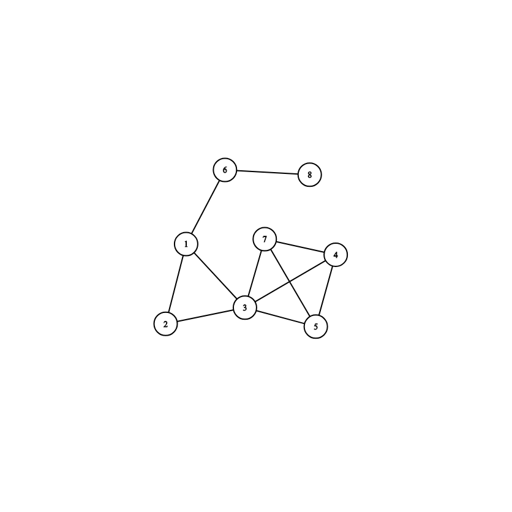

<h1 style='text-align: center;'> C. Hyperspace Highways</h1>

<h5 style='text-align: center;'>time limit per test: 1 second</h5>
<h5 style='text-align: center;'>memory limit per test: 256 megabytes</h5>

In an unspecified solar system, there are $N$ planets. A space government company has recently hired space contractors to build $M$ bidirectional Hyperspace™ highways, each connecting two different planets. The primary objective, which was to make sure that every planet can be reached from any other planet taking only Hyperspace™ highways, has been completely fulfilled. Unfortunately, lots of space contractors had friends and cousins in the Space Board of Directors of the company, so the company decided to do much more than just connecting all planets. 

In order to make spending enormous amounts of space money for Hyperspace™ highways look neccessary, they decided to enforce a strict rule on the Hyperspace™ highway network: whenever there is a way to travel through some planets and return to the starting point without travelling through any planet twice, every pair of planets on the itinerary should be directly connected by a Hyperspace™ highway. In other words, the set of planets in every simple cycle induces a complete subgraph.

You are designing a Hyperspace™ navigational app, and the key technical problem you are facing is finding the minimal number of Hyperspace™ highways one needs to use to travel from planet $A$ to planet $B$. As this problem is too easy for Bubble Cup, here is a harder task: your program needs to do it for $Q$ pairs of planets.

## Input

The first line contains three positive integers $N$ ($1\leq N\leq 100\,000$), $M$ ($1\leq M\leq 500\,000$) and $Q$ ($1\leq Q\leq 200\,000$), denoting the number of planets, the number of Hyperspace™ highways, and the number of queries, respectively.

Each of the following M lines contains a highway: highway $i$ is given by two integers $u_i$ and $v_i$ ($1 \leq u_i < v_i \leq N$), meaning the planets $u_i$ and $v_i$ are connected by a Hyperspace™ highway. It is guaranteed that the network of planets and Hyperspace™ highways forms a simple connected graph.

Each of the following $Q$ lines contains a query: query $j$ is given by two integers $a_j$ and $b_j$ $(1 \leq a_j < b_j \leq N )$, meaning we are interested in the minimal number of Hyperspace™ highways one needs to take to travel from planet $a_j$ to planet $b_j$.

## Output

## Output

 $Q$ lines: the $j$-th line of output should contain the minimal number of Hyperspace™ highways one needs to take to travel from planet $a_j$ to planet $b_j$.

## Examples

## Input


```
5 7 2  
1 2  
1 3  
1 4  
2 3  
2 4  
3 4  
1 5  
1 4  
2 5  

```
## Output


```
1  
2  

```
## Input


```
8 11 4  
1 2  
2 3  
3 4  
4 5  
1 3  
1 6  
3 5  
3 7  
4 7  
5 7  
6 8  
1 5  
2 4  
6 7  
3 8  

```
## Output


```
2  
2  
3  
3  

```
## Note

The graph from the second sample: 


#### tags 

#2300 #dfs_and_similar #graphs #trees 