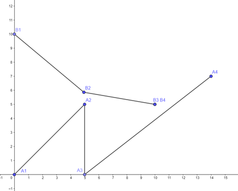

<h1 style='text-align: center;'> I. Say Hello</h1>

<h5 style='text-align: center;'>time limit per test: 2 seconds</h5>
<h5 style='text-align: center;'>memory limit per test: 256 megabytes</h5>

Two friends are travelling through Bubble galaxy. They say "Hello!" via signals to each other if their distance is smaller or equal than $d_1$ and 

* it's the first time they speak to each other or
* at some point in time after their last talk their distance was greater than $d_2$.

We need to calculate how many times friends said "Hello!" to each other. For $N$ moments, you'll have an array of points for each friend representing their positions at that moment. A person can stay in the same position between two moments in time, but if a person made a move we assume this movement as movement with constant speed in constant direction.

## Input

The first line contains one integer number $N$ ($2 \leq N \leq 100\,000$) representing number of moments in which we captured positions for two friends.

The second line contains two integer numbers $d_1$ and $d_2 \ (0 < d_1 < d_2 < 1000)$. 

The next $N$ lines contains four integer numbers $A_x,A_y,B_x,B_y$ ($0 \leq A_x, A_y, B_x, B_y \leq 1000$) representing coordinates of friends A and B in each captured moment.

## Output

## Output

 contains one integer number that represents how many times friends will say "Hello!" to each other.

## Example

## Input


```
4  
2 5  
0 0 0 10  
5 5 5 6  
5 0 10 5  
14 7 10 5  

```
## Output


```
2  

```
## Note

 Explanation: Friends should send signals 2 times to each other, first time around point $A2$ and $B2$ and second time during A's travel from point $A3$ to $A4$ while B stays in point $B3=B4$. 


#### tags 

#2300 #geometry 