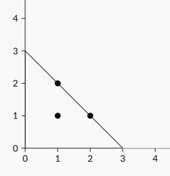

<h1 style='text-align: center;'> B. Cover Points</h1>

<h5 style='text-align: center;'>time limit per test: 1 second</h5>
<h5 style='text-align: center;'>memory limit per test: 256 megabytes</h5>

There are $n$ points on the plane, $(x_1,y_1), (x_2,y_2), \ldots, (x_n,y_n)$.

You need to place an isosceles triangle with two sides on the coordinate axis to cover all points (a point is covered if it lies inside the triangle or on the side of the triangle). Calculate the minimum length of the shorter side of the triangle.

## Input

First line contains one integer $n$ ($1 \leq n \leq 10^5$).

Each of the next $n$ lines contains two integers $x_i$ and $y_i$ ($1 \leq x_i,y_i \leq 10^9$).

## Output

Print the minimum length of the shorter side of the triangle. It can be proved that it's always an integer.

## Examples

## Input


```
3  
1 1  
1 2  
2 1  

```
## Output


```
3
```
## Input


```
4  
1 1  
1 2  
2 1  
2 2  

```
## Output


```
4
```
## Note

Illustration for the first example: 

Illustration for the second example: 


#### tags 

#900 #geometry #math 