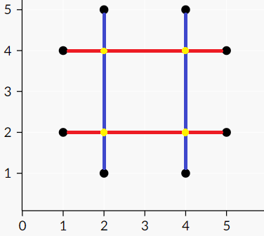

<h1 style='text-align: center;'> F. Electric Scheme</h1>

<h5 style='text-align: center;'>time limit per test: 1 second</h5>
<h5 style='text-align: center;'>memory limit per test: 256 megabytes</h5>

Pasha is a young technician, nevertheless, he has already got a huge goal: to assemble a PC. The first task he has to become familiar with is to assemble an electric scheme.

The scheme Pasha assembled yesterday consists of several wires. Each wire is a segment that connects two points on a plane with integer coordinates within the segment $[1, 10^9]$.

There are wires of two colors in the scheme: 

* red wires: these wires are horizontal segments, i.e. if such a wire connects two points $(x_1, y_1)$ and $(x_2, y_2)$, then $y_1 = y_2$;
* blue wires: these wires are vertical segments, i.e. if such a wire connects two points $(x_1, y_1)$ and $(x_2, y_2)$, then $x_1 = x_2$.

## Note

 that if a wire connects a point to itself, it may be blue, and it can be red. Also, in Pasha's scheme no two wires of the same color intersect, i.e. there are no two wires of same color that have common points.

The imperfection of Pasha's scheme was that the wires were not isolated, so in the points where two wires of different colors intersect, Pasha saw sparks. Pasha wrote down all the points where he saw sparks and obtained a set of $n$ distinct points. After that he disassembled the scheme.

Next morning Pasha looked at the set of $n$ points where he had seen sparks and wondered how many wires had he used. Unfortunately, he does not remember that, so he wonders now what is the smallest number of wires he might have used in the scheme. Help him to determine this number and place the wires in such a way that in the resulting scheme the sparks occur in the same places.

## Input

The first line contains a single integer $n$ ($1 \leq n \leq 1000$) — the number of points where Pasha saw sparks.

Each of the next $n$ lines contain two integers $x$ and $y$ ($1 \leq x, y \leq 10^9$) — the coordinates of a point with sparks. It is guaranteed that all points are distinct.

## Output

Print the description of the scheme in the following format.

In the first line print $h$ — the number of horizontal red wires ($0 \leq h$). In each of the next $h$ lines print $4$ integers $x_1$, $y_1$, $x_2$, $y_2$ — the coordinates of two points $(x_1, y_1)$ and $(x_2, y_2)$ that are connected with this red wire. The segmenst must be horizontal, i.e. $y_1 = y_2$ must hold. Also, the constraint $1 \leq x_1, y_1, x_2, y_2 \leq 10^9$ must hold.

After that print $v$ — the number of vertical blue wires ($0 \leq v$). In each of the next $v$ lines print $4$ integers $x_1$, $y_1$, $x_2$, $y_2$ — the coordinates of two points $(x_1, y_1)$ and $(x_2, y_2)$ that are connected with this blue wire. The segmenst must be vertical, i.e. $x_1 = x_2$ shomustuld hold. Also, the constraint $1 \leq x_1, y_1, x_2, y_2 \leq 10^9$ must hold.

No two segments of the same color should have common points. The set of points where sparks appear should be the same as given in the input.

The number of segments $(h + v)$ should be minimum possible. It's easy to see that the answer always exists. If there are multiple possible answers, print any.

## Examples

## Input


```
4  
2 2  
2 4  
4 2  
4 4  

```
## Output


```
2  
5 2 1 2  
1 4 5 4  
2  
2 1 2 5  
4 5 4 1  

```
## Input


```
4  
2 1  
3 2  
2 3  
1 2  

```
## Output


```
4  
2 1 2 1  
3 2 3 2  
1 2 1 2  
2 3 2 3  
3  
1 2 1 2  
3 2 3 2  
2 3 2 1  

```
## Note

In the first example Pasha could have assembled the following scheme:

  In this scheme there are $2$ wires of each color: red ones connecting $(5, 2)$ with $(1, 2)$ and $(1, 4)$ with $(5, 4)$, blue ones connecting $(2, 1)$ with $(2, 5)$ and $(4, 5)$ with $(4, 1)$. ## Note

 that the sparks appear in the points that are described in the input, they are shown in yellow on the picture. For example, Pasha will see the spark in the point $(2, 4)$ because the second red wire and the first blue wire intersect there. It is possible to show that we can't have less than $4$ wires to produce a scheme with same sparks positions.


#### tags 

#2700 #flows #graph_matchings 