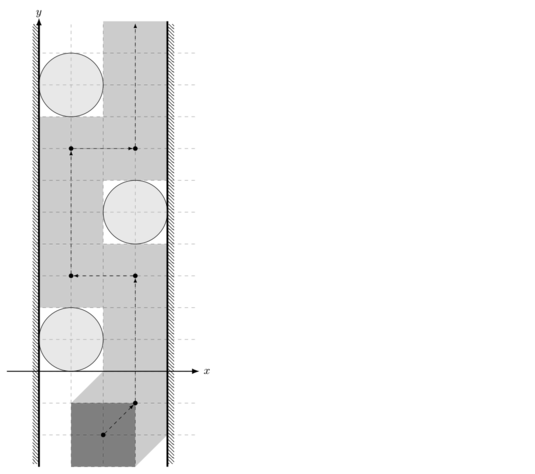
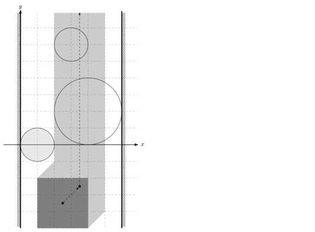

<h1 style='text-align: center;'> G. Jellyfish Nightmare</h1>

<h5 style='text-align: center;'>time limit per test: 2 seconds</h5>
<h5 style='text-align: center;'>memory limit per test: 256 megabytes</h5>

Bob has put on some weight recently. In order to lose weight a bit, Bob has decided to swim regularly in the pool. However, the day before he went to the pool for the first time he had a weird dream. In this dream Bob was swimming along one of the pool's lanes, but also there were some jellyfish swimming around him. It's worth mentioning that jellyfish have always been one of Bob's deepest childhood fears.

Let us assume the following physical model for Bob's dream.

1. The pool's lane is an area of the plane between lines $x=0$ and $x=w$. Bob is not allowed to swim outside of the lane, but he may touch its bounding lines if he wants.
2. The jellyfish are very small, but in Bob's dream they are extremely swift. Each jellyfish has its area of activity around it. Those areas are circles of various radii, with the jellyfish sitting in their centers. The areas of activity of two jellyfish may overlap and one area of activity may even be fully contained within another one.
3. Bob has a shape of a convex polygon.
4. Unfortunately, Bob's excess weight has made him very clumsy, and as a result he can't rotate his body while swimming. So he swims in a parallel translation pattern. However at any given moment of time he can choose any direction of his movement.
5. Whenever Bob swims into a jellyfish's activity area, it will immediately notice him and sting him very painfully. We assume that Bob has swum into the activity area if at some moment of time the intersection of his body with the jellyfish's activity area had a positive area (for example, if they only touch, the jellyfish does not notice Bob).
6. Once a jellyfish stung Bob, it happily swims away and no longer poses any threat to Bob.

Bob wants to swim the lane to its end and get stung the least possible number of times. He will start swimming on the line $y=-h$, and finish on the line $y=h$ where $h = 10^{10}$.

## Input

The first line contains two integers $n$ and $w$ ($3 \le n \le 200, 1 \le w \le 30000$) — the number of vertices in the polygon that constitutes the Bob's shape and the width of the swimming pool lane.

Each of the next $n$ lines contains two integers $x_i$ and $y_i$ ($0 \le x_i \le w, 0 \le y_i \le 30000$) — the coordinates of corresponding vertex of the polygon. The vertices in the polygon are given in counterclockwise order. It is guaranteed that the given polygon is strictly convex.

The next line contains an only integer $m$ ($0 \le m \le 200$) — the number of the jellyfish in the pool.

Each of the next $m$ lines contains three integers ($x_i$, $y_i$, $r_i$ ($0 \le x_i \le w, 0 \le y_i \le 30000, 1 \le r_i \le 30000$) — coordinates of the $i$-th jellyfish in the pool and the radius of her activity. It is guaranteed, that no two jellyfish are located in the same point.

## Output

## Output

 a single integer — the least possible number of jellyfish that will sting Bob.

## Examples

## Input


```
4 4  
0 0  
2 0  
2 2  
0 2  
3  
1 1 1  
3 5 1  
1 9 1  

```
## Output


```
0  

```
## Input


```
4 6  
0 0  
3 0  
3 3  
0 3  
3  
1 0 1  
4 2 2  
3 6 1  

```
## Output


```
2  

```
## Input


```
4 2  
0 0  
1 0  
1 1  
0 1  
2  
1 1 1  
1 3 1  

```
## Output


```
2  

```
## Note

Visualization of the possible solutions to the first and the second sample test cases are below:

 


#### tags 

#3500 