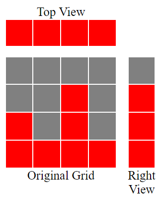
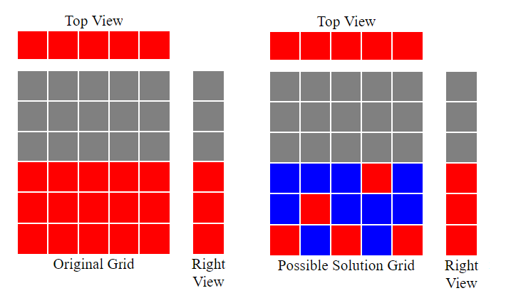

<h1 style='text-align: center;'> B. Views Matter</h1>

<h5 style='text-align: center;'>time limit per test: 2 seconds</h5>
<h5 style='text-align: center;'>memory limit per test: 256 megabytes</h5>

You came to the exhibition and one exhibit has drawn your attention. It consists of $n$ stacks of blocks, where the $i$-th stack consists of $a_i$ blocks resting on the surface.

The height of the exhibit is equal to $m$. Consequently, the number of blocks in each stack is less than or equal to $m$.

There is a camera on the ceiling that sees the top view of the blocks and a camera on the right wall that sees the side view of the blocks.

 Find the maximum number of blocks you can remove such that the views for both the cameras would not change.

## Note

, that while originally all blocks are stacked on the floor, it is not required for them to stay connected to the floor after some blocks are removed. There is no gravity in the whole exhibition, so no block would fall down, even if the block underneath is removed. It is not allowed to move blocks by hand either.

## Input

The first line contains two integers $n$ and $m$ ($1 \le n \le 100\,000$, $1 \le m \le 10^9$) — the number of stacks and the height of the exhibit.

The second line contains $n$ integers $a_1, a_2, \ldots, a_n$ ($1 \le a_i \le m$) — the number of blocks in each stack from left to right.

## Output

Print exactly one integer — the maximum number of blocks that can be removed.

## Examples

## Input


```
5 6  
3 3 3 3 3  

```
## Output


```
10
```
## Input


```
3 5  
1 2 4  

```
## Output


```
3
```
## Input


```
5 5  
2 3 1 4 4  

```
## Output


```
9
```
## Input


```
1 1000  
548  

```
## Output


```
0
```
## Input


```
3 3  
3 1 1  

```
## Output


```
1
```
## Note

The following pictures illustrate the first example and its possible solution.

Blue cells indicate removed blocks. There are $10$ blue cells, so the answer is $10$.

 

#### tags 

#1400 #greedy #implementation #sortings 