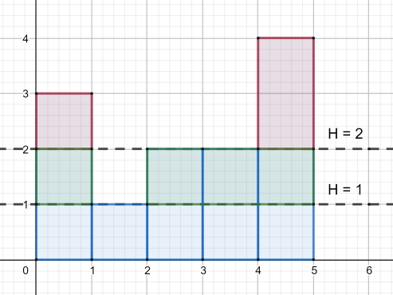

<h1 style='text-align: center;'> C. Make It Equal</h1>

<h5 style='text-align: center;'>time limit per test: 2 seconds</h5>
<h5 style='text-align: center;'>memory limit per test: 256 megabytes</h5>

There is a toy building consisting of $n$ towers. Each tower consists of several cubes standing on each other. The $i$-th tower consists of $h_i$ cubes, so it has height $h_i$.

Let's define operation slice on some height $H$ as following: for each tower $i$, if its height is greater than $H$, then remove some top cubes to make tower's height equal to $H$. Cost of one "slice" equals to the total number of removed cubes from all towers.

Let's name slice as good one if its cost is lower or equal to $k$ ($k \ge n$).

  Calculate the minimum number of good slices you have to do to make all towers have the same height. Of course, it is always possible to make it so.

## Input

The first line contains two integers $n$ and $k$ ($1 \le n \le 2 \cdot 10^5$, $n \le k \le 10^9$) — the number of towers and the restriction on slices, respectively.

The second line contains $n$ space separated integers $h_1, h_2, \dots, h_n$ ($1 \le h_i \le 2 \cdot 10^5$) — the initial heights of towers.

## Output

Print one integer — the minimum number of good slices you have to do to make all towers have the same heigth.

## Examples

## Input


```
5 5  
3 1 2 2 4  

```
## Output


```
2  

```
## Input


```
4 5  
2 3 4 5  

```
## Output


```
2  

```
## Note

In the first example it's optimal to make $2$ slices. The first slice is on height $2$ (its cost is $3$), and the second one is on height $1$ (its cost is $4$).


#### tags 

#1600 #greedy 