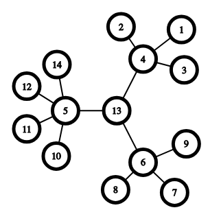

<h1 style='text-align: center;'> B. Multihedgehog</h1>

<h5 style='text-align: center;'>time limit per test: 1 second</h5>
<h5 style='text-align: center;'>memory limit per test: 256 megabytes</h5>

Someone give a strange birthday present to Ivan. It is hedgehog — connected undirected graph in which one vertex has degree at least $3$ (we will call it center) and all other vertices has degree 1. Ivan thought that hedgehog is too boring and decided to make himself $k$-multihedgehog.

Let us define $k$-multihedgehog as follows:

* $1$-multihedgehog is hedgehog: it has one vertex of degree at least $3$ and some vertices of degree 1.
* For all $k \ge 2$, $k$-multihedgehog is $(k-1)$-multihedgehog in which the following changes has been made for each vertex $v$ with degree 1: let $u$ be its only neighbor; remove vertex $v$, create a new hedgehog with center at vertex $w$ and connect vertices $u$ and $w$ with an edge. New hedgehogs can differ from each other and the initial gift.

Thereby $k$-multihedgehog is a tree. Ivan made $k$-multihedgehog but he is not sure that he did not make any mistakes. That is why he asked you to check if his tree is indeed $k$-multihedgehog.

## Input

First line of input contains $2$ integers $n$, $k$ ($1 \le n \le 10^{5}$, $1 \le k \le 10^{9}$) — number of vertices and hedgehog parameter.

Next $n-1$ lines contains two integers $u$ $v$ ($1 \le u, \,\, v \le n; \,\, u \ne v$) — indices of vertices connected by edge.

It is guaranteed that given graph is a tree.

## Output

Print "Yes" (without quotes), if given graph is $k$-multihedgehog, and "No" (without quotes) otherwise.

## Examples

## Input


```
14 2  
1 4  
2 4  
3 4  
4 13  
10 5  
11 5  
12 5  
14 5  
5 13  
6 7  
8 6  
13 6  
9 6  

```
## Output


```
Yes  

```
## Input


```
3 1  
1 3  
2 3  

```
## Output


```
No  

```
## Note

2-multihedgehog from the first example looks like this:



Its center is vertex $13$. Hedgehogs created on last step are: [4 (center), 1, 2, 3], [6 (center), 7, 8, 9], [5 (center), 10, 11, 12, 13].

Tree from second example is not a hedgehog because degree of center should be at least $3$.


#### tags 

#1800 #dfs_and_similar #graphs #shortest_paths 