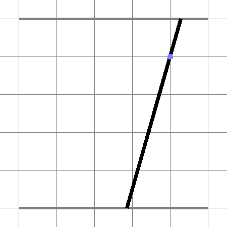
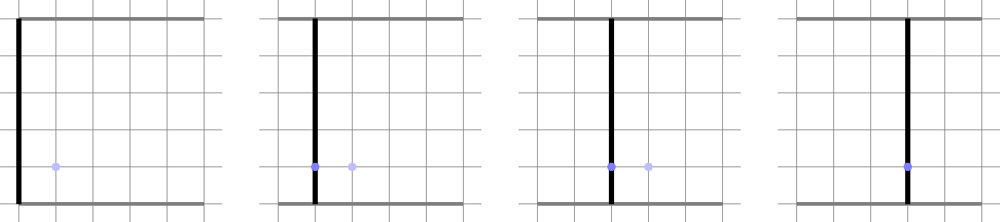
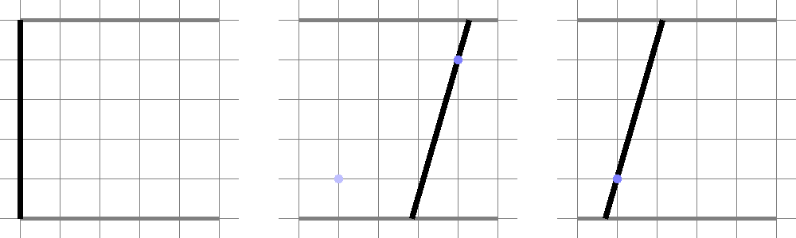

<h1 style='text-align: center;'> E. Rain Protection</h1>

<h5 style='text-align: center;'>time limit per test: 7 seconds</h5>
<h5 style='text-align: center;'>memory limit per test: 256 megabytes</h5>

A lot of people dream of convertibles (also often called cabriolets). Some of convertibles, however, don't have roof at all, and are vulnerable to rain. This is why Melon Ask, the famous inventor, decided to create a rain protection mechanism for convertibles.

The workplace of the mechanism is a part of plane just above the driver. Its functional part consists of two rails with sliding endpoints of a piece of stretching rope. For the sake of simplicity we can consider this as a pair of parallel segments in a plane with the rope segment, whose endpoints we are free to choose as any points on these rails segments.

  The algorithmic part of the mechanism detects each particular raindrop and predicts when and where it reaches the plane. At this exact moment the rope segment must contain the raindrop point (so the rope adsorbs the raindrop).

You are given the initial position of the rope endpoints and all information about raindrops. You are to choose the minimal possible speed $v$ of the endpoints sliding (both endpoints can slide in any direction along their segments independently of each other) in such a way that it is possible to catch all raindrops moving both endpoints with speed not greater than $v$, or find out that it's impossible no matter how high the speed is.

## Input

The first line contains three integers $n$, $w$ and $h$ ($1 \le n \le 10^5$, $1\le w, h \le 10^3$), meaning that there are $n$ raindrops, and two rails are represented as segments connecting $(0, 0)$ and $(w, 0)$ and connecting $(0, h)$ and $(w, h)$.

The second line contains two integers $e_1$ and $e_2$, meaning that the initial (that is, at the moment $t = 0$) positions of the endpoints are $(e_1, 0)$ and $(e_2, h)$ ($0\le e_1, e_2\le w$).

The $i$-th of the following $n$ lines contains three integers $t_i$, $x_i$ and $y_i$ ($1\le t_i\le 10^5$, $0\le x_i \le w$, $0 < y_i < h$) meaning that the $i$-th raindrop touches the plane at the point $(x_i, y_i)$ at the time moment $t_i$. It is guaranteed that $t_i \le t_{i+1}$ for all valid $i$.

## Output

If it is impossible to catch all raindrops, print $-1$.

Otherwise, print the least possible maximum speed of the rope endpoints for which it is possible to catch them all. Your answer is considered correct if the absolute or relative error doesn't exceed $10^{-4}$.

Formally, let your answer be $a$, and the jury's answer be $b$. Your answer is considered correct if $\frac{|a - b|}{\max{(1, |b|)}} \le 10^{-4}$.

## Examples

## Input


```
3 5 5  
0 0  
1 1 4  
2 2 4  
3 3 4  

```
## Output


```
1.0000000019  

```
## Input


```
2 5 5  
0 0  
2 4 1  
3 1 4  

```
## Output


```
2.1428571437  

```
## Input


```
3 5 5  
0 0  
1 2 1  
1 3 3  
1 4 2  

```
## Output


```
-1  

```
## Note

That is how one can act in the first sample test:



Here is the same for the second:




#### tags 

#3500 #binary_search #geometry 