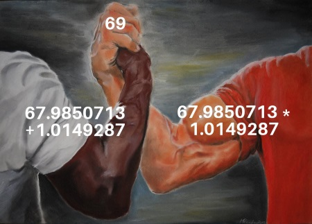

<h1 style='text-align: center;'> C. Meme Problem</h1>

<h5 style='text-align: center;'>time limit per test: 1 second</h5>
<h5 style='text-align: center;'>memory limit per test: 256 megabytes</h5>

Try guessing the statement from this picture: 

  You are given a non-negative integer $d$. You have to find two non-negative real numbers $a$ and $b$ such that $a + b = d$ and $a \cdot b = d$.

## Input

The first line contains $t$ ($1 \le t \le 10^3$) — the number of test cases.

Each test case contains one integer $d$ $(0 \le d \le 10^3)$.

## Output

For each test print one line.

If there is an answer for the $i$-th test, print "Y", and then the numbers $a$ and $b$.

If there is no answer for the $i$-th test, print "N".

Your answer will be considered correct if $|(a + b) - a \cdot b| \le 10^{-6}$ and $|(a + b) - d| \le 10^{-6}$.

## Example

## Input


```

7
69
0
1
4
5
999
1000

```
## Output


```

Y 67.985071301 1.014928699
Y 0.000000000 0.000000000
N
Y 2.000000000 2.000000000
Y 3.618033989 1.381966011
Y 997.998996990 1.001003010
Y 998.998997995 1.001002005

```


#### tags 

#1300 #binary_search #math 