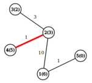

<h1 style='text-align: center;'> A. The Fair Nut and the Best Path</h1>

<h5 style='text-align: center;'>time limit per test: 3 seconds</h5>
<h5 style='text-align: center;'>memory limit per test: 256 megabytes</h5>

The Fair Nut is going to travel to the Tree Country, in which there are $n$ cities. Most of the land of this country is covered by forest. Furthermore, the local road system forms a tree (connected graph without cycles). Nut wants to rent a car in the city $u$ and go by a simple path to city $v$. He hasn't determined the path, so it's time to do it. ## Note

 that chosen path can consist of only one vertex.

A filling station is located in every city. Because of strange law, Nut can buy only $w_i$ liters of gasoline in the $i$-th city. We can assume, that he has infinite money. Each road has a length, and as soon as Nut drives through this road, the amount of gasoline decreases by length. Of course, Nut can't choose a path, which consists of roads, where he runs out of gasoline. He can buy gasoline in every visited city, even in the first and the last.

He also wants to find the maximum amount of gasoline that he can have at the end of the path. Help him: count it.

## Input

The first line contains a single integer $n$ ($1 \leq n \leq 3 \cdot 10^5$) — the number of cities.

The second line contains $n$ integers $w_1, w_2, \ldots, w_n$ ($0 \leq w_{i} \leq 10^9$) — the maximum amounts of liters of gasoline that Nut can buy in cities.

Each of the next $n - 1$ lines describes road and contains three integers $u$, $v$, $c$ ($1 \leq u, v \leq n$, $1 \leq c \leq 10^9$, $u \ne v$), where $u$ and $v$ — cities that are connected by this road and $c$ — its length.

It is guaranteed that graph of road connectivity is a tree.

## Output

Print one number — the maximum amount of gasoline that he can have at the end of the path.

## Examples

## Input


```
3  
1 3 3  
1 2 2  
1 3 2  

```
## Output


```
3  

```
## Input


```
5  
6 3 2 5 0  
1 2 10  
2 3 3  
2 4 1  
1 5 1  

```
## Output


```
7  

```
## Note

The optimal way in the first example is $2 \to 1 \to 3$. 

  The optimal way in the second example is $2 \to 4$. 

  

#### tags 

#1800 #data_structures #dp #trees 